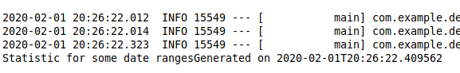
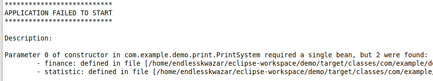
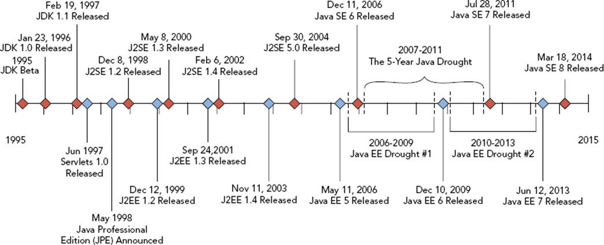
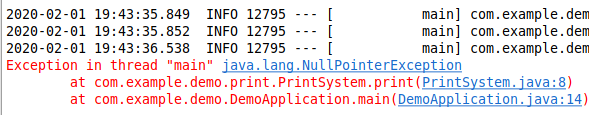
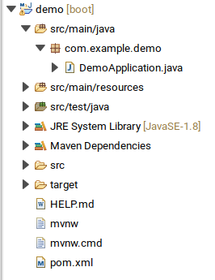
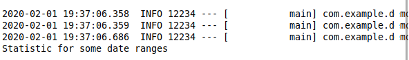

# Java. Intro


## Історія і мотивація


## Мотивація до вивчення Java
Мало мов можуть похвалитися тим, що їм вдалося змінити загальне уявлення про програмування. Але і в цій "елітнії" групі одна мова вирізняється з-поміж інших. ЇЇ вплив дуже швидко відчули всі програмісти. Мова, звичайно ж, йдеться про Java. Мова Java багато років залишається в топах.


### TIOBE community index
TIOBE індекс (рейтинг мов програмування) — показник популярності мов програмування. Розраховується виходячи з кількості результів запитів до пошукових систем, що містять назву мови.


### The PYPL

PopularitY of Programming Language Index is created by analyzing how often language tutorials are searched.




### GitHub

Here are the most popular programming languages used at Github.




### Історія винекнення

Java  - сильно типізований об'єктно-орієнтована мова програмування. Клас мови мультипарадигмальності: об'єктно-орієнтована, структурний, імперативний, компонентно-орієнтований, узагальнений, рефлективний, функціональний.

Мова Java була розроблена компанією Sun Microsystems, творцем якої був Джеймс Гослінг, і випущена в 1995 році в якості основних компонентів компанії Sun Microsystems - Java платформ (Java 1.0 [J2SE])


### Області застосування Java
- Java насамперед - це мова, яка використовується для серверних додатків у великих корпораціях. Особливо часто Java використовується в банках, страхових компаніях, роздрібних мережах т.д. Наприклад, такі банки як Deutsche Bank, Citigroup, Barclays, Goldman Sachs і багато-багато інших використовують Java для написання бек-енд і фронт-енд офісних електронних систем і т.д. Ще приклад, серверна частина Google+ написана на Java.
- Трейдингові додатки. Наприклад, LMAX, Murex.
- Android програми. Якщо у Вас телефон на Android, то всі програми в ньому написані на Java з використанням Google і Android API.


## Версіонування і різновиди платформи


### Версіонування і різновиди платформи
- **Java SE** - стандартна версія. Це базова платформа програмування Java. Вона містить всі бібліотеки і API, які повинен вивчити будь-який Java-програміст (java.lang, java.io, java.math, java.net, java.util і т.д.).


### Версіонування і різновиди платформи
- **Java EE**. Платформа Java (Enterprise Edition) відрізняється від стандарту Java (Java SE) в тому, що він додає бібліотеки, які надають функціональність для розгортання відмовостійкої, розподіленої багаторівневої Java програмне забезпечення, засноване в основному на модульних компонентах, які працюють на сервера додатків.
- **Java ME (Micro Edition)**. Це платформа для розробки додатків для мобільних пристроїв і вбудованих систем, таких як телевізійні приставки. Java ME надає підмножина функцій Java SE, але також представляє бібліотеки, специфічні для мобільних пристроїв.


### Версіонування і різновиди платформи
Починаючи з першої версії до java 8 проміжок часу між релізами був 3-5 років, що прекрасно підходить для стабільних enterprise - додатків. 




### Версіонування і різновиди платформи
Але в такій моделі є недоліки - платформа розвивається повільно. Тому Oracle вирішив змінити модель і випускати нову версію java кожні півроку. Починаючи з Java 9, більшість версій Java матиме термін служби лише 6 місяців. Після цього періоду оновлення версії не надаватимуться. Крім того, всі 3 роки буде випущена версія Java LTS (довготривала підтримка). Першою версією з підтримкою LTS буде Java 11, яка запланована на осінь 2018 року. Ця версія LTS надаватиме комерційну підтримку з оновленнями протягом 8 років. Найважливіший факт полягає в тому, що до оновлень версій LTS можуть бути доступні та використані лише люди, які купують комерційну підтримку в Oracle. 


### Версіонування і різновиди платформи



### JVM & JDK
Для виконання програм написаних на Java нам знадобиться JVM, яка входить в поставку JRE, а для їх розробки JDK.

- JVM(Java Virtual Machine) - середовище ("віртуальне"), в якому виконується  скомпільований код.
- JRE(Java Runtime Environment). Просто пакет, який включає в себе JVM і мінімальний набір бібліотек для роботи програм. І ще браузерні плагін, де будуть виконуватися аплети.
- JDK(Java Development Kit) - це вже повноцінний набір бібліотек і інструментів для створення, компіляції та дебага програм. Включає в себе jre.


## Як працює Java?


### Як працює Java?
Програми на Java транслюються в байт-код Java, який виконується віртуальною машиною Java (JVM) – програмою, яка обробляє байт-код і передає інструкції обладнанню як інтерпретатор.

Байт-код або байтко́д (англ. byte-code), іноді також використовується термін псевдокод — машинно-незалежний код низького рівня, що генерується транслятором і виконуваний інтерпретатором. Більшість інструкцій байт-коду еквівалентні одній або кільком командам асемблера. Трансляція в байт-код займає проміжне положення між компіляцією в машинний код і інтерпретацією.


### Як працює Java?
```java
outer:
for (int i = 2; i < 1000; i++) {
    for (int j = 2; j < i; j++) {
        if (i % j == 0)
            continue outer;
    }
  System.out.println (i);
}
```


### Як працює Java?
```
 0:   iconst_2
 1:   istore_1
 2:   iload_1
 3:   sipush  1000
 6:   if_icmpge       44
 9:   iconst_2
 10:  istore_2
 11:  iload_2
 12:  iload_1
 13:  if_icmpge       31
 16:  iload_1
 17:  iload_2
 18:  irem
 19:  ifne    25
 22:  goto    38
 25:  iinc    2, 1
 28:  goto    11
 31:  getstatic       #84; //Field java/lang/System.out:Ljava/io/PrintStream;
 34:  iload_1
 35:  invokevirtual   #85; //Method java/io/PrintStream.println:(I)V
 38:  iinc    1, 1
 41:  goto    2
 44:  return
```


### Як працює Java?
Перевагою подібного способу виконання програм є повна незалежність байт-коду від операційної системи і обладнання, що дозволяє виконувати Java-додатки на будь-якому пристрої, для якого існує відповідна віртуальна машина. Іншою важливою особливістю технології Java є гнучка система безпеки, в рамках якої виконання програми повністю контролюється віртуальною машиною. Будь-які операції, які перевищують встановлені повноваження програми (наприклад, спроба несанкціонованого доступу до даних або з'єднання з іншим комп'ютером), викликають негайне переривання.


### Як працює Java?
Часто до недоліків концепції віртуальної машини відносять зниження продуктивності.

Ряд удосконалень дещо збільшив швидкість виконання програм на Java:
- застосування технології трансляції байт-коду в машинний код безпосередньо під час роботи програми (JIT-технологія) з можливістю збереження версій класу в машинному коді;
- широке використання переносного орієнтованого коду (native-код) в стандартних бібліотеках;
- апаратні засоби, що забезпечують прискорену обробку байт-коду


### Як працює Java?
Коли ми компілюємо .java файл, файл .class (містить байтовий код). Цей файл класу підходить різні етапи, коли ми його запускаємо. Ці кроки разом описують весь JVM.


### Як працює Java?



### Як працює Java?
Підсистема завантаження класів.
	Підсистема завантаження класів відповідає за:
- Завантаження.
- Лінкування.
- Ініціалізацію


### Як працює Java?
**Завантаження**: Class loader зчитує файл класу .class, генерує відповідні бінарні дані та зберігає його в області методів. Для кожного файлу класу JVM зберігає наступну інформацію в області методів.

- Повністю кваліфіковане ім'я завантаженого класу та його найближчий батьківський клас.
- Чи .class файл пов'язаний з класом або інтерфейсом або перечисленням
- Модифікатор, змінні та метод інформації і т.д.


### Як працює Java?
Після завантаження файлу класу JVM створює об'єкт класу типу, який представляє цей файл у пам'яті купі. 
**Лінкування**: виконує перевірку, підготовку.
- Верифікація: перевірка коректності файлу .class, тобто він перевіряє, чи цей файл правильно відформатовано та створено дійсним компілятором чи ні. Якщо перевірка не пройшла, ми отримуємо виняток runtime exception java.lang.VerifyError.
- Підготовка: JVM виділяє пам'ять для змінних класу та ініціалізує пам'ять за замовчуванням.


### Як працює Java?
**Ініціалізація**: на цьому етапі всі статичні змінні присвоюються своїми значеннями, визначеними в коді та статичному блоці (якщо такі є). Це виконується зверху вниз у класі та від батьків до дочірнього в ієрархії класів.


### Як працює Java?
Загалом, є три види class loader:
- Bootstrap class loader: кожна реалізація JVM повинна мати bootstrap class loader, здатний завантажувати довірені класи. Він завантажує основні класи Java, присутні в каталозі JAVA_HOME / jre / lib. Цей шлях відомий як шлях початкового шляху. Він реалізується рідними мовами, такими як C, C ++.
- Extension class loader: це дочірній завантажувач по — відношенню до bootstrap class loader. Він завантажує класи, що містяться в каталогах розширень JAVA_HOME / jre / lib / ext (шлях розширення) або будь-який інший каталог, вказаний властивістю java.ext.dirs. Вона реалізована в Java для класу Sun.misc.Launcher $ ExtClassLoader.


### Як працює Java?
- System/Application class loader: це дочірній завантажувач класів по — відношенню до extension class loader. Він несе відповідальність за завантаження класів із шляху класу додатків. Він внутрішньо використовує змінні середовища, які зв'язані з java.class.path. Він також реалізується в Java класом sun.misc.Launcher $ AppClassLoader.


### Як працює Java?



### Будування і виконання java - додатків використовуючи утиліти javac, java, jar
see in workbook