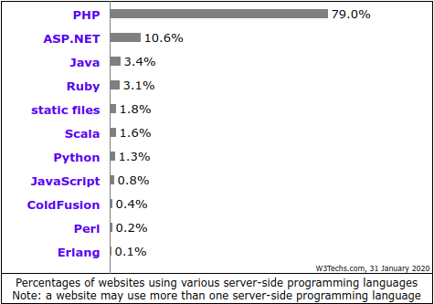
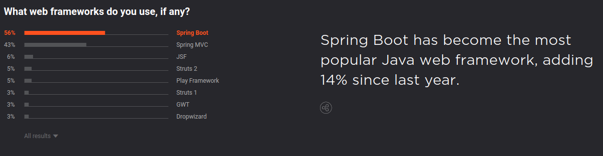

# Java for web

## Where java is used

1. Ентерпрайс веб - додатки
2. Андроід (Втрачає нішу)
3. Big Data (Haddop)
4. Infrastructure(Jenkins, ElasticSearch, ActiveMQ, RabitMQ, Kafka)

## Java for web

## Java web frameworks

[devecosystem-2019](https://www.jetbrains.com/lp/devecosystem-2019/java/)

## Jakarta EE

- Jakarta EE (раніше - Java Platform, Enterprise Edition, скор. Java EE, до версії 5.0 - Java 2 Enterprise Edition або J2EE). У 2018 Eclipse Foundation перейменувала Java EE в Jakarta EE - набір специфікацій і відповідної документації для мови Java, яка описує архітектуру серверної платформи для задач середніх і великих підприємств.
- >>> The platform provides an API and runtime environment for developing and running enterprise software, including network and web services, and other large-scale, multi-tiered, scalable, reliable, and secure network applications.

## Jakarta EE

Jakarta EE налічує близько 13 технологій, які складають платформу: JDBC, JNDI, EJBs, RMI, JSP, Java servlets, XML, JMS, Java IDL, JTS, JTA, JavaMail, JAF

## Spring Framework

- Spring Framework (або коротко Spring) - універсальний фреймворк з відкритим вихідним кодом для Java-платформи.
- Незважаючи на те, що Spring не забезпечував якусь конкретну модель програмування, він став широко поширеним в Java-співтоваристві головним чином як альтернатива і заміна моделі Enterprise JavaBeans. Spring надає велику свободу Java-розробникам в проектуванні; крім того, він надає добре документовані і легкі у використанні засоби вирішення проблем, що виникають при створенні додатків корпоративного масштабу.

## Spring and JEE. History

- Спочатку був JEE
- Spring виник як невеличка бібліотека для JEE, яка займається DI
- Оскільки JEE повільно розвивається і змінюється, Spring відокремлюється і розроблює свій фреймворк
- Із невеличкої бібліотеки Spring перетворився в велику екосистему

## Spring Project

Екосистему Spring складають наступні проекти: Spring Boot, Spring Framework, Spring Cloud Data Flow, Spring Cloud, Spring Data, Spring Integration, Spring Batch, Spring Security, Spring HATEOAS, Spring REST Docs, Spring AMQP, Spring Mobile, Spring For Android, Spring Web Flow, Spring Web Services, Spring LDAP, Spring Session, Spring Shell, Spring FLO, Spring Kafka, Spring Statemachine, Spring IO Platform