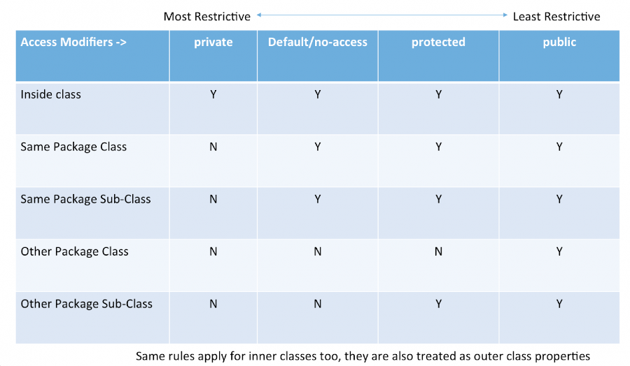
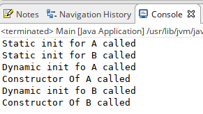

### Task
Що буде результатом виконання нвступного коду:
```java
public static void main(String args[]) {
      System.out.println("Web adress:");
      http://ius.kdu.edu.ua
      return;
    }
```

1. Web adress: http://ius.kdu.edu.ua
2. Помилка компіляції
3. Web adress:
4. Програма зависне.


# Java. ООП.


## Об'єкти. Класи. Базовий синтаксис класу


### Об'єкти. Класи
Java є об'єктно-орієнтованою мовою, тому такі поняття як "клас" і "об'єкт" грають в ньому ключову роль. Будь-яку програму на Java можна уявити як набір взаємодіючих між собою об'єктів.


### Об'єкти. Класи
Шаблоном або описом об'єкта є клас, а об'єкт являє екземпляр цього класу. Можна ще провести наступну аналогію. У нас у всіх є деяке уявлення про людину - наявність двох рук, двох ніг, голови, тулуба і т.д. Є деякий шаблон - цей шаблон можна назвати класом. Реально ж існуюча людина (фактично екземпляр даного класу) є об'єктом цього класу.


### Базовий синтаксис класу і його ініціалізація
```java
[modifier] class [identiofier] [extends/implements] [..class, interface]{

	[identifier](){} //constructor (конструктор)

	{
		//динамічний ініціалізатор
	}

	static {
		// Статичний ініціалізатор
	}

	finilize(){} //destructor(деструктор)

	[modifier] [type] [name]; //property(атрибут)
	[modifier] [return_type] [identifier]([params]){ //method(метод)
		[some_code];
	}
}
```


### Базовий синтаксис класу і його ініціалізація
```java
class Student {
	String name;
	
	Student(String name){
		this.name = name;
	}
	
	void printName() {
		System.out.println(this.name);
	}
}
```


### Базовий синтаксис класу і його ініціалізація
```java
[type] [indentifier] = new([parameters for constructor]);

Student student = new Student("Alex");
```


### Getters/Setters
У кожного об'єкта є свої поля, згідно з принципом ООП поля класу треба оголошувати приватним модифікатором доступу. І отже, щоб змінювати і отримувати інформацію про поля об'єкта якраз і створюють геттери і сеттери з публічним доступом. Геттер видає значення поля викликає об'єкта, а сетер встановлює значення цього поля.


### Getters/Setters
Зазвичай класи, які Ви будете писати виглядають наступним чином:

```java
class Student {
    private int age;
    
    public int getAge() {
        return this.age;
    }
    
    public void setAge(int age) {
        this.age = age;
    }
    
    private String name;
    
    public String getName() {
        return this.name;
    }
    
    public void String setName(String name) {
        this.name = name;
    }
}
```


### Getters/Setters
Варто зауважити, що існує і інша точка зору на геттери і сеттери. Ось деякі недоліки використання геттерів і сеттерів:

- Об'єкт може бути розібраний по частинах іншими об'єктами, тому що вони в змозі вбудувати будь-які дані в об'єкт, через сеттери. Об'єкт просто не може приховати свій власний стан досить безпечно, тому що будь-хто може це стан змінити.
- Більшість програмістів вірять, що об'єкт - це структура даних з методами. Геттери і Сетери - не зло. Але більшість об'єктів, для яких створюються геттери і сеттери просто містять в собі дані. Це представлення викривляє ООП.


### Java не підтримує перезавантаження операторів
Java не підтримує перезавантаження операторів - це вибір, який зробили його творці, які хотіли зробити мову простішою. Кожен оператор має хороший сенс завдяки арифметичній операції, яку виконує. Перевантаження оператора дозволяє зробити щось зайве, ніж те, на що очікується. Java дозволяє лише арифметичні операції на елементарних типах(+ String). Якщо ви дозволите розробнику робити перевантаження оператора, вони придумають декілька значень для одного оператора, що зробить криву навчання будь-якого розробника важкою, а речі ще більш заплутаними. Дизайнери Java хотіли завадити людям використовувати оператори в заплутаному вигляді.


## Методи класу Object


### toString()
**toString ()** надає рядкове представлення об'єкта і використовується для перетворення об'єкта в String. Метод toString () для класу Object повертає рядок, що складається з імені класу, об'єктом якого є екземпляр, символу `@ ' та шістнадцяткового відображення хеш-коду об'єкта. Іншими словами, він визначається як:

```java
public String toString()
{
    return getClass().getName() + "@" + Integer.toHexString(hashCode());
}
```


### toString()
Завжди рекомендується перевизначити метод toString(), щоб отримати власне рядкове - представлення об'єкта.

Наприклад, використовуючи атрибути класу:

```java
class Student {
	
	private int id;
	private String name;
	private int cardId;
	
	public Student(int id, String name, int cardId) {
		super();
		this.id = id;
		this.name = name;
		this.cardId = cardId;
	}

	public int getId() {
		return id;
	}

	public void setId(int id) {
		this.id = id;
	}

	public String getName() {
		return name;
	}

	public void setName(String name) {
		this.name = name;
	}

	public int getCardId() {
		return cardId;
	}

	public void setCardId(int cardId) {
		this.cardId = cardId;
	}

	@Override
	public String toString() {
		return "Student [id=" + id + ", name=" + name + ", cardId=" + cardId + "]";
	}
}
```


### hashCode()
Для кожного об'єкта JVM генерує унікальне число, яке називається хеш-кодом. Він повертає окремі цілі числа для різних об'єктів. Поширене помилкове уявлення про цей метод полягає в тому, що метод **hashCode ()** повертає адресу об'єкта, що є невірним. Він перетворює внутрішню адресу об'єкта в ціле число за допомогою алгоритму. Метод **hashCode ()** є нативні, тому що в Java неможливо знайти адресу об'єкта, тому він використовує рідні мови, такі як C/C ++, щоб знайти адресу об'єкта.


### hashCode()
Використання методу **hashCode ()**: Повертає хеш-значення, яке використовується для пошуку об’єкта в колекції. JVM (Java Virtual Machine) використовує метод хеш-коду під час збереження об'єктів у хешованих структурах даних, таких як HashSet, HashMap, Hashtable тощо. Основна перевага збереження об'єктів на основі хеш-коду полягає в тому, що пошук стає простим.

> Примітка: Перевизначення методу hashCode () потрібно зробити таким чином, що для кожного об'єкта ми генеруємо унікальне число.


### hashCode()

```java
class Student {
	private int cardNumber;
	
	public Student(int cardNumber) {
		this.cardNumber = cardNumber;
	}
	
	@Override
	public int hashCode() {
		return this.cardNumber;
	}
}
...
Student st = new Student(12);
System.out.println(st.hashCode());
...
```


### equals(Object obj)
Порівняє переданий об’єкт із "this" об'єктом (об'єктом, щодо якого викликається метод). Це дає загальний спосіб порівняння об'єктів на рівність. Для отримання власної умови рівності потрібно перевизначити метод **equals (Object obj)**.

Стандартна реалізація:

```java
public boolean equals(Object obj) {
	return (this == obj);
}
```


### equals(Object obj)
Приклад перевизначення **equals()**:

```java
class Student {
	private int cardNumber;
	
	public int getCardNumber() {
		return this.cardNumber;
	}
	
	public Student(int cardNumber) {
		this.cardNumber = cardNumber;
	}
	
	@Override
	public boolean equals(Object obj) {
		if (this.cardNumber == ((Student)obj).getCardNumber())
			return true;
		return false;
	}
}
...
Student st1 = new Student(1);
Student st2 = new Student(1);
Student st3 = new Student(2);
System.out.println("st1 == st2 " + st1.equals(st2));
System.out.println("st1 == st3 " + st1.equals(st3));
...
```


### getClass()
Повертає клас виконання об’єкта.


### finalize()
Цей метод викликається безпосередньо перед тим, як об’єкт буде знищенно. Колектор сміття викликає його на об'єкті, коли збирач сміття визначає, що більше немає посилань на об'єкт.


### clone()
Метод clone() створює точну, "глибоку" копію об'єкта. Він створює новий екземпляр класу поточного об'єкта та ініціалізує всі його поля з точно вмістом відповідних полів цього об’єкта.


## Пакети


### Пакети
Пакети використовуються в Java для запобігання іменування конфліктів, контролю доступу, полегшення пошуку / розміщення та використання класів, інтерфейсів, перерахувань та приміток тощо.

Привила визначення пакетів:
- Імена пакетів записуються у нижньому регістрі, щоб уникнути конфлікту з іменами класів або інтерфейсів.
- Компанії використовують своє інвертоване доменне ім’я для початку імен пакунків, наприклад, com.example.mypackage для пакету з назвою mypackage, створеного програмістом на example.com.
- Пакети на самій мові Java починаються з java. або javax.


### Пакети
Синтаксис визначення пакету:
```java
package package_name;
//class definition code
```

> Визначення пакету повино бути поміщено до будь-якого коду.


### Пакети
У деяких випадках ім'я домену в може бути невалідним пакетом. Це може статися, якщо доменне ім’я містить дефіс або інший спеціальний символ, якщо ім'я пакета починається з цифри чи іншого символу, який неможна використовувати як початок імені Java, або якщо ім'я пакета містить зарезервоване ключове слово Java, наприклад "int". У цьому випадку пропонується умова додати підкреслення.


### Пакети
|Невалідне|Валідне|
|-|-|
|hyphenated-name.example.org|org.example.hyphenated_name|
|example.int|int_.example|
|123name.example.com|com.example._123name|


### Імпортування класів
Для імпортування класів із пакетів використовується ключове слово import:

```java				
import [package].[class_name]; //Один клас із пакету
import [package].*; //Всі класи із пакету			
```

```java
import ua.edu.kdu.ius.Animal;

public class Main {

	public static void main(String[] args) {
		Animal animal = new Animal("Some name");
	}
}
```


### Статичне імпортування
В java також існує імпортування статичних методів і полів з інших класів:

```java
package ua.edu.kdu.ius;

public class Animal {

	private String name;

	public Animal(String name){
		this.name = name;
	}

	public void setName(String name){
		this.name = name;
	}

	public String getName(){
		return this.name;
	}

	public static void printAnimal(Animal animal){
		if(animal == null)
			return;
		System.out.println("Animal name: " + animal.name);
	}
}
```


### Статичне імпортування
```java
import ua.edu.kdu.ius.Animal;
import static ua.edu.kdu.ius.Animal.printAnimal;

public class Main {

	public static void main(String[] args) {
		Animal animal = new Animal("Some name");
		printAnimal(animal);
	}
}
```


## Три принципи ООП


### Інкапсуляція
Інкапсуляція - можливість приховування реалізації будь-яких частин модуля або об'єкта від зовнішнього світу (від клієнта). Це означає, що маніпулюючи модифікаторами доступу, можна приховати або відкрити тільки певні властивості, методи або класи для того, щоб непотрібні для класу-клієнта дані не були доступні.


### Інкапсуляція
Модифікатори доступу:




### Наслідування
Наслідування дозволяє описати новий клас на основі вже існуючого (батьківського), при цьому властивості і функціональність батьківського класу запозичуються новим класом.

Для наслідування класу використовується ключове слово extends.

> Java не підтримує множинне наслідування.


### Наслідування
```java
class Animal {
	private String name;

	public String getName() {
		return name;
	}

	public void setName(String name) {
		this.name = name;
	}

	public Animal(String name) {
		super();
		this.name = name;
	}
	
	
}

class Dog extends Animal {

	public Dog(String name) {
		super(name);
	}
	
}

...
Dog dog = new Dog("Sharik");
System.out.println(dog.getName());
...
```


### Наслідування
Доступ до батьківських полів і методів наступний:


### Наслідування - зло?
Наслідування - це хороший механізм, але потрібно розуміти проблеми з якими можна стикнутися використовуючи цей принцип ООП де попало.

- наслідування не враховує майбутні зміни батьківського класу. Адже коли ви успадковуєте новий клас від існуючого, ви підписуєте контракт про те, що новий клас завжди буде вести себе як існуючий, можливо розширюючи його поведінку в деяких місцях.
- Коли у класу з'являється кілька спадкоємців, то у них є загальна поведінка, а є розширене. І часто доводиться морочитися з тестами, щоб уникнути дублікатів.
- В Java не можна розірвати спадкування стану від успадкування поведінки. Виходить, що при бажанні наслідувати стан (набір полів і дії над ними) ви змушені тягнути за собою і всю поведінку.


### Наслідування - зло?
Практично будь-яке використання успадкування можна замінити на композицію. Для цього потрібен лише інтерфейс. Тестувати стає значно простіше, гнучкості стає більше, повідомлення про зміни буде давати компілятор, код стає менш пов'язаним. Одні переваги! Чому ж так не роблять на практиці? Відповідь проста - через лінь. Набагато простіше додати ще одного спадкоємця і дописати рядок коду, перекривши один з методів. Це вимагає менших зусиль.


### Поліморфізм
**Поліморфізм** - це можливість застосування однойменних методів з однаковими або різними наборами параметрів в одному класі або в групі класів, пов'язаних відношенням наслідування.

Розгляньмо приклад. Допустимо в нас є об'єкт, який відповідальний за генерацію звіта. В ньому є метод report. Спочатку звіт повинен був генеруватися як просто текст. Далі функціональні вімоги змінилися і потрібно генерувати як текст так і xml. І можливо в подальшому формати будуть змінюватися.


### Поліморфізм
```java
class ReportFormatter {
	public String format(String reportBody) {
		return reportBody;
	}
}

class XMLReportFormatter extends ReportFormatter {
	@Override
	public String format(String reportBody) {
		return "<xml>" + reportBody + "</xml>";
	}
}

class Report {
	private ReportFormatter formatter;
	
	public Report(ReportFormatter formatter) {
		this.formatter = formatter;
	}
	
	public String report() {
		String reportText = "Some report text";
		return this.formatter.format(reportText);
	}

}

...
ReportFormatter formatter = new ReportFormatter();
Report report = new Report(formatter);
System.out.println(report.report());
...
```


### Ad-hoc polymorphism(method overloading)
Перевантаження методу - це функція, яка дозволяє класу мати більше одного методу, що має однакове ім'я, якщо їх аргументи списки різні. Перезавантаження також може бути застосоване до конструктора:


### Ad-hoc polymorphism(method overloading)
```java
class A {
	public A(int a) {
		System.out.println("Using constructor(int)");
	}
	
	public A(int a, int b) {
		System.out.println("Using constructor(int,int)");
	}
	
	public void sum(int a) {
		System.out.println("Using sum(int)");
	}
		
	public void sum(int a, int b) {
		System.out.println("Using sum(i		nt, int)");
	}
}	
...
A a = new A(3);
a.sum(5);
A a1 = new A(3,2);
a1.sum(5,4);
...
```


### Replace conditional with polymorphism
Такі конструкції як if,switch є елементами структурного програмування. Якщо ці конструкції зустрічаються у Вашому коді і	 створені для того, щоб виконувати рогалудження в залежності від типу об'єкта або його атрибуватів можна застосувати такий прийом як "Replace switch with polymorphism".


### Replace conditional with polymorphism
```java
class SalesPerson {
	
	private int skill;
	public int getSkill() {
		return skill;
	}

	public void setSkill(int skill) {
		this.skill = skill;
	}

	public String getName() {
		return name;
	}

	public void setName(String name) {
		this.name = name;
	}

	private String name;
	
	public SalesPerson(String name, int skill) {
		this.name = name;
		this.skill = skill;
	}
	
	public double evalAdditionalSalary() {
		if (skill >= 0 && skill <= 5)
			return 150d;
		else
			if (skill > 5 && skill <= 10)
				return 300d;
		return 500d;
	}
}
```


### Replace conditional with polymorphism
Метод getSkillTitle в залежності від цілочисельного параметра skill повертає його рядкове представлення. Давайте змінимо наш код використовуючи "Replace conditional with polymorphism". Для цього:

- Створемо підкласи, яким відповідають відповідні гілки розгалудження.
- У підкласах створемо загальний метод і перенесіть відповідний код гілки із оригінального коду
- Замінемо умовний оператор викликом загального методу


### Replace conditional with polymorphism
```java
class SalesPerson {
	
	private int skill;
	public int getSkill() {
		return skill;
	}

	public void setSkill(int skill) {
		this.skill = skill;
	}

	public String getName() {
		return name;
	}

	public void setName(String name) {
		this.name = name;
	}

	private String name;
	
	public SalesPerson(String name, int skill) {
		this.name = name;
		this.skill = skill;
	}
	
	public double evalAdditionalSalary() {
		throw new java.lang.UnsupportedOperationException("Not supported yet.");
	}
}

class Junior extends SalesPerson {

	public Junior(String name, int skill) {
		super(name, skill);
	}
	
	public double evalAdditionalSalary() {
		return 150d;
	}
	
}

class Middle extends SalesPerson {

	public Middle(String name, int skill) {
		super(name, skill);
	}
	
	public double evalAdditionalSalary() {
		return 300d;
	}
	
}

class Senior extends SalesPerson {

	public Senior(String name, int skill) {
		super(name, skill);
	}
	
	public double evalAdditionalSalary() {
		return 500d;
	}
	
}

public class Main {

	public static void main(String[] args) {
		SalesPerson s = new Middle("Alex", 8);
		System.out.println(s.evalAdditionalSalary());
	}

}
```


## Порядок ініціалізації класів


### Порядок ініціалізації класів
```java
class A {
	protected int a;
	
	public A(int a) {
		this.a = a;
		System.out.println("Constructor Of A called");
	}
	
	{
		System.out.println("Dynamic init fo A called");
	}
	
	static {
		System.out.println("Static init for A called");
	}
}

class B extends A {
	protected int b;
	
	public B(int a, int b) {
		super(a);
		this.b = b;
		System.out.println("Constructor Of B called");
	}
	
	{
		System.out.println("Dynamic init fo B called");
	}
	
	static {
		System.out.println("Static init for B called");
	}
	
}

public class Main {

	public static void main(String[] args) throws InterruptedException {
		B b = new B(2,2);
	}

}
```


### Порядок ініціалізації класів



### Порядок ініціалізації класів
1. Статичні поля базового класу.
2. Статичний блок ініціалізації батьківського класу.
3. Статичні поля похідного класу.
4. Статичний блок ініціалізації похідного класу.
5. Поля базового класу.
6. Динамічний блок ініціалізації батьківського класу.
7. Конструктор базового класу.
8. Поля похідного класу.
9. Динамічний блок ініціалізації похідного класу.
10. Конструктор похідного класу.


## Абстрактні класи


### Абстрактні класи
Крім звичайних класів в Java є абстрактні класи. Абстрактний клас схожий на звичайний клас. В абстрактному класі також можна визначити поля і методи, в той же час не можна створити об'єкт або екземпляр абстрактного класу. Абстрактні класи покликані надавати базовий функціонал для класів-спадкоємців. А похідні класи вже реалізують цей функціонал.


### Абстрактні класи
```java
abstract class Product {
	
}
```

Крім звичайних методів абстрактний клас може містити абстрактні методи. Такі методи визначаються за допомогою ключового слова abstract і не мають ніякого функціоналу:

```java
public abstract void display();
```


### Абстрактні класи
Розглянемо правила абстрактних класів:
- Абстрактний клас повинен оголошуватися, використовуючи ключове слово abstract
- Абстрактний клас може мати абстрактні і не абстрактні методи
- Неможливо створити екземплря абстрактного класу
- Він може мати final - методи
- Може мати конструктор і статичні методи


### Абстрактні класи
```java
abstract class Shape {
	public Shape() {}
	
	public abstract void draw();
}

class Rectangle extends Shape {
	public void draw() {
		System.out.println("Drawing rectangle");
	}
}
```


## Інтерфейси


### Інтерфейси
Інтерфейс є типом - посиланням в Java. Вони схожі на абстрактні клас. Це сукупність абстрактних методів. Клас реалізує інтерфейс, тим самим успадковуючи абстрактні методи інтерфейсу.

Поряд з абстрактними методами інтерфейс може також містити константи, методи за замовчуванням, статичні методи та вкладені типи. Тіла методів існують лише для стандартних методів та статичних методів.


### Інтерфейси
Приклад:

```java
interface Readable {
	void read(); //public void read
	static int GLOBAL_READ_FLAG = 0; //public final static int
	int LOCAL_READ_FLAG = 2;
	static void checkEnv() {
		System.out.println("Cheking env");
	}
	default void lock() {
		System.out.println("Trying to lock read");
	}
}
```


### Інтерфейси
Описаний інтерфейс містить:
- публічний абстрактний метод read
- статичну константу
- локальну константу
- публічний статичний метод checkEnv
- стандартний метод lock


### Інтерфейси
До Java 8 інтерфейси могли мати лише абстрактні методи. Реалізація цих методів повинна забезпечуватися в окремому класі. Отже, якщо новий метод потрібно додати в інтерфейс, код його реалізації повинен бути наданий у класі, що реалізує той самий інтерфейс. Щоб подолати цю проблему, Java 8 представила концепцію методів за замовчуванням, які дозволяють інтерфейсам мати методи з реалізацією, не впливаючи на класи, які реалізують інтерфейс.

> На відмінну від наслідування, коли один клас може бути унаслідуваний від ондного єдиного класу, клас може реалізувати безліч інтерфейсів.


### Поліморфізм, використовуючи інтерфейси
```java
interface ReportFormatter {
	String format(String reportBody);
}

class XMLReportFormatter implements ReportFormatter {

	@Override
	public String format(String reportBody) {
		return "<xml>" + reportBody + "</xml>";
	}
	
}

class Report {
	private ReportFormatter formatter;
	
	public Report(ReportFormatter formatter) {
		this.formatter = formatter;
	}
	
	public String report() {
		String reportText = "Some report text";
		return this.formatter.format(reportText);
	}

}
...
ReportFormatter formatter = new XMLReportFormatter();
Report report = new Report(formatter);
System.out.println(report.report());
...
```


## Заміна наслідування композицією


### Заміна наслідування композицією
Припустимо, що в нас є клас, який може прочитати файл з диску і повернути його контент:

```java
class Read {
	
	private String fileName;

	public String getFileName() {
		return fileName;
	}

	public void setFileName(String fileName) {
		this.fileName = fileName;
	}

	public Read(String fileName) {
		super();
		this.fileName = fileName;
	}
	
	public String read() {
		return "Content of file";
	}
	
}
```


### Заміна наслідування композицією
Нам потрібно створити ще один класс ConfigFile, який також може прочитати контент з файла. Замість того, щоб наслідувати клас File, ми можемо створити поле в класі FileConfig і делегувати виконання читання:

```java
class ConfigFile {
	
	private File file;

	public ConfigFile(File file) {
		super();
		this.file = file;
	}
	
	public String getConfigContent() {
		return this.file.read();
	}
}
...
ConfigFile cf = new ConfigFile(new File("text.txt"));
System.out.println(cf.getConfigContent());
...
```


## Enum


### Enum
Enum - це особливий тип даних, який дозволяє змінній бути набором заздалегідь визначених констант. Змінна повинна дорівнювати одному із попередньо визначених для неї значень. Найпоширеніші приклади включають напрямки компаса (значення Північного, Південного, Східного та Західного) та дні тижня.

Оскільки enum містить константи, назви полів типу enum пишуться великими літерами.


### Enum
```java
enum Day {
	SUNDAY, MONDAY, TUESDAY, WEDNESDAY,
	THURSDAY, FRIDAY, SATURDAY 
}

public class Main {
	Day day;
	
	public Main(Day day) {
		this.day = day;
	}
	
	public void tellItLikeItIs() {
		switch (day) {
			case MONDAY:
				System.out.println("Mondays are bad.");
				break;
					
			case FRIDAY:
				System.out.println("Fridays are better.");
				break;
						 
			case SATURDAY: case SUNDAY:
				System.out.println("Weekends are best.");
				break;
						
			default:
				System.out.println("Midweek days are so-so.");
				break;
		}
	}
	
	public static void main(String[] args) {
		Main firstDay = new Main(Day.MONDAY);
		firstDay.tellItLikeItIs();
		Main thirdDay = new Main(Day.WEDNESDAY);
		thirdDay.tellItLikeItIs();
		Main fifthDay = new Main(Day.FRIDAY);
		fifthDay.tellItLikeItIs();
		Main sixthDay = new Main(Day.SATURDAY);
		sixthDay.tellItLikeItIs();
		Main seventhDay = new Main(Day.SUNDAY);
		seventhDay.tellItLikeItIs();
	}
}
```


## Скільки пам'яті займають об'єкти


### Скільки пам'яті займають об'єкти
В java - everything is an object. Крім, мабуть, примітивів і посилань на самі об'єкти. Розгляньмо дві типові ситуації:

```java
int a = 300;
Integer b = 301;
```


### Скільки пам'яті займають об'єкти
У цих простих рядках різниця просто величезна, як для JVM так і для ООП. У першому випадку, все що у нас є - це 4-х байтна змінна, яка містить значення з стека. У другому випадку у нас є змінна  посилання і сам об'єкт, на який ця змінна посилається. Отже, якщо в першому випадку ми знаємо, що розмір змінної рівний:

```java
sizeOf(int)
```
То у другому випадку:
```java
sizeOf(reference) + sizeOf(Integer)
```


### Скільки пам'яті займають об'єкти
**Щоб дізнатися скільки займає об'єкт розгляньмо з чого він складається:**

- Заголовок об'єкта
- Пам'ять для примітивних типів
- Память для змінних посилань
- Зміщення / вирівнювання (по суті, це кілька невикористовуваних байт, що розміщуються після даних самого об'єкта. Це зроблено для того, щоб адреса в пам'яті завжди була кратниому машинному слову, для прискорення читання з пам'яті + зменшення кількості біт для покажчика на об'єкт + імовірно для зменшення фрагментації пам'яті. Варто також відзначити, що в java розмір будь-якого об'єкта кратний 8 байтам!)


### Скільки пам'яті займають об'єкти
**Розгляньмо детальніше структуру заголовка об'єкта.**

Кожен екземпляр класу містить заголовок. Кожен заголовок для більшості JVM (Hotspot, openJVM) складається з двох машинних слів. Якщо мова йде про 32-х розрядну систему, то розмір заголовка - 8 байт, якщо мова про 64-х розрядноу систему, то відповідно - 16 байт. 


### Скільки пам'яті займають об'єкти
Кожен заголовок може містити наступну інформацію:
- Маркувальне слово (mark word) - 
- Hash Code - кожен об'єкт має хеш код. За замовчуванням результат виклику методу Object.hashCode () поверне адресу об'єкта в пам'яті, проте деякі збирачі сміття можуть переміщувати об'єкти в пам'яті, але хеш код завжди залишається одним і тим же, так як місце в заголовку об'єкта якраз може бути використано для зберігання оригінального значення хеш коду.
- Garbage Collection Information - кожен java об'єкт містить інформацію потрібну для системи управління пам'яттю. Найчастіше це один або два біта-прапора, але також це може бути, наприклад, якась комбінація бітів для зберігання кількості посилань на об'єкт.


### Скільки пам'яті займають об'єкти
- Type Information Block Pointer - містить інформацію про тип об'єкта. Цей блок включає інформацію про таблиці віртуальних методів, покажчик на об'єкт, який представляє тип і покажчики на деякі додаткові структури, для більш ефективних викликів інтерфейсів і динамічної перевірки типів.
- Lock - кожен об'єкт містить інформацію про стан блокування. Це може бути покажчик на об'єкт блокування або пряме уявлення блокування.
- Array Length - якщо об'єкт - масив, то заголовок розширюється 4 байтами для зберігання довжини масиву.


### Скільки пам'яті займають об'єкти
**Розмір посилань.**

В принципі, розмір посилання в JVM залежить від її розрядності. Тому в 32-х розрядних JVM розмір посилання зазвичай 4 байта, а в 64-х розрядних - 8 байт. Хоча ця умова і не обов'язкова.


### Скільки пам'яті займають об'єкти
Розраховувати розмір ми будемо для наступного класу:

```java
class MyInt {
	private int value;
	
	public int getValue() {
		return value;
	}

	public void setValue(int value) {
		this.value = value;
	}

	public MyInt(int value) {
		this.value = value;
	}
}
```


### Скільки пам'яті займають об'єкти
Ітак, розмір об'єкта рівний:

```java
sizeOf(reference) + sizeOf(MyInt)
```

Припустимо, що наш код буде виконуватися на 64-х бітній платформі, тоді sizeOf(reference) - 8 байт. Тепер нам потрібно розрахувати sizeOf(MyInt), це доволі просто, кожен об'єкт містить заголовок, беручи до уваги розрядність це буде 16 байт. Наш клас містить всього-навсього одне примітивне поле, це ще 4 байти. Складаємо докупи: 8 + 16 + 4 = 28 байт.

> Disclaimer. Розрахований розмір не є точним, на нього можуть впливати багато факторів.
