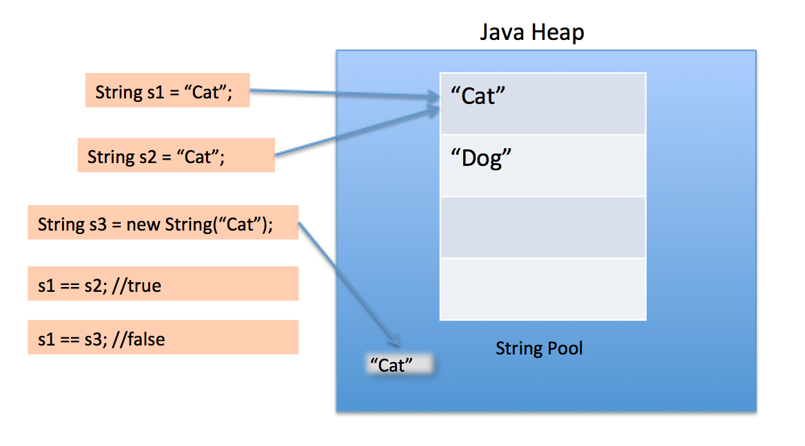
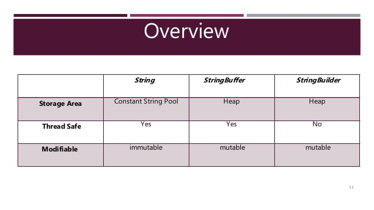

### Tasks


### Task
refactor this

```java
package demo;

import java.util.Scanner;

public class Main {
	
	public static void command_read() {
		System.out.println("Read command");
	}
	
	public static void command_write() {
		System.out.println("Write Command");
	}

	public static void main(String[] args) throws InterruptedException {
		Scanner in = new Scanner(System.in);
		
		loop: while(true) {
			System.out.println("Enter command:");
			String s = in.nextLine();
			switch(s) {
				case "exit": break loop;
				case "read": Main.command_read();
				break;
				case "write": Main.command_write();
				break;
				default: System.out.println("No valid command");
			}
		}
	}
}
```


### call priority
```java
class A{
	A(){
		System.out.println("A constructor called");
	}

	static{
		System.out.println("A static init called");
	}

	{
		System.out.println("A dynamic init called");
	}
}

class B extends A{
	B(){
		super();
		System.out.println("B constructor called");
	}

	static{
		System.out.println("B static init called");
	}

	{
		System.out.println("B dynamic init called");
	}
}
```


### Abstract class and interfaces
```java
interface A{
	void A();
}

interface B extends A{
	void B();
}

abstract class C implements B{}
class D implements B{}
```


### packege friendlly :)

```java
interface A{
	void A();
}

class B implements A{
	void A(){
		System.out.println("A");
	}
}	
```


### modifiers

```java

class Person{
	public void display(){
		//some operation
	}
}

class Employee extends Person{
	private void display(){
		//some operation
	}
	
	Person p=new Employee();
```


### modifiers
```java

class Person{
	protected void display(){
		System.out.println("Person");
	}
}

class Employee extends Person {
	public void display() {
		super.display();
		System.out.println("Employee");
	}
}

public class Main {

	public static void main(String[] args) {
		Person p = new Employee();
		p.display();
	}
}
```


### final
```java
class Person{
	final void say(){
		
	}
}

class Employee extends Person{
	void say(){
		
	}
}	
```


### private constructor
```java
class Person{
	private Person(){
		
	}
}

class Employee extends Person{
	
}
```


### mb, this = final
```java
public class Test  
{  
	public Test()  
	{  
		this = null;   
		System.out.println("Test class constructor called");  
	}  
	public static void main (String args[])  
	{  
		Test t = new Test();  
	}  
}  
```


### this and final
```java
class Main
{
	static int i = 10;
	public Main ()
	{
		System.out.println(this.i);
	}
	public static void main (String args[])
	{
		Main t = new Main();
	}
}
```


## Wrapper classes


### Wrapper classes
|Примітивний тип|Wrapper - class|
|-|-|
|boolean|Boolean|
|byte|Byte|
|char|Char|
|float|Float|
|double|Double|
|int|Integer|
|long|Long|
|short|Short|


### Why do we need wrappers
- java is not 100% object oriented programming language because of the 8 primitive types. Then wrapper classes are introduced to give the primitive types an object form.
- Collection framework or data-structures in Java works only with Objects. Also, key-value stores like HashMap accept only objects as both key and values.
- Wrapper classes provide many ready to use utility methods.


### Instantiation wrappers before 1.5
```java
Integer intVal = new Integer(10);
Float floatVal = new Float(2.5f);
```


### Instantiation wrappers since 1.5
```java
Integer intVal = 10;
Float floatVal = 2.5f;
```


### Boxing/unboxing
- Отже, в Java SE 5 був представлений механізм упакування / розпакування (boxing / unboxing).
- Автоупаковка і розпакування це функція перетворення примітивних типів в об'єктні і навпаки.


### Note about boxing/unboxing
Весь процес виконується автоматично середовищем виконання Java (JRE). Але слід бути обережним при реалізації цієї функції, тому що Вона може впливати на продуктивність вашої програми.


### Boxing examples
```java
Character ch = 'a';
```


### Boxing examples
```java
List<Integer> li = new ArrayList<>();
for (int i = 1; i &lt; 50; i += 2)
	li.add(i);
```


### Unboxing examples
```java
//before JDK 5
int i = iOb.intValue();
double d = dOb.doubleValue();
char c = cOb.charValue();
boolean b = bOb.booleanValue();

//after jdk 5
int i = iOb;
double d = dOb;
char c = cOb;
boolean b = bOb;
```


### Unboxing examples
```java
//before jdk 5
Integer iOb1 = new Integer(5);
Integer iOb2 = new Integer(7);
System.out.println(iOb1.intValue() > iOb2.intValue());

//after jdk 5
System.out.println(iOb1 > iOb2);
System.out.println(iOb1 + iOb2);
```


### Unboxing examples
```java
public class Main {
	public static void main(String[] args) {
		Integer iOb  = 10;
		method(iOb);
	}

	public static void method(int i) {
		System.out.println("int");
	}
}
```


### Unboxing examples
```java
public class Main {
	public static void main(String[] args) {
		Integer iOb  = 10;
		method(iOb);
	}

	public static void method(int i) {
		System.out.println("int");
	}

	public static void method(Integer iOb) { //Будет вызван данный метод
		System.out.println("Integer");
	}
}	
```


### Boxing/Unboxing arrays
```java
public class Main {
	public static void main(String[] args) {
		Integer[] iObs = new Integer[] {5, 10, 50, 2, 7};
		method(iObs); //Ошибка компиляции
	}

	public static void method(int ... i) {
		System.out.println("int[]");
	}
}	
```


### Compare two boxes
При сравнении классов-обёрток оператором == или !=, происходит сравнение по ссылкам, а не по значениям и может возникнуть путаница.


### Compare two boxes
```java
Integer a = 12;
Integer b = 12;
Integer c = 250;
Integer d = 250;

if(a == b)
	System.out.println("a equals b"); //executes
	
if(c == d)
	System.out.println("c equals d"); //will not executes
```


### Compare two boxes
- == between Integer, Long etc will check for reference equality
- Java maintains Integer pool from -128 to 127

```java
public static Integer valueOf(int i) {
	if(i >= -128 && i &lt;= IntegerCache.high)
		return IntegerCache.cache[i + 128];
	else
		return new Integer(i);
}
```


### Compare two boxe
- Cache doesnt work for new

```java
Integer a = new Integer(10);
Integer b = new Integer(10);

if (a == b)
	System.out.println("a == b");
```


### Common methods in boxes
- All boxes classes are final class

```java
public final class Integer extends Number implements Comparable<Integer> {
	.....
	
public final class Double extends Number implements Comparable<Double> {
```


### Common methods in boxes
- all primitive values are final

```java
public final class Double extends Number implements Comparable&lt;Double&gt; {
private final double value;
....

public final class Character implements Serializable, Comparable&lt;Character&gt; {
private final char value;
....	
```


### Common methods in boxes
- all boxes have geter for primitive value

```java
//Character
public char charValue() {
	return this.value;
}

//Double
public double doubleValue() {
	return this.value;
}
```


### Common methods in boxes
- All boxes, exept Boolean have min, max, and size constants

```java
public final class Double extends Number implements Comparable&lt;Double&gt; {
public static final double MAX_VALUE = 1.7976931348623157E308D;
public static final double MIN_NORMAL = 2.2250738585072014E-308D;
public static final int SIZE = 64;
public static final int BYTES = 8;	
```


### Common methods in boxes
- Boxes have compare and compareTo

```java
public int compareTo(Integer anotherInteger);
public static int compare(int x, int y);
```


### Common methods in boxes
- boxes have methods to parse from string

```java
public static int parseInt(String s) throws NumberFormatException;
public static double parseDouble(String s) throws NumberFormatException;
```


### Common methods in boxes
- boxes have ovveriden method toString


## strings classes


### String
- String class are final
- String char[] value are final

```java
public final class String implements Serializable, Comparable&lt;String&gt;, CharSequence {
....

//implementation before compact strings
private final char[] value;
```


### String
```java
String a = "qwe";
a.concat("asd");
System.out.println(a);
```


### String
- Java String uses string pooling
- ==, compare for reference


### String



### String
```java
String a = "qwe";
String b = "qwe";
String c = new String("qwe");

if(a == b)
	System.out.println("a == b"); //executes

if(b == c)
	System.out.println("b == c"); //not executes

if(b == "qwe")
	System.out.println("b == literal"); //executes valueOf()

if(b.equals("qwe"))
	System.out.println("b == literal equals"); //executes	
```


### String. Compact strings
- Strings in Java are internally represented by a char[] containing the characters of the String. And, every char is made up of 2 bytes because Java internally uses UTF-16.
- For instance, if a String contains a word in the English language, the leading 8 bits will all be 0 for every char, as an ASCII character can be represented using a single byte.


### String. Compact strings
- Java 9 has brought the concept of compact Strings back(compressed string in jdk 6).
- This means that whenever we create a String if all the characters of the String can be represented using a byte — LATIN-1 representation, a byte array will be used internally, such that one byte is given for one character.


### String. compact strings
```java
//Until now, the String was stored as a char[]:
private final char[] value;

//From now on, it’ll be a byte[]:
private final byte[] value;

//The variable coder:
private final byte coder;

//Where the coder can be:
static final byte LATIN1 = 0;
static final byte UTF16 = 1;
```


### String. compact strings
- With all the info the JVM needs ready and available, the CompactString VM option is enabled by default. To disable it, we can use:

```
+XX:-CompactStrings
```


### String. usefull methods
```java
public int length();
public boolean isEmpty();
public boolean equalsIgnoreCase(String anotherString);
public String substring(int beginIndex);
public String substring(int beginIndex, int endIndex);
public String replace(char oldChar, char newChar);
public String[] split(String regex);
public String trim();
public static String valueOf([primitive type] i);
```


### String. Why string is immutable
- Security: parameters are typically represented as String in network connections, database connection urls, usernames/passwords etc. If it were mutable, these parameters could be easily changed.
- Synchronization and concurrency: making String immutable automatically makes them thread safe thereby solving the synchronization issues.
- Caching: when compiler optimizes your String objects, it sees that if two objects have same value (a="test", and b="test") and thus you need only one string object (for both a and b, these two will point to the same object).


### StringBuilder
Java StringBuilder class is used to create mutable (modifiable) string. The Java StringBuilder class is same as StringBuffer class except that it is non-synchronized. It is available since JDK 1.5.


### StringBuilder. Usefull methods
```java
public StringBuilder append(String s);
public StringBuilder insert(int offset, String s)
public StringBuilder replace(int startIndex, int endIndex, String str)
public StringBuilder delete(int startIndex, int endIndex)
public StringBuilder reverse()
```


### StringBuilder. instantiating
```java
StringBuilder some = "qwe"; //wrong cannot convert
StringBuilder some = new StringBuilder("qwe") //correct
```


### StringBuilder. instantiating
```java
StringBuilder sb=new StringBuilder("Hello ");
sb.append("Java");//now original string is changed
System.out.println(sb);//prints Hello Java
```


### StringBuffer
- A thread-safe, mutable sequence of characters. A string buffer is like a String, but can be modified. At any
point in time it contains some particular sequence of characters, but the length and content of the sequence can
be changed through certain method calls.
- String buffers are safe for use by multiple threads. The methods are synchronized where necessary so that all
the operations on any particular instance behave as if they occur in some serial order that is consistent with
the order of the method calls made by each of the individual threads involved.
- The principal operations on a StringBuffer are the append and insert methods, which are overloaded so as to
accept data of any type.


### StringBuffer. instantiating
```java
StringBuffer some = "qwe"; //wrong
StringBuffer some = new StringBuffer("qwe"); //correct
```


### strings overview
