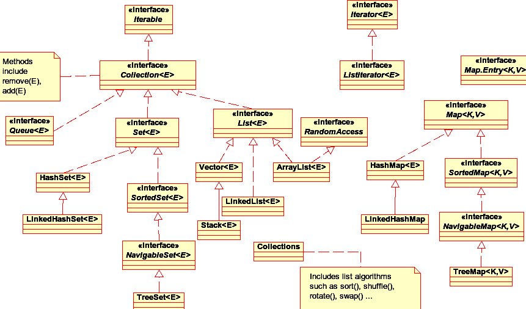
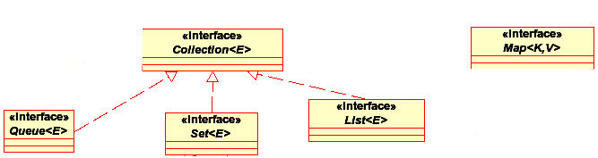
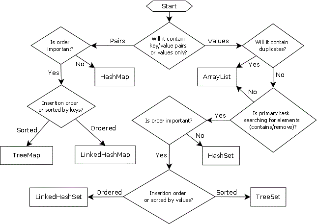
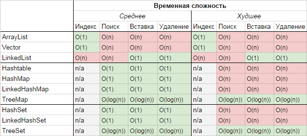

## Tasks


### Tasks
```java
//Line 1
switch (cardVal) {
 case 4:
 case 5:
 case 6:
 case 7:
 case 8:
  System.out.println("Hit");
  break;
 case 9:
 case 10:
 case 11:
  System.out.println("Double");
  break;
 case 15:
 case 16:
  System.out.println("Surrender");
  break;
 default:
  System.out.println("Stand");
}
```

Що можна підставити в Line1, щоб було написатано "Stand"

1. int cardVal = 6; 2. int cardVal = 10;
3. int cardVal = 14; 4. int cardVal = 18;


### Tasks
```java
class SuperClass {
 SuperClass(int x) {
  System.out.println("Super");
 }
}
public class SubClass extends SuperClass {
 SubClass() {
     //Line n1
	 System.out.println("Sub 2");
     }
}
```

Що можна підставити в Line1, щоб код скомпілювався:
1. this(10);
2. super(10);
3. SuperClass(10);
4. super.SuperClass (10);


### Tasks
```java
public abstract class Customer {
 private String name;
 public Customer(String name) {
  this.name = name;
 }
 public String getName() {
  return name;
 }
 public abstract void buy();
}
```

Які з цих тверджень правдиві?

1. Не сожна створити екземпляр каласу Customer.
2. Не можна унаслідувати клас Customer.
3. Підкласи Customer не можуть перевизначити метод getName().
4. Дочірній клас Customer повинен реалізувати метод buy().


### Tasks
```java
public interface MyInt {
 public void method1() {
  System.out.println("method1");
 }
 public default void method2() {
  System.out.println("method2");
 }
 public static void method3() {
  System.out.println("method3");
 }
 public abstract void method4();
}
```

Які з цих тверджень правдиві?

1. Лише method4() валідний.
2. method2() method4() валідні.
3. method2(), method3(), method4() валідні.
4. Всі методи валідні.


### Tasks
```java
class Vector{
  private int value;

  public Vector(int value){
    this.value = value;
  }

  public intVal(){
    return this.value;
  }

  public static Vector operator+(Vector vec1, Vector vec2){
    return new Vector(vec1.intVal() + vec2.intVal());
  }
}
```

Який результат виконання?

1. Все ок.
2. Код не скомпілюється.
3. Неправильний синтаксис перезавантаження оператора.


### Tasks
```java
Integer i1 = 22;
Integer i2 = 22;
if (i1 == i2)
	System.out.println("i1 == i2");
Integer i3 = 300;
Integer i4 = 300;
if(i3 == i4)
	System.out.println("i3 == i4");
if(i3.equals(i4))
	System.out.println("i3 == i4");
Integer i5 = new Integer(2);
Integer i6 = new Integer(2);
if(i5 == i6)
	System.out.println("i5 == i6");
```

Що буде напечатано:
1. i1 == i2 i3 == i4 i5 == i6
2. i3 == i4 i5 == i6
3. i1 == i2 i3 == i4
4. i1 == i2


### Tasks
```java
String s1 = "qwe";
String s2 = "qwe";
if(s1 == s2)
	System.out.println("s1 == s2");
String s3 = "zxc";
String s4 = "xcv";
if(s3 == s4)
	System.out.println("s3 == s4 dfd");
if(s3.equals(s4))
	System.out.println("s3 == s4");
String s5 = new String("a");
String s6 = new String("a");
if(s5 == s6)
	System.out.println("s5 == s6");
```

Що буде напечатано:
1. s1 ==s2 s3 == s4 s3 == s4 s5 == s6 
2. s3 == s4 s5 == s6
3. s1 == s2


## Generics


### Some history with c/c++
```cpp
#include <iostream>

int min(int a, int b)
{
	int result = a;
	if(a > b)
		result = b;
	return result;
}

int main()
{
	int minimalOfTwo = min(3,1);
	std::cout << minimalOfTwo << std::endl;
	return 0;
}
```


### Some history with c/c++
```cpp
int min(int a, int b)
{
	int result = a;
	if(a > b)
		result = b;
	return result;
}

int main()
{
	double minimalOfTwo = min(2.5,2.3);
	std::cout << minimalOfTwo << std::endl; //2
	return 0;
}
```


### Some history with c/c++
```cpp
int i_min(int a, int b)
{
	int result = a;
	if(a > b)
		result = b;
	return result;
}

double d_min(double a, double b)
{
	double result = a;
	if(a > b)
		result = b;
	return b;
}

int main()
{
	double minimalOfTwo = d_min(2.5,2.3);
	std::cout << minimalOfTwo <<std::endl; //2.3
	return 0;
}
```


### Some history with c/c++
```cpp
int min(int a, int b)
{
	int result = a;
	if(a > b)
		result = b;
	return result;
}

double min(double a, double b)
{
	double result = a;
	if(a > b)
		result = b;
	return b;
}

int main()
{
	double minimalOfTwo = min(2.5,2.3);
	std::cout << minimalOfTwo << std::endl;
	return 0;
}
```


### Some history with c/c++
```cpp
#include <iostream>

template<class T>
T min(T a, T b)
{
	T result = a;
	if(a > b)
		result = b;
	return result;
}

int main()
{
	int minimalOfTwoInt = min<int>(3,1); //<int> is not needed
	double minimalOfTwoD = min<double>(2.5,2.3); //<double> is not needed
	std::cout << minimalOfTwoInt << std::endl;
	std::cout << minimalOfTwoD << std::endl;
	return 0;
}
```


### generics
Узагальнення (generics) - це параметризовані типи.

Переваги generics

- Забезпечують безпеку типів на етапі компіляції
- Дозволять використовувати один алгоритм для різних типів даних


### Java generics. Before jdk5
```java
class Box {
	private Object item;
	public void setItem (Object o) {
		item = o;
	}
	public Object getItem () {
		return item;
	}
}

public class Test {
	public static void main(String[] args) {
		Box box = new Box();
		box.setItem("hello");
		String str1 = (String)box.getItem();
		System.out.println(str1);
	}
}
```


### Java. Runtime exeption
```java
class Box {
	private Object item;
	public void setItem (Object o) {
		item = o;
	}
	public Object getItem () {
		return item;
	}
}

public class Test {
	public static void main(String[] args) {
		Box box = new Box();
		box.setItem("hello");
		Integer int1 = (Integer)box.getItem();//Exception
		System.out.println(int1);
	}
}
```


### Java generics after jdk5
```java
class Box<T> {
	private T item;
	public void setItem (T o) {
		item = o;
	}
	public T getItem () {
		return item;
	}
}

public class Test {
	public static void main(String[] args) {
		Box<String> box = new Box<String>();
		box.setItem("hello");
		String str1 = box.getItem();
		System.out.println(str1);
	}
}
```


### Java generics. Compilation error
```java
class Box<T> {
	private T item;
	public void setItem (T o) {
		item = o;
	}
	public T getItem () {
		return item;
	}
}

public class Test {
	public static void main(String[] args) {
		Box<String> box = new Box<String>();
		box.setItem(1234567);//Exception
		String str1 = box.getItem();
		System.out.println(str1);
	}
}
```


### Java generics

Generics can be used only with referenced types 

```java
Box<int> box = new Box<int>(); //Error!
```


### Java generics

Restricted types. Upper restriction

```java
class Box <T extends Number>{
	private T item;
	public void setItem (T o) {
		item = o;
	}
	public Integer getIntValue () {
		return item.intValue();
	}
}

public class Test {
	public static void main(String[] args) {
		Box<Float> box = new Box<>();
		box.setItem(123.45F);
		Integer int1 = box.getIntValue();
		System.out.println(int1);
	}
}
```


### meta arguments
```java
class Box<Т> {}

class Human {
	public void useBox(Box<?> box) {}
}

public class Test {
	public static void main(String[] args) {
		Box<String> stringBox = new Box<>();
		Box<Number> numberBox = new Box<>();

		Human human = new Human();

		human.useBox(stringBox);
		human.useBox(numberBox);
	}
}
```


### Java generics. Generic interface
```java
interface Box<Т> {
	setItem(T item);
}

class BoxImpl implements Box<String> {
	public void setItem(String item) {}
}

public class Test {
	public static void main(String[] args) {
		Box<String> stringBox = new BoxImpl<>();
		stringBox.setItem("Hello World");
	}
}
```


### Java generics. Hierarchy
```java
class Box<Т> {
	public void setItem (T item) {}
}

class BigBox<K, T> extends Box<T> {
	public void setBigItems(K item, T item2) {}
}

public class Test {
	public static void main(String[] args) {
		BigBox<String, Integer> stringBox = new BigBox<>();
		stringBox.setItem("Very big item", 23);
	}
}
```


### Java generics. Old code and generics
```java
class Box<Т> {
	private T item;
	public void setItem (T item) {
		this.item = item;
	}
	public T getItem() {
		return item;
	}
}

public class Test {
	public static void main(String[] args) {
		Box box = new Box();
		box.setItem("string");
		String str = (String)box.getItem();
	}
}
```


## Collection Framework


### Collection Framework
**Java Collection Framework** - ієрархія інтерфейсів і їх реалізацій, яка є частиною JDK і дозволяє розробнику користуватися великою кількість структур даних з «коробки».


### Collection Framework



### Collection Framework
На вершині ієрархії в Java Collection Framework розташовуються 2 інтерфейсу: Collection і Map. Ці інтерфейси поділяють всі колекції, що входять у фреймворк на дві частини за типом зберігання даних: прості послідовні набори елементів і набори пар «ключ - значення» (словники).


### Collection Framework



### Collection Framework
**Collection** - цей інтерфейс знаходиться в складі JDK c версії 1.2 і визначає основні методи роботи з простими наборами елементів, які будуть спільними для всіх його реалізацій (наприклад size (), isEmpty (), add (E e) і ін.).


### Collection Framework
```java
public interface Collection < E > extends Iterable < E > {
 /**
  * Add an element to this collection.
  *
  */
 boolean add(E o);

 /**
  * Add the contents of a given collection to this collection.
  *
  */
 boolean addAll(Collection < ? extends E > c);

 /**
  * Clear the collection, such that a subsequent call to isEmpty() 
  */
 void clear();

 /**
  * Test whether this collection contains a given object as one of its
  * elements.
  *
  */
 boolean contains(Object o);

 /**
  * Test whether this collection contains every element in a given collection.
  */
 boolean containsAll(Collection < ? > c);

 /**
  * Test whether this collection is equal to some object. The Collection
  */
 boolean equals(Object o);

 /**
  * Obtain a hash code for this collection.
  */
 int hashCode();

 /**
  * Test whether this collection is empty, that is, if size() == 0.
  */
 boolean isEmpty();

 /**
  * Obtain an Iterator over this collection.
  */
 Iterator < E > iterator();

 /**
  * Remove a single occurrence of an object from this collection. That is
  */
 boolean remove(Object o);

 /**
  * Remove all elements of a given collection from this collection. That is,
  * remove every element e such that c.contains(e).
  */
 boolean removeAll(Collection < ? > c);

 /**
  * Remove all elements of this collection that are not contained in a given
  * collection.
  */
 boolean retainAll(Collection < ? > c);

 /**
  * Get the number of elements in this collection.
  */
 int size();

 /**
  * Copy the current contents of this collection into an array.
  */
 Object[] toArray();
}
```


### Collection Framework
**Map** - Даний інтерфейс також знаходиться в складі JDK c версії 1.2 і надає розробнику базові методи для роботи з даними виду «ключ - значення».


### Collection Framework
```java
public interface Map < K, V > {
 /**
  * Remove all entries from this Map (optional operation).
  */
 void clear();

 /**
  * Returns true if this contains a mapping for the given key.
  */
 boolean containsKey(Object key);

 /**
  * Returns true if this contains at least one mapping with the given value.
  */
 boolean containsValue(Object value);

 /**
  * Returns a set view of the mappings in this Map.  Each element in the
  * set is a Map.Entry.
  */
 Set < Map.Entry < K,
 V >> entrySet();

 /**
  * Compares the specified object with this map for equality. Returns
  * <code>true</code> if the other object is a Map with the same mappings
  */
 boolean equals(Object o);

 /**
  * Returns the value mapped by the given key. Returns <code>null</code> if
  * there is no mapping.
  */
 V get(Object key);

 /**
  * Associates the given key to the given value (optional operation). If the
  * map already contains the key, its value is replaced.
  */
 V put(K key, V value);

 /**
  * Returns the hash code for this map.
  */
 int hashCode();

 /**
  * Returns true if the map contains no mappings.
  */
 boolean isEmpty();

 /**
  * Returns a set view of the keys in this Map.
  */
 Set < K > keySet();

 /**
  * Copies all entries of the given map to this one
  */
 void putAll(Map < ? extends K, ? extends V > m);

 /**
  * Removes the mapping for this key if present (optional operation).
  */
 V remove(Object o);

 /**
  * Returns the number of key-value mappings in the map.
  */
 int size();

 /**
  * Returns a collection (or bag) view of the values in this Map.
  */
 Collection < V > values();
}
```


### List. ArrayList
**ArrayList** - автоматично розширюваний масив. Ви можете працювати з масивом, але при цьому не використовуються квадратні дужки.

Працювати з ArrayList просто: створіть потрібний об'єкт, вставте об'єкт методом add (), звертайтеся до нього методом get (), використовуйте індексування так само, як для масивів, але без квадратних дужок. ArrayList також містить метод size (), який повертає поточну кількість елементів в масиві (нагадаю, що в звичайному масиві використовується властивість length).


### List. ArrayList
```java
ArrayList<Integer> numbers = new ArrayList<>();
numbers.add(12);
numbers.add(500);
System.out.println("Element at index 0: " + numbers.get(0));
System.out.println("Is numbers contain 500 " + numbers.contains(500));
numbers.remove(Integer.valueOf(500));
System.out.println("Is numbers contain 500 " + numbers.contains(500));

for (Integer number : numbers) {
    System.out.println("elem " + number);
}
```


### List. Vector
**Vector** - реалізація динамічного масиву об'єктів. Дозволяє зберігати будь-які дані, включаючи null як елемент. Vector з'явився в JDK версії Java 1.0, але цю колекцію не рекомендується використовувати, якщо не потрібно досягнення потокобезпечна. Тому як в Vector, на відміну від інших реалізацій List, всі операції з даними є синхронізованими. В якості альтернативи часто застосовується аналог - ArrayList.


### List. Vector
```java
Vector<Integer> numbers = new Vector<>();
numbers.add(12);
numbers.add(500);
System.out.println("Element at index 0: " + numbers.get(0));
System.out.println("Is numbers contain 20 " + numbers.contains(500));
numbers.remove(Integer.valueOf(500));
System.out.println("Is numbers contain 20 " + numbers.contains(500));

for (Integer number : numbers) {
    System.out.println("elem " + number);
}
```


### List. Stack
**Stack** -  колекція є розширенням колекції Vector. Була додана в Java 1.0 як реалізація стека LIFO (last-in-first-out). Є частково синхронізованою колекцією (крім методу додавання push ()). Після додавання в Java 1.6 інтерфейсу Deque, рекомендується використовувати саме реалізації цього інтерфейсу, наприклад ArrayDeque.

Метод push () поміщає об'єкт в стек, а метод pop (), навпаки, витягує об'єкт з стека. Метод peek() може бути використаний для того щою бізнатися, який елемент знаходиться на вершині стека не видаляючи його.


### List. Stack
```java
Stack<Integer> s = new Stack<Integer>();
s.push(12);
s.push(33);
for (Integer integer : s) {
    System.out.println(integer);
}
s.pop();
s.peek();
for (Integer integer : s) {
    System.out.println(integer);
}
```


### List. LinkedList
**LinkedList** - ще одина реалізація List. Дозволяє зберігати будь-які дані, включаючи null. Особливістю реалізації даної колекції є те, що в її основі лежить двонаправлений зв'язаний список (кожен елемент має посилання на попередній і наступний).


### List. LinkedList
```java
LinkedList<Integer> integers = new LinkedList<Integer>();
integers.add(12);
integers.addFirst(33);
integers.addLast(44);
for (Integer integer : integers) {
    System.out.println(integer);
}
```


### Map. Hashtable
*Hashtable** - реалізація такої структури даних, як хеш-таблиця. Вона не дозволяє використовувати null як значення або ключа. Ця колекція була реалізована раніше, ніж Java Collection Framework, але надалі була включена в його склад. Як і інші колекції з Java 1.0, Hashtable є синхронізованою (майже всі методи позначені як synchronized). Через цю особливість у неї є істотні проблеми з продуктивністю і, починаючи з Java 1.2, в більшості випадків рекомендується використовувати інші реалізації інтерфейсу Map через відсутність у них синхронізації. Дана колекція не зберігає порядок елементів.


### Map. Hashtable
```java
Hashtable<String, String> hashtable = new Hashtable<String, String>();
hashtable.put("key1", "value1");
hashtable.put("key2", "value2");

for(String key: hashtable.keySet()) {
    System.out.println("Value is " + hashtable.get(key) + " for key " + key );
}
```


### Map. HashMap
**HashMap** - колекція є альтернативою Hashtable. Двома основними відмінностями від Hashtable є те, що HashMap не синхронізована і HashMap дозволяє використовувати null як в якості ключа, так і значення. Так само як і Hashtable, дана колекція не є упорядкованою: порядок зберігання елементів залежить від хеш-функції.


### Map. HashMap
```java
HashMap<String, String> hashtable = new HashMap<String, String>();
hashtable.put("key1", "value1");
hashtable.put("key2", "value2");

for(String key: hashtable.keySet()) {
    System.out.println("Value is " + hashtable.get(key) + " for key " + key );
}
```


### Map. LinkedHashMap
**LinkedHashMap** - це впорядкована реалізація хеш-таблиці. Тут, на відміну від HashMap, порядок перебору рівний порядку додавання елементів. Дана особливість досягається завдяки двонаправленим зв'язків між елементами (аналогічно LinkedList). Але ця перевага має також і недолік - збільшення пам'яті, яке занімає колекція.


### Map. LinkedHashMap
```java
LinkedHashMap<String, String> hashtable = new LinkedHashMap<String, String>();
hashtable.put("key1", "value1");
hashtable.put("key2", "value2");

for(String key: hashtable.keySet()) {
    System.out.println("Value is " + hashtable.get(key) + " for key " + key );
}
```


### Map. TreeMap
**TreeMap** - реалізація Map заснована на червоно-чорних деревах. Як і LinkedHashMap є впорядкованою. За замовчуванням, колекція сортується по ключам.


### Set. HashSet
**HashSet** - реалізація інтерфейсу Set, що базується на HashMap. Усередині використовує об'єкт HashMap для зберігання даних. Як ключ використовується для додавання, а в якості значення - об'єкт-заглушка (new Object ()). Через особливості реалізації порядок елементів не гарантується при додаванні.


### Set. HashSet
```java
HashSet<String> s = new HashSet<String>();
s.add("some");

for (String elem: s) {
    System.out.println(elem);
}
```


### Set. LinkedHashSet
**LinkedHashSet** - відрізняється від HashSet тільки тим, що в основі лежить LinkedHashMap замість HashSet. Завдяки цій відмінності порядок елементів при обході колекції є ідентичним порядку додавання елементів.


### Set. LinkedHashSet
```java
LinkedHashSet<String> s = new LinkedHashSet<String>();
s.add("some");
s.add("aa");
s.add("bbb");

for (String elem: s) {
    System.out.println(elem);
}
```


### Set. TreeSet
**TreeSet** - аналогічно іншим класам-реалізацій інтерфейсу Set містить в собі об'єкт NavigableMap, що й обумовлює його поведінку. Надає можливість управляти порядком елементів в колекції за допомогою об'єкта Comparator, або зберігає елементи з використанням "natural ordering".


### Set. TreeSet
```java
TreeSet<String> s = new TreeSet<String>();
s.add("some");
s.add("aa");
s.add("bbb");

for (String elem: s) {
    System.out.println(elem);
}
```


### Queue. PriorityQueue
Особливістю даної черги є можливість управління порядком елементів. За замовчуванням, елементи сортуються з використанням «natural ordering», але це поведінка може бути перевизначити за допомогою об'єкта Comparator, який задається при створенні черги. Ця колекція не підтримує null як елементи.


### Queue. PriorityQueue
```java
PriorityQueue<Integer> q = new PriorityQueue<>();
q.add(20);
q.add(1);

for (Integer elem: q) {
    System.out.println(elem);
}

q.peek();
q.poll();
```


### Queue. ArrayDeque
**ArrayDeque** - реалізація інтерфейсу Deque, який розширює інтерфейс Queue методами, що дозволяють реалізувати конструкцію виду LIFO (last-in-first-out). Інтерфейс Deque і реалізація ArrayDeque були додані в Java 1.6. Ця колекція представляє собою реалізацію з використанням масивів, подібно ArrayList, але не дозволяє звертатися до елементів за індексом і зберігання null. Як заявлено в документації, колекція працює швидше ніж Stack, якщо використовується як LIFO колекція, а також швидше ніж LinkedList, якщо використовується як FIFO.


### Queue. ArrayDeque
```java
// ArrayDEqueue as Queue
ArrayDeque<Integer> q = new ArrayDeque<>();
q.offer(Integer.valueOf(12));
q.offer(Integer.valueOf(22));
q.poll();
q.poll();

// ArrayDEqueue as Stack
ArrayDeque<Integer> s = new ArrayDeque<>();
s.push(Integer.valueOf(12));
s.push(Integer.valueOf(22));
s.pop();
s.pop();
```


### Як вибрати структуру даних?



### Як вибрати структуру даних?
