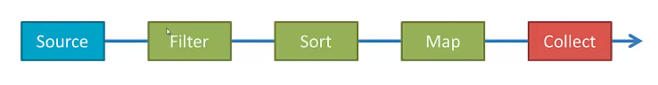

# Tasks


### Tasks
```java
class MyClass{}

public class Main {

	public static void main(String[] args) {
		MyClass class1 = new MyClass();
		System.out.println(class1.getClass().getSuperclass().getSuperclass().getName());
		
	}
}
```

- Object
- null
- Код не скомпілюється
- NullPointerException


### Tasks
```java
class MyClass{
	private String name;
	public String age;
}

public class Main {

	public static void main(String[] args) {
		System.out.println(MyClass.class.getMethods().length);
	}
}
```

- 0
- 2
- 1
- 9


### Tasks
```java
class MyClass{
	private String name;
	public String age;
}

public class Main {

	public static void main(String[] args) {
		System.out.println(MyClass.class.getFields().length);
	}
}
```

- 0
- 1
- 2
- 9


## Concurrency


### Concurrency
```java
public class Main {

	public static void main(String[] args) throws InterruptedException {
		System.out.println("Starting main");
		Thread.sleep(5000);
		System.out.println("End of main");
	}
}
```


### Concurrency
```java
class MyThread extends Thread {
	@Override
	public void run() {
		for(int i = 0; i < 5; i++) {
			System.out.println(i);
			try {
				Thread.sleep(500);
			} catch (InterruptedException e) {
				// TODO Auto-generated catch block
				e.printStackTrace();
			}
		}
	}
}

public class Main {

	public static void main(String[] args) throws InterruptedException {
		System.out.println("Starting main");
		MyThread myThread = new MyThread();
		myThread.start();
		Thread.sleep(5000);
		System.out.println("End of main");
	}
}
```


### Concurrency
```java
class MyThreadRunnable implements Runnable {
	@Override
	public void run() {
		for(int i = 0; i < 5; i++) {
			System.out.println(i);
			try {
				Thread.sleep(500);
			} catch (InterruptedException e) {
				// TODO Auto-generated catch block
				e.printStackTrace();
			}
		}
	}
}

public class Main {

	public static void main(String[] args) throws InterruptedException {
		System.out.println("Starting main");
		Thread myThread = new Thread(new MyThreadRunnable());
		myThread.start();
		Thread.sleep(5000);
		System.out.println("End of main");
	}
}
```


### Concurrency
```java
public class Main {

	public static void main(String[] args) throws InterruptedException {
		System.out.println("Starting main");
		Runnable r = () -> {
			for(int i = 0; i < 5; i++) {
				System.out.println(i);
				try {
					Thread.sleep(500);
				} catch (InterruptedException e) {
					// TODO Auto-generated catch block
					e.printStackTrace();
				}
			}
		};
		Thread thread = new Thread(r);
		thread.start();
		Thread.sleep(5000);
		System.out.println("End of main");
	}
}
```


### Concurrency

- Main thread не є демоном створеного потоку

```java
public class Main {

	public static void main(String[] args) throws InterruptedException {
		System.out.println("Starting main");
		new Thread(() -> {
			for(int i = 0; i < 7; i++) {
				System.out.println(i);
				try {
					Thread.sleep(1000);
				} catch (InterruptedException e) {
					// TODO Auto-generated catch block
					e.printStackTrace();
				}
			}
		}).start();
		Thread.sleep(5000);
		System.out.println("End of main");
	}
}
```


### Concurrency
- Зачикати завершення потоку

```java
public class Main {

	public static void main(String[] args) throws InterruptedException {
		System.out.println("Starting main");
		Thread thread = new Thread(() -> {
			for(int i = 0; i < 10; i++) {
				System.out.println(i);
				try {
					Thread.sleep(1000);
				} catch (InterruptedException e) {
					// TODO Auto-generated catch block
					e.printStackTrace();
				}
			}
			System.out.println("end of user thread");
		});
		thread.start();
		Thread.sleep(5000);
		thread.join();
		System.out.println("End of main");
	}
}
```


### Concurrency
```java
import java.util.ArrayList;
import java.util.Arrays;
import java.util.Collection;
import java.util.Collections;

public class Main {

	public static void main(String[] args) throws InterruptedException {
		Collection<Integer> syncCollection = Collections.synchronizedCollection(new ArrayList<>());
	    Runnable listOperations = () -> {
	        syncCollection.addAll(Arrays.asList(1, 2, 3, 4, 5, 6));
	    };
	     
	    Thread thread1 = new Thread(listOperations);
	    Thread thread2 = new Thread(listOperations);
	    thread1.start();
	    thread2.start();
	    thread1.join();
	    thread2.join();
	    
	    for (Integer item: syncCollection) {
	    	System.out.println(item);
	    }
	}
}
```


### Concurrency
```java
import java.util.ArrayList;
import java.util.Arrays;
import java.util.List;

public class Main {

	public static void main(String[] args) throws InterruptedException {
		List<Integer> list = new ArrayList<>();
	    Runnable listOperations = () -> {
	        list.addAll(Arrays.asList(1, 2, 3, 4, 5, 6));
	    };
	     
	    Thread thread1 = new Thread(listOperations);
	    Thread thread2 = new Thread(listOperations);
	    thread1.start();
	    thread2.start();
	    thread1.join();
	    thread2.join();
	    
	    for (Integer item: list) {
	    	System.out.println(item);
	    }
	}
}
```


## Optional


### Optional
```java
class Student {
	private String name;

	public Student(String name) {
		super();
		this.name = name;
	}

	public String getName() {
		return name;
	}

	public void setName(String name) {
		this.name = name;
	}
}

public class Main {
	
	public static Student findStudentByName(String name) {
		return null;
	}

	public static void main(String[] args) throws InterruptedException {
		Student s = findStudentByName("Alex");
		System.out.println(s.getName());
	}
}
```


### Optional
- Optional is a container object used to contain not-null objects. Optional object is used to represent null with absent value. This class has various utility methods to facilitate code to handle values as ‘available’ or ‘not available’ instead of checking null values. It is introduced in Java 8 and is similar to what Optional is in Guava.


### Optional
|Method|Description|
|-|-|
|T get()|If a value is present in this Optional, returns the value, otherwise throws NoSuchElementException.|
|void ifPresent(Consumer<? super T> consumer)|If a value is present, it invokes the specified consumer with the value, otherwise does nothing.|
|If a value is present, it invokes the specified consumer with the value, otherwise does nothing.|If a value is present, it invokes the specified consumer with the value, otherwise does nothing.|


### Optinal
```java
class Student {
	private String name;

	public Student(String name) {
		super();
		this.name = name;
	}

	public String getName() {
		return name;
	}

	public void setName(String name) {
		this.name = name;
	}
}

public class Main {
	
	public static Optional<Student> findStudentByName(String name) {
		return Optional.empty();
	}

	public static void main(String[] args) throws InterruptedException {
		Optional<Student> s = findStudentByName("Alex");
		if (s.isPresent()) {
			System.out.println("Student is present");
		}
	}
}
```


### Optinal
```java
class Student {
	private String name;

	public Student(String name) {
		super();
		this.name = name;
	}

	public String getName() {
		return name;
	}

	public void setName(String name) {
		this.name = name;
	}
}

public class Main {
	
	public static Optional<Student> findStudentByName(String name) {
		return Optional.of(new Student("Alex"));
	}

	public static void main(String[] args) throws InterruptedException {
		Optional<Student> s = findStudentByName("Alex");
		if (s.isPresent()) {
			System.out.println("Student is present");
		}
		s.ifPresent(stud -> System.out.println(stud.getName()));
	}
}
```


## streams


### streams
- A stream represents a sequence of elements and supports different kind of operations to perform computations upon those elements
- First of all, Java 8 Streams should not be confused with Java I/O streams (ex: FileInputStream etc); these have very little to do with each other.
- A stream pipeline consists of a source, followed by zero or more intermediate operations; and a terminal operation.
- A stream does not store data and, in that sense, is not a data structure. It also never modifies the underlying data source.


### streams
Stream Source: 

- Streams source can be created from collections, lists, sets, ints, longs, doubles, arrays, lines of a file
- Stream operations are either ointermediate or terminal.
- Intermediate operations such as filter, map or sort return a stream so we can chain multiple intermediate operations.
- Terminal operations such as forEach, collect or reduce are either void or return non-stream result.


### streams



### streams. intermediate operations
- Zero or more intermediate operations are allowed
- Order matters for large datasets: filter first, then sort or map
- For very large datasets use ParallelStream to enable multiple threads


### streams. intermediate operations
intermediate operations include: 

- distinct()
- filter()
- findFirst()
- map()
- skip()
- sorted()


### streams. terminal operations

- one terminal operation is allowed
- forEach applies the same function to each element
- collect saves the elements into a collection
- other options reduce the stream to a single summary element(count(), max(), min(), reduce())


### streams. examples
```java
IntStream
	.range(1,10)
	.forEach(System.out::print);
```


### streams. examples
```java
IntStream
	.range(1,10)
	.skip(5)
	.limit(2)
	.forEach(System.out::print);
```


### streams. examples
```java
int sum = IntStream
			.range(1,5)
			.sum();
System.out.println(sum);
```


### streams. examples
```java
Stream.of("Ava", "Aneri", "Alberto")
	.sorted()
	.findFirst()
	.ifPresent(System.out::println);
```


### streams. examples
```java
String[] names = {"Alex", "John", "Marry", "Kate", "Mick"};
Arrays.stream(names)
		.filter(x -> x.startsWith("M"))
		.sorted()
		.forEach(System.out::println);
```


### streams. examples
```java
Arrays.stream(new int[] {2,4,6,8,10})
		.map(x -> x*x)
		.average()
		.ifPresent(System.out::println);
```


### streams. examples
```java
List<String> peoples = Arrays.asList("Alex", "Anisha", "John", "Merry");
	peoples.stream()
			.map(String::toLowerCase)
			.filter(x -> x.startsWith("a"))
			.forEach(System.out::println);
```


### streams. examples
```java
try {
	Stream<String> csvStream = Files.lines(Paths.get("/home/endlesskwazar/Documents/dontTouch.csv"));
	csvStream
			.map(x ->  x.split(","))
			.filter(x -> x.length == 3)
			.collect(Collectors.toList())
			.stream()
				.forEach(x -> System.out.println(Arrays.toString(x)));
} catch (IOException e) {
	e.printStackTrace();
}
```


### streams. examples
```java
import java.util.Arrays;
import java.util.List;
import java.util.stream.Collectors;

class Person{
	String name;

	public String getName() {
		return name;
	}

	public void setName(String name) {
		this.name = name;
	}

	public int getAge() {
		return age;
	}

	public void setAge(int age) {
		this.age = age;
	}

	int age;

	public Person(String name, int age) {
		this.name = name;
		this.age = age;
	}

	@Override
	public String toString() {
		return "Person{" +
				"name='" + name + '\'' +
				", age=" + age +
				'}';
	}
}

class Main {
	public static void main(String[] args){
		List<Person> persons = Arrays.asList(new Person("Alex", 22), new Person("Marry", 44));
		List<Person> persontWichAgeGreaterThanThirty = persons.stream()
				.filter(x -> x.age > 30)
				.collect(Collectors.toList());
		persontWichAgeGreaterThanThirty
				.forEach(System.out::println);
	}
}
```
