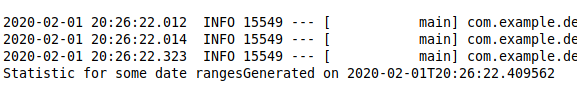
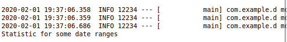

# Зміст

${toc}

# Історія і мотивація

## Мотивація до вивчення Java

Мало мов можуть похвалитися тим, що їм вдалося змінити загальне уявлення про програмування. Але і в цій "елітній" групі одна мова вирізняється з-поміж інших. ЇЇ вплив дуже швидко відчули всі програмісти. Мова, звичайно ж, йдеться про Java. Мова Java багато років залишається в топах.

### TIOBE community index

TIOBE індекс (рейтинг мов програмування) — показник популярності мов програмування. Розраховується виходячи з кількості результатів запитів до пошукових систем, що містять назву мови.


### The PYPL PopularitY of Programming Language Index is created by analyzing how often language tutorials are searched

PopularitY of Programming Language Index is created by analyzing how often language tutorials are searched.



### GitHub

Here are the most popular programming languages used at Github.


## Області застосування Java

- Java насамперед — це мова, яка використовується для серверних додатків у великих корпораціях. Особливо часто Java використовується в банках, страхових компаніях, роздрібних мережах т.д. Наприклад, такі банки як Deutsche Bank, Citigroup, Barclays, Goldman Sachs і багато-багато інших використовують Java для написання бек-енд і фронт-енд офісних електронних систем і т.д. Ще приклад, серверна частина Google+ написана на Java.
- Веб-додатки. Широке застосування Java знайшла в електронній комерції і в веб-додатках. Наприклад, якщо говорити про ринок Європи, США, багато веб-додатки держустанов, страхових, освітніх, оборонних установ написані на Java.
- Трейдингові додатки. Наприклад, LMAX, Murex.
- Android програми. Якщо у Вас телефон на Android, то всі програми в ньому написані на Java з використанням Google і Android API.

## Історія винекнення

Java - сильно типізований об'єктно-орієнтована мова програмування. Клас мови мультипарадигмальності: об'єктно-орієнтована, структурний, імперативний, компонентно-орієнтований, узагальнений, рефлективний, функціональний.

Мова Java була розроблена компанією Sun Microsystems, творцем якої був Джеймс Гослінг, і випущена в 1995 році в якості основних компонентів компанії Sun Microsystems - Java платформ (Java 1.0 [J2SE])

Спочатку мова називалася Oak («Дуб»), розроблялася для програмування побутових електронних пристроїв. Згодом вона була перейменована в Java і стала використовуватися для написання клієнтських додатків і серверного програмного забезпечення. Названа на честь марки кави Java, яка, у свою чергу, отримала найменування однойменного острова (Ява), тому на офіційній емблемі мови зображена чашка з гарячою кавою. Існує й інша версія походження назви мови, пов'язана з алюзією на кава-машину як приклад побутового пристрою, для програмування якого спочатку мова створювалася. Відповідно до етимології в російськомовній літературі з кінця двадцятого і до перших років ХХІ століття назва мови нерідко переводилося як Ява, а не як транскрибація, як це стало загальноприйнятим пізніше.

# Версіонування і різновиди платформи

Java має декілька поставок в залежності від того, що нам потрібно розробляти:

**Java SE** - стандартна версія. Це базова платформа програмування Java. Він містить всі бібліотеки і API, які повинен вивчити будь-який Java-програміст (java.lang, java.io, java.math, java.net, java.util і т.д.).
**Java EE**. Платформа Java (Enterprise Edition) відрізняється від стандарту Java (Java SE) в тому, що він додає бібліотеки, які надають функціональність для розгортання відмовостійкої, розподіленої багаторівневої Java програмне забезпечення, засноване в основному на модульних компонентах, які працюють на сервері додатків.
**Java ME (Micro Edition)**. Це платформа для розробки додатків для мобільних пристроїв і вбудованих систем, таких як телевізійні приставки. Java ME надає підмножина функцій Java SE, але також представляє бібліотеки, специфічні для мобільних пристроїв.

Починаючи з першої версії до java 8 проміжок часу між релізами був 3-5 років, що прекрасно підходить для стабільних enterprise - додатків.


Але в такій моделі є недоліки — платформа розвивається повільно. Тому Oracle вирішив змінити модель і випускати нову версію java кожні пів року. Починаючи з Java 9, більшість версій Java матиме термін служби лише 6 місяців. Після цього періоду оновлення версії не надаватимуться. Навіть якщо у вас є комерційний контракт з Oracle, ви не отримаєте жодних додаткових оновлень для Java 9 або 10 після цих 6 місяців. Крім того, всі 3 роки буде випущена версія Java LTS (довготривала підтримка). Першою версією з підтримкою LTS буде Java 11, яка запланована на осінь 2018 року. Ця версія LTS надаватиме комерційну підтримку з оновленнями протягом 8 років. Найважливіший факт полягає в тому, що до оновлень версій LTS можуть бути доступні та використані лише люди, які купують комерційну підтримку в Oracle. Мій досвід полягає в тому, що сьогодні більшість компаній, що розробляють програмне забезпечення на базі Java, не мають комерційної підтримки, оскільки випуск Java був досить «дружним», і прийняття новітньої версії було легким.


## JVM & JDK

Для виконання програм написаних на Java нам знадобиться JVM, яка входить в поставку JRE, а для їх розробки JDK.

- JVM(Java Virtual Machine) - середовище ("віртуальне"), в якому виконується скомпільований код.
- JRE(Java Runtime Environment). Просто пакет, який містить JVM і мінімальний набір бібліотек для роботи програм. І ще браузерні плагін, де будуть виконуватися аплети.
- JDK(Java Development Kit) - це вже повноцінний набір бібліотек і інструментів для створення, компіляції та дебага програм. Містить JRE.

# Як працює Java?

Програми на Java транслюються в байт-код Java, який виконується віртуальною машиною Java (JVM) – програмою, яка обробляє байт-код і передає інструкції обладнанню як інтерпретатор.

Байт-код або байт-код (англ. byte-code), іноді також використовується термін псевдокод — машинно-незалежний код низького рівня, що генерується транслятором і виконуваний інтерпретатором. Більшість інструкцій байт-коду еквівалентні одній або кільком командам асемблера. Трансляція в байт-код займає проміжне положення між компіляцією в машинний код і інтерпретацією.

Байт-код називається так тому, що довжина кожного коду операції — один байт, але довжина коду команди різна. Кожна інструкція є однобайтовим кодом операції від 0 до 255, за яким слідують такі параметри, як регістри або адреси пам'яті. Це в типовому випадку, але специфікація байт-коду значно відрізняється в мовах програмування.
Java:

```java
outer:
for (int i = 2; i < 1000; i++) {
    for (int j = 2; j < i; j++) {
        if (i % j == 0)
            continue outer;
    }
  System.out.println (i);
}
```

Байт-код:

```
 0:   iconst_2
 1:   istore_1
 2:   iload_1
 3:   sipush  1000
 6:   if_icmpge       44
 9:   iconst_2
 10:  istore_2
 11:  iload_2
 12:  iload_1
 13:  if_icmpge       31
 16:  iload_1
 17:  iload_2
 18:  irem
 19:  ifne    25
 22:  goto    38
 25:  iinc    2, 1
 28:  goto    11
 31:  getstatic       #84; //Field java/lang/System.out:Ljava/io/PrintStream;
 34:  iload_1
 35:  invokevirtual   #85; //Method java/io/PrintStream.println:(I)V
 38:  iinc    1, 1
 41:  goto    2
 44:  return
```

Перевагою подібного способу виконання програм є повна незалежність байт-коду від операційної системи і обладнання, що дозволяє виконувати Java-додатки на будь-якому пристрої, для якого існує відповідна віртуальна машина. Іншою важливою особливістю технології Java є гнучка система безпеки, в рамках якої виконання програми повністю контролюється віртуальною машиною. Будь-які операції, які перевищують встановлені повноваження програми (наприклад, спроба несанкціонованого доступу до даних або з'єднання з іншим комп'ютером), викликають негайне переривання.

Часто до недоліків концепції віртуальної машини відносять зниження продуктивності.

Ряд удосконалень дещо збільшив швидкість виконання програм на Java:
• застосування технології трансляції байт-коду в машинний код безпосередньо під час роботи програми (JIT-технологія) з можливістю збереження версій класу в машинному коді;
• широке використання переносного орієнтованого коду (native-код) в стандартних бібліотеках;
• апаратні засоби, що забезпечують прискорену обробку байт-коду (наприклад, технологія Jazelle, підтримувана деякими процесорами архітектури ARM).
Jazelle DBX (англ. Direct Bytecode eXecution, «безпосереднє виконання байт-коду») — технологія, що дозволяє виконання інструкцій байт-коду Java на апаратному рівні. Реалізована у деяких процесорах архітектури ARM.

Коли ми компілюємо .java файл, файл .class (містить байтовий код). Цей файл класу підходить різні етапи, коли ми його запускаємо. Ці кроки разом описують весь JVM.


Підсистема завантаження класів.
	Підсистема завантаження класів відповідає за:
- Завантаження.
- Лінкування.
- Ініціалізацію
      
**Завантаження**: Class loader зчитує файл класу .class, генерує відповідні бінарні дані та зберігає його в області методів. Для кожного файлу класу JVM зберігає наступну інформацію в області методів.

- Повністю кваліфіковане ім'я завантаженого класу та його найближчий батьківський клас.
- Чи .class файл пов'язаний з класом або інтерфейсом або перечисленням
- Модифікатор, змінні та метод інформації і т.д.

Після завантаження файлу класу JVM створює об'єкт класу типу, який представляє цей файл у пам'яті купі. 
**Лінкування**: виконує перевірку, підготовку.
- Верифікація: перевірка коректності файлу .class, тобто він перевіряє, чи цей файл правильно відформатовано та створено дійсним компілятором чи ні. Якщо перевірка не пройшла, ми отримуємо виняток runtime exception java.lang.VerifyError.
- Підготовка: JVM виділяє пам'ять для змінних класу та ініціалізує пам'ять за замовчуванням.

**Ініціалізація**: на цьому етапі всі статичні змінні присвоюються своїми значеннями, визначеними в коді та статичному блоці (якщо такі є). Це виконується зверху вниз у класі та від батьків до дочірнього в ієрархії класів.

Загалом, є три види class loader:
- Bootstrap class loader: кожна реалізація JVM повинна мати bootstrap class loader, здатний завантажувати довірені класи. Він завантажує основні класи Java, присутні в каталозі JAVA_HOME / jre / lib. Цей шлях відомий як шлях початкового шляху. Він реалізується рідними мовами, такими як C, C ++.
- Extension class loader: це дочірній завантажувач по — відношенню до bootstrap class loader. Він завантажує класи, що містяться в каталогах розширень JAVA_HOME / jre / lib / ext (шлях розширення) або будь-який інший каталог, вказаний властивістю java.ext.dirs. Вона реалізована в Java для класу Sun.misc.Launcher $ ExtClassLoader.
- System/Application class loader: це дочірній завантажувач класів по — відношенню до extension class loader. Він несе відповідальність за завантаження класів зі шляху класу додатків. Він внутрішньо використовує змінні середовища, які зв'язані з java.class.path. Він також реалізується в Java класом sun.misc.Launcher $ AppClassLoader.

Зауважте. JVM дотримується принципу делегування-ієрархії для завантаження класів. System class loader делегує запит на extension class loader і extension class loader делегує запит на bootstrap class loader. Якщо клас знайшовся у шляху bootstrap class loader, клас завантажується, інакше запит буде знову переміщено до extension class loader, а потім до system class loader(рис. 5). Нарешті, якщо завантажувач системного класу не завантажує клас, ми отримуємо виняток виконання, java.lang.ClassNotFoundException.



# Будування і виконання java - додатків використовуючи утиліти javac, java, jar

Завантажте і установіть [Oracle JDK](https://www.oracle.com/technetwork/java/javase/downloads/index.html). Відкрийте термінал і перевірте чи правильно установлені утиліти java і javac.


Спробуймо написати та скомпілювати, вже класичну, першу програму на Java, яка виводить на термінал повідомлення “Hello World”.

Для початку відкрийте Блокнот, або інший текстовий редактор і напишіть наступний код:

```java
class Hello {
	public static void main(String[] args) {
		System.out.println("Hello World");
	}
}
```

Збережіть файл під іменем hello.java.

Для того щоб запустити цей код потрібно транслювати його в байт-код. Це можна зробити за допомогою командної утиліти javac


Інструмент javac читає визначення класів та інтерфейсів, написаних мовою програмування Java, і збирає їх у файли класу байт-коді. Він також може обробляти анотації у вихідних файлах та класах Java.

Існує два способи передачі назв файлів джерельного коду в javac:
- Для невеликої кількості вихідних файлів просто перелічіть імена файлів у командному рядку.
- Для великої кількості вихідних файлів перелічіть імена файлів у файлі, розділені заголовками чи перервами рядка. Потім використовуйте ім'я файлу списку у командному рядку javac, перед яким передує символ @.

**Примітка**. Якщо при спробі скомпілювати програму компілятор javac не буде знайдений, вам доведеться вказати повний шлях до інструментальних засобів JDK, доступним з командного рядка, при умові, що комплект JDK встановлений правильно. У Windows це, наприклад, означає, що вам потрібно ввести шлях до доступних з командного рядка інструментальних засобів JDK, зазначений в змінній середовища РАТН. Так, якщо комплект JDK 10 встановлений в обираних за замовченням каталогах, шлях до його інструментальних засобів буде наступним: С:\ Program Files \Java \ jdkl.10.2 \ Ьin. (Зрозуміло, якщо комплект JDK 10 встановлений в іншому каталозі або використовується інша версія, цей шлях треба змінити.) Щоб дізнатися, як ставити шлях до файлів, зверніться до довідкової системи конкретної операційної системи, оскільки в різних операційних системах ця процедура може відрізнятися.

Щоб запустити згенерований байт-код на виконання потрібно передати назву згенерованого файлу(Hello) в середовище віртуальної машини — командна утиліта java:


Інструмент java запускає додаток Java. Відбувається запуск середовища виконання Java, завантаження вказаного class-файлу, і виклик основного методу.

Метод повинен бути оголошений загальнодоступним і статичним, він не повинен повертати значення, і він повинен приймати масив типу String як параметр. Оголошення методу повинно бути схожим на наступне:

```java
public static void main (String args [])
```

В утиліти java є ряд стандартних опцій, які підтримуються на поточному середовищі виконання і будуть підтримуватися в майбутніх випусках. Розглянемо найбільш часто використовувані параметри.

|Параметр|Пояснення|
|-|-|
|-Xms|Цей параметр полягає у визначенні початкового розміру купи для JVM, наприклад, Xms2048m означає, що початковий розмір купі JVM становить 2 Гб.
|-Xmx|Цей параметр полягає в тому, щоб вказати максимальний розмір купи JVM, наприклад, Xmx2048m означає, що максимальний розмір купи JVM буде 2 ГБ. Ви майже завжди будете бачити -Xms та -Xmx разом. Також важливим є їх співвідношення, 1:1 або 1:1,5 виявляється більш ефективним.|
|-verbose:gc|Цей параметр JVM використовується для ввімкнення журналу збору сміття у вашій програмі Java|

Приклад запуску, використовуючи параметри jvm:

```
java Hello -Xms256 -Xmx256 -verbose:gc
```

Іноді, програма на java може містити в собі тисячі .class – файлів. Тоді їх розповсюдження стає складним процесом. Щоб спростити розповсюдження і збереження використовуються jar – архіви.

JAR-файл - це Java-архів (Java Archive). Це просто архівний файл, зжатий (іноді з нульовою компресією) по алгоритму zip.

JAR – файл може містити:
- файл маніфесту META-INF/MANIFEST.MF
- java-файли (джерельний код)
- .class-файли
- файли, необхідні для роботи програми: картинки, файли з настройками та інше (ресурси)
- електронні підписи, які дозволяють захистити програму від модифікації

Маніфест — це текстовий файл формату ключ — значення: він містить опис jar-файлу. В нього можуть бути наступні ключі:
- Manifest-Version - версія маніфесту.
- Main-Class - назва головного класу (повинен мати основний метод), такий jar-файл можна запустити як звичайний виконуваний файл.
- Class-Path - дозволяє вказати CLASSPATH, який необхідний для повноцінної роботи програми.
- SHA-Digest - контрольна сума певної файлу всередині архіву.

Крім того, існують також інші архіви, пов'язані з Java:

- WAR (Web Application aRchive) - містить в собі додаток для веба.
- EAR (Enterprise Application aRchive) - містить у собі ентерпрайзис програму (звичайно з декількох модулів).
- APK (Android aPplication pacKage) - містить в собі додаток для Android.

**P.S.** У перекладі з англійської, jar - означає банку, скляний або керамічний циліндричний контейнер з широким горлом, призначений для зберігання їжі (зазвичай). Кава часту зберігають в банках, так що тут гра слів: банку з кавою — банку з java-класами.

Щоб створити JAR-файл за допомогою інструмента "jar", виконайте команду jar (в оболонці CMD) з опцією "c"
```
jar cvf jarFile inputFileDir1 inputFileDir2 ...
```

де:
- Параметр "c" вказує на те, що ви хочете створити новий файл JAR;
- Параметр 'v' вмикає режим, в якому відображаються інформаційні повідомлення;
- 'f' вказує, що ім’я вихідного файлу буде jarfile (замість стандартного виводу за замовчуванням).

Приклад:
```
jar cvf hello.jar *.class
```

Дана команда запакує всі .class файли в робочій директорії та створить маніфест за замовчуванням.


Для запуску jar – файлу в утиліті java потрібно вказати параметр -jar з ім’ям файлу. Якщо ми спробуємо запустити щойно створений файл виникне помилка, оскільки в маніфесті відсутнє значення головного класу.


Розпакуйте файл hello.jar і скопіюйте файл META-INF/MANIFEST.MF до кореневої директорії. Змініть його вміст
```
Manifest-Version: 1.0
Created-By: 10.0.2 (Oracle Corporation)
Main-Class: Hello
```

Для того, щоб створити jar-файл і вручну запакувати в нього маніфест потрібно виконати наступну команду:

```
jar cvfm hello.jar MANIFEST.MF *.class 
```

Тепер ми можемо запустити програму на виконання.


# Домашнє завдання

Створіть файл main.java, який містить клас із методом main. В залежності від операційної системи створіть файл .bat або .sh, який збудує, запакує файл в jar і запустить його.

# Контрольні запитання

1. Що таке JVM, JDK?
2. Яка різниця між Java SE і Java EE?
3. Як працює JVM?
4. Поясніть процес збирання java - додатка.