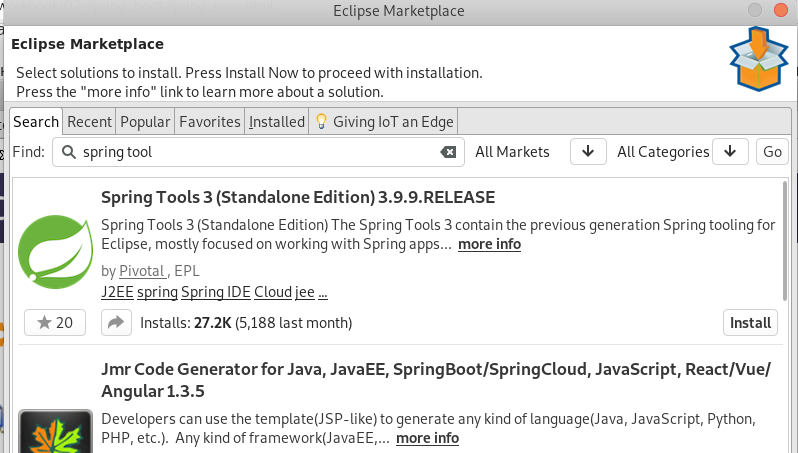
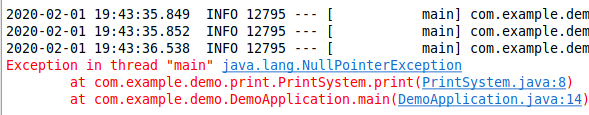
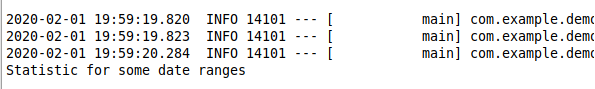

# Spring Core

${toc}

# Інверсія керування(IoC)

**Інверсія управління** (англ. Inversion of Control, IoC) - важливий принцип об'єктно-орієнтованого програмування, що використовується для зменшення зачеплення в комп'ютерних програмах. Також архітектурне рішення інтеграції, що спрощує розширення можливостей системи, при якому потік управління програми контролюється фреймворком.

методи реалізації:

- Шаблон «Фабрика» (англ. Factory pattern)
- Локатор служб (Service Locator)
- Впровадження залежності (англ. Dependency injection)

# Що таке Dependency injection?

Впровадження залежності (англ. Dependency injection, DI) — шаблон проектування програмного забезпечення, що передбачає надання зовнішньої залежності програмному компоненту, використовуючи «інверсію управління» (англ. Inversion of control, IoC) для розв'язання (отримання) залежностей.

Впровадження — це передача залежності (тобто, сервісу) залежному об'єкту (тобто, клієнту). Передавати залежності клієнту замість дозволити клієнту створити сервіс є фундаментальною вимогою до цього шаблону проектування.

## Приклад

Уявіть собі, що ми проектуємо систему в, якій кожного місяця потрібно виводити статистику на екран(статистику продаж тощо). Нехай цей об'єкт буди мати інтерфейс:

```java
public interface StatisticReporter {
	void report();
}
```

Все доволі просто, об'єкт буде мати один метод в інтерфейсі report(), який і виводить статистику на екран.

Користовуч може забажати мати статистику в різних форматах - HTML, XML, DOC. Для цих цілей ми введимо в системі інтерфейс:

```java
public interface Formatter {
	String format(String text);
}
```

І Зробимо декілька реалізації:

```java
public class HtmlFormatter implements Formatter {

	public String format(String text) {
		return "HTml format";
	}

}
```

```java
public class XMLFormatter implements Formatter {

	public String format(String text) {
		return "Xml format";
	}

}
```

І нерешті зробимо реалізацію StatisticReporter:

```java
public class StatisticReporterImpl implements StatisticReporter {
	
	HtmlFormatter formatter = new HtmlFormatter();
	
	public void report() {
		String report = "This is report";
		String outRep = formatter.format(report);
		System.out.print(outRep);
	}

}
```

Тестуємо систему:

```java
public class Main {
	
	public static void main(String[] args) {
		StatisticReporterImpl statisticReporterImpl = new StatisticReporterImpl();
		statisticReporterImpl.report();
	}
}
```

Якщо ми пішли таки шляхом, для того щоб виводити статистику в іншому форматы нам, або доведеться змінювати реалізацію statisticReporterImpl, або створювати ще один клас, який реалізує StatisticReporter.

Можна підти і іншим шляхом, замість того щоб створювати об'єкт Formatter всередині StatisticReporterImpl можна передати його ззовні:

```java
package test;

public class StatisticReporterImpl implements StatisticReporter {
	
	private Formatter formatter;
	
	public StatisticReporterImpl(Formatter formatter) {
		this.formatter = formatter;
	}
	
	public void report() {
		String report = "This is report";
		String outRep = formatter.format(report);
		System.out.print(outRep);
	}

}
```

```java
public class Main {
	
	public static void main(String[] args) {
		Formatter formatter = new HtmlFormatter();
		StatisticReporterImpl statisticReporterImpl = new StatisticReporterImpl(formatter);
		statisticReporterImpl.report();
	}
}
```

# Ще раз про IoC і DI

# Spring Boot

Через громіздку конфігурацію залежностей налаштування Spring для корпоративних додатків перетворилася в досить втомлива і схильне до помилок заняття. Особливо це відноситься до додатків, які використовують також кілька сторонніх бібліотек.

Автори Spring вирішили надати розробникам деякі утиліти, які автоматизують процедуру настройки і прискорюють процес створення і розгортання Spring-додатків, під загальною назвою **Spring Boot**.

**Spring Boot** - це корисний проект, метою якого є спрощення створення додатків на основі Spring. Він дозволяє найбільш простим способом створити web-додаток, вимагаючи від розробників мінімум зусиль по його настройці.

## Особливості Spring Boot

### Керування залежностями

Щоб прискорити процес управління залежностями, Spring Boot неявно упаковує необхідні сторонні залежності для кожного типу додатки на основі Spring і надає їх розробнику за допомогою так званих starter-пакетів (spring-boot-starter-web, spring-boot-starter-data-jpa і т . Д.).

**Starter-пакети** становлять собою набір зручних дескрипторів залежностей, які можна включити в свій додаток. Це дозволить отримати універсальне рішення для всіх, пов'язаних зі Spring технологій, позбавляючи програміста від зайвого пошуку прикладів коду та завантаження з них необхідних дескрипторів залежностей (приклад таких дескрипторів і стартових пакетів буде показаний нижче).

Іншими словами, Spring Boot збирає всі загальні залежності і визначає їх в одному місці, що дозволяє розробникам просто використовувати їх, замість того, щоб винаходити колесо кожен раз, коли вони створюють новий додаток.

Отже, при використанні Spring Boot, файл pom.xml містить набагато менше рядків, ніж при використанні його в Spring-додатках.

Подивитися start - пакети можна [в документації](https://docs.spring.io/spring-boot/docs/current/reference/htmlsingle/#using-boot-starter).

### Автоматична конфігурація

Після вибору підходящого starter-пакета, Spring Boot спробує автоматично налаштувати Spring-додаток на основі доданих вами jar-залежностей.

Наприклад, якщо ви додасте Spring-boot-starter-web, Spring Boot автоматично сконфигурирует такі зареєстровані біни, як DispatcherServlet, ResourceHandlers, MessageSource.

Якщо ви використовуєте spring-boot-starter-jdbc, Spring Boot автоматично реєструє біни DataSource, EntityManagerFactory, TransactionManager і зчитує інформацію для підключення до бази даних з файлу application.properties.

Якщо ви не збираєтеся використовувати базу даних, і не надаєте ніяких докладних відомостей про підключення в ручному режимі, Spring Boot автоматично налаштує базу в пам'яті, без будь-якої додаткової конфігурації з вашого боку (при наявності H2 або HSQL бібліотек).

Автоматична конфігурація може бути повністю перевизначена в будь-який момент за допомогою налаштувань.

### Вбудований сервлет - контейнер

Кожний Spring Boot web-додаток включає вбудований web-сервер. Подивіться на список контейнерів сервлетів, які підтримуються "з коробки".

Розробникам тепер не треба турбуватися про налаштування контейнера сервлетів і розгортанні додатки на ньому. Тепер додаток може запускатися саме, як виконуваний jar-файл з використанням вбудованого сервера.

Створення автономних web-додатків з вбудованими серверами не тільки зручно для розробки, а й є допустимим рішенням для додатків корпоративного рівня і стає все більш корисно в світі мікросервісов.

# Eclipse і Spring Boot

Для інтеграції Eclpse і Spring Boot потрібно встановити плагін. Для цього:

1. Перейдіть в Help -> Eclipse Marketplace...


2. Зробіть пошук по spring tool
   


3. Встановіть плагін і перезавантажте Eclipse


# Spring Core

Spring Core забезпечує ключові частини фреймворка, включаючи властивості IoC і DI.

# Створюємо проект

Для початку створимо spring boot - проект, для цього File -> New -> Other і виконаємо пошук по ключовому слову spring, далі вибераємо Spring Starter project:


Далі перед нами з'явиться діалогове вікно із налаштуванням проекту. Із багатьома із цих налаштувань Ви повинні бути знайомі так-як вивчали Maven. Я залишу все за замовчуванням.


Наступним етапом є вибір залежностей для проекту. В нашому випадку ми не будемо нічого вибирати.


В результаті буде створений наступний проект.


Він містить лише main класс, який є точкою входу в Spring Boot Application. Вся магія конфігурації Spring Boot прихована в анотації @SpringBootApplicationю

# Конфігурація впровадження, використовуючи XML

Створимо наступні класи і інтерфейси в проекті:

**Printable.java:**
```java
package com.example.demo.print;

public interface Printable {

	public String getTextToPrint();
	
}
```

**Statistic.java:**
```java
package com.example.demo.print;

public class Statistic implements Printable {

	@Override
	public String getTextToPrint() {
		return "Statistic for some date ranges";
	}

}
```

**PrintSystem.java:**
```java
package com.example.demo.print;

public class PrintSystem {
	
	Printable source = new Statistic();

	public Printable getSource() {
		return source;
	}

	public void setSource(Printable source) {
		this.source = source;
	}
	
	public String print() {
		return source.getTextToPrint();
	}

}
```

Перевіримо роботоспроможність класів, модифікувавши main - клас:
```java
public static void main(String[] args) {
	SpringApplication.run(DemoApplication.class, args);
	PrintSystem printSystem = new PrintSystem();
	System.out.println(printSystem.print());
}
```


Головною проблемо коду є наступний рядок, який пов'язую класи PrintSystem і Statistic місним зв'язком.

```java
Printable source = new Statistic();
```

Давайте видалимо ініціалізацію Printable взагалі. Звісно після цього код уже не буде працювати:



**Тепер в дію вступає DI і IoC.**

Створимо файл beans.xml в src/main/resources з наступним вмістом:

```xml
<?xml version="1.0" encoding="UTF-8"?>
<beans xmlns="http://www.springframework.org/schema/beans"
	xmlns:xsi="http://www.w3.org/2001/XMLSchema-instance"
	xsi:schemaLocation="http://www.springframework.org/schema/beans http://www.springframework.org/schema/beans/spring-beans.xsd">
	<bean 
		id="statistic"
		class="com.example.demo.print.Statistic"/>
	<bean 
		id="printSystem"
		class="com.example.demo.print.PrintSystem">
	<property name="source" ref="statistic"/>
	</bean>
</beans>
```

Ми створюємо опис створення стіорення класів і надання їм залежностей. Що тепер протестувати код, ми не можемо вручну створити екземпляр класу PrintSystem. Нам доведеться взяти його із контексту:

```java
public static void main(String[] args) {
	SpringApplication.run(DemoApplication.class, args);
	ApplicationContext applicationContext = new ClassPathXmlApplicationContext("beans.xml");
	PrintSystem printSystem = applicationContext.getBean("printSystem", PrintSystem.class);
	System.out.println(printSystem.print());
}
```



В цьому випадку ми використали впровадження залежностей використовуючи setter. Який повинен бути визначений в класі. Також можна використати конструктор для впровадження залежностей.

Модифікуємо PrintSystem:

```java
public class PrintSystem {
	
	public PrintSystem(Printable source) {
		this.source = source;
	}
	
	private Printable source;

	public String print() {
		return source.getTextToPrint();
	}

}
```

Модифікуємо beans.xml
```xml
<?xml version="1.0" encoding="UTF-8"?>
<beans xmlns="http://www.springframework.org/schema/beans"
	xmlns:xsi="http://www.w3.org/2001/XMLSchema-instance"
	xsi:schemaLocation="http://www.springframework.org/schema/beans http://www.springframework.org/schema/beans/spring-beans.xsd">
	<bean 
		id="statistic"
		class="com.example.demo.print.Statistic"/>
	<bean 
		id="printSystem"
		class="com.example.demo.print.PrintSystem">
	<constructor-arg ref="statistic" />
	</bean>
</beans>
```

Для закріплення давайте додамо ще один клас:

Cnf.java
```java
package com.example.demo.print;

import java.time.LocalDateTime;

public class Cnf {
	
	private final LocalDateTime current;
	
	public Cnf() {
		current = LocalDateTime.now();
	}
	
	public String getInfo() {
		return "Generated on " + current.toString();
	}
}
```

Модифікуємо Statistic.java:

```java
package com.example.demo.print;

public class Statistic implements Printable {
	
	private final Cnf cnf;
	
	public Statistic(Cnf cnf) {
		this.cnf= cnf;
	}

	@Override
	public String getTextToPrint() {
		return "Statistic for some date ranges" + cnf.getInfo();
	}

}
```

І модифікуємо beans.xml для того щоб наша система запрацювала:

```xml
<?xml version="1.0" encoding="UTF-8"?>
<beans xmlns="http://www.springframework.org/schema/beans"
	xmlns:xsi="http://www.w3.org/2001/XMLSchema-instance"
	xsi:schemaLocation="http://www.springframework.org/schema/beans http://www.springframework.org/schema/beans/spring-beans.xsd">
	<bean id="cnf" class="com.example.demo.print.Cnf" />
	<bean id="statistic" class="com.example.demo.print.Statistic">
		<constructor-arg ref="cnf" />
	</bean>
	<bean id="printSystem" class="com.example.demo.print.PrintSystem">
		<constructor-arg ref="statistic" />
	</bean>
</beans>
```


Проект можнай знайти на https://github.com/endlesskwazar/spring-examples гілка - di-xml


# Конфігурація впровадження, використовуючи Java

Ми з Вами вже розглянули впровадження залежностей чере описання в файлі XML. Цей спосіб існував із самого початку і на теперішній момент є дещо застарілий, тепер натомість можна використовувати Java - конфігурацію, точніше анотації.

Давайте розглянемо теорію перед тим як переходити до практики.

Для того щоб Spring знав про клас, який може бути використаний для запровадження потрібно використати одну із декількох анотацій: Component, Controller, Service, Repository.

Кожна з цих анотацій слугує одній цілі, але розділення несе в собі класифікацію компонентів і внутрішню логіку роботи з цими класами в самому Spring:

|Анотація|Пояснення|
|-|-|
|Component|Загальний тип|
|Controller|Тип презентаційного шару|
|Service|Тип шару сервісів|
|Repository|Тип шару доступу до даних|

Після того, як всі необхідні залежності помічені, в тих місцях де потріюно впроваджквати залежності потрібно використати анотацію Autowired.

В якості прикладу використаємо нащ минулий проект. Видалимо із нього beans.xml. Зрозуміло, що після цього проект працювати не буде.

Давайте використаємо всі ті анотації, які ми розглянули:

**Cnf.java**
```java
package com.example.demo.print;

import java.time.LocalDateTime;

import org.springframework.stereotype.Component;

@Component
public class Cnf {
	
	private final LocalDateTime current;
	
	public Cnf() {
		current = LocalDateTime.now();
	}
	
	public String getInfo() {
		return "Generated on " + current.toString();
	}
}
```

**PrintSystem.java***
```java
package com.example.demo.print;

import org.springframework.beans.factory.annotation.Autowired;
import org.springframework.stereotype.Component;

@Component
public class PrintSystem {
	
	public PrintSystem(Printable source) {
		this.source = source;
	}
	
	@Autowired
	private Printable source;

	public String print() {
		return source.getTextToPrint();
	}

}
```

**Statistic.java**
```java
package com.example.demo.print;

import org.springframework.beans.factory.annotation.Autowired;
import org.springframework.stereotype.Component;

@Component
public class Statistic implements Printable {
	
	@Autowired
	private final Cnf cnf;
	
	public Statistic(Cnf cnf) {
		this.cnf= cnf;
	}

	@Override
	public String getTextToPrint() {
		return "Statistic for some date ranges" + cnf.getInfo();
	}

}
```

Для того щоб додаток запрацював також потрібно модифікувати main - клас:

```java
package com.example.demo;

import org.springframework.boot.SpringApplication;
import org.springframework.boot.autoconfigure.SpringBootApplication;
import org.springframework.context.ApplicationContext;

import com.example.demo.print.PrintSystem;

@SpringBootApplication
public class DemoApplication {

	public static void main(String[] args) {
		ApplicationContext applicationContext = SpringApplication.run(DemoApplication.class, args);
	    PrintSystem printSystem = applicationContext.getBean(PrintSystem.class);
		System.out.println(printSystem.print());
	}

}
```


# Домашня робота

# Контрольні запитання

1. ваів
2. іваів
3. аіва
4. іва
5. іваі

