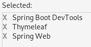
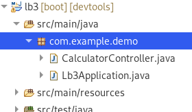
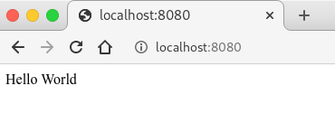
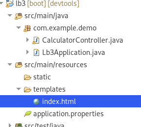
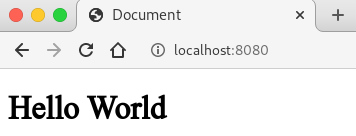

# Spring MVC

${toc}

# Spring MVC

Фреймворк **Spring MVC** забезпечує архітектуру паттерна Model - View - Controller (Модель — Відображення (далі — Вид) - Контролер) за допомогою слабо пов'язаних готових компонентів. Патерн MVC розділяє аспекти додатки (логіку введення, бізнес-логіку і логіку UI), забезпечуючи при цьому вільний зв'язок між ними.

- Model (Модель) інкапсулює (об'єднує) дані програми, в цілому вони будуть складатися з POJO ( «Старих добрих Java-об'єктів», або бінів).
- View (Відображення, Вид) відповідає за відображення даних Моделі, — як правило, генеруючи HTML, які ми бачимо у своєму браузері.
- Controller (Контролер) обробляє запит користувача, створює відповідну Model і передає її для відображення в View.

Вся логіка роботи Spring MVC побудована навколо **DispatcherServlet**, який приймає і обробляє всі HTTP-запити (з UI) і відповіді на них. Робочий процес обробки запиту DispatcherServlet'ом проілюстрований на рисунку:


Нижче наведена послідовність подій, відповідна вхідному HTTP-запиту:

- Після отримання HTTP-запиту DispatcherServlet звертається до інтерфейсу HandlerMapping, який визначає, який Контролер повинен бути викликаний, після чого, відправляє запит в потрібний Контролер.
- Контролер приймає запит і викликає відповідний службовий метод, заснований на GET або POST. Викликаний метод визначає дані Моделі, засновані на певній бізнес-логіці та повертає в DispatcherServlet ім'я Представлення (View).
- За допомогою інтерфейсу ViewResolver DispatcherServlet визначає, який Вид потрібно використовувати на підставі отриманого імені.
- Після того, як Вид (View) створений, DispatcherServlet відправляє дані Моделі у вигляді атрибутів у Вид, який в кінцевому підсумку відображається в браузері.

# Thymeleaf

# Створюємо проект

В Eclipse з установленим Spring Boot плагіном створимо новий проєкт із наступними залежностями:



- Spring WEB - містить в собі функціонал за допомогою, якого реалізується патерн MVC
- Thymeleaf - це Template Engine, який ми будемо використовувати для того щоб динамічно генерувати HTML.
- Spring Boot DevTools - допоможе нам в розробці. Річ у тому, що якщо ми зробимо зміну в коді, при запущеному сервері, то зміни не будуть видні, доки ми не перезавантажимо сервер. DevTools перезавантажить сервер за нас.

# Простий калькулятор

**Створимо клас CalculatorController в дефолтному пакеті:** 



**Анотуємо створений клас за допомогою анотації Controller.** Анотація @Controller - це просто спеціалізація класу @Component і дозволяє автоматично виявляти класи впровадження за допомогою сканування classpath.

@Controller зазвичай використовується в поєднанні з анотацією @RequestMapping, що використовується для методів обробки запитів.

```java
package com.example.demo;

import org.springframework.stereotype.Controller;

@Controller
public class CalculatorController {

}
```

**Створимо метод index** і за допомогою анотації @RequestMapping визначимо за якою адресою буде виконуватися даний метод:

```java
@Controller
public class CalculatorController {

	@RequestMapping("/")
	@ResponseBody
	public String index() {
		return "Hello World";
	}
	
}
```

Анотація @RequestMapping призначена для того, щоб задати методам вашого контролера адреси, за якими вони будуть доступні на клієнті.
У цій інструкції можна задати деякі параметри:

- **value** - призначений для вказівки адреси. Його зазвичай застосовують, якщо задається більш, ніж один параметр.
- **method** - визначає метод доступу. Варіанти - RequestMethod.GET, RequestMethod.POST, RequestMethod.DELETE, RequestMethod.PUT і інші.
- **consumes** - визначає тип вмісту тіла запиту. наприклад, consumes = "application / json" визначає, що Content-Type запиту, який відправив клієнт повинен бути "application / json". Можна задати негативне вказівку: consumes = "! Application / json". Тоді буде вимагатися будь Content-Type, крім зазначеного. допускається вказівку кількох значень: ("text / plain", "application / *).
- **produces** - визначає формат повертається методом значення. Якщо на клієнті в header'ах не вказано заголовок Accept, то не має значення, що встановлено в produces. Якщо ж заголовок Accept встановлений, то значення produces має збігатися з ним для успішного повернення результату клієнтові. Параметр produces може також містити перерахування значень.
- **params** - дозволяє відфільтрувати запити по наявності / відсутності певного параметра в запиті або по його значенню. params = "myParam = myValue", params = "! myParam = myValue", params = "myParam", params = "! myParam".
- **headers** - дозволяє відфільтрувати запити по наявності / відсутності певного заголовка в запиті або по його значенню. headers = "myHeader = myValue", headers = "! myHeader = myValue", headers = "myHeader", headers = "! myHeader".

Анотація @ResponseBody в нас тимчасова, вона вказує на те що ми хочемо повернути строку у відповідь, а не шукати Thymeleaf - представлення по значенню строки.

Якщо ми зараз запустимо додаток, то отримаємо наступний результат:



**Створюємо представлення для калькулятора**. Якщо ми приберемо анотацію @ResponseBody і запустимо додаток, то отримаємо наступну помилку:


Інформативний текст помилки - Error resolving template [Hello World], template might not exist or might not be accessible by any of the configured Template Resolvers. Який говорить нам, що Template Resolver намагався знайти представлення, по імені(вміст рядка, який ми повернули із контролера), але не зміг його знайти.

Створімо файл index.html в директорії templates:



Вміст index.html зробімо, покищо, наступним:

```html
<!DOCTYPE html>
<html lang="en">
<head>
    <meta charset="UTF-8">
    <meta name="viewport" content="width=device-width, initial-scale=1.0">
    <meta http-equiv="X-UA-Compatible" content="ie=edge">
    <title>Document</title>
</head>
<body>
    <h1>Hello World</h1>
</body>
</html>
```

Змінимо метод index в CalculatorController:

```java
@RequestMapping("/")
	public String index() {
		return "index";
	}
```

І подивимося на результат:



**Створимо форму для майбутнього калькулятора**. Для цього модифікуємо index.html наступним чином:

```html
<!DOCTYPE html>
<html lang="en" >
<head>
    <meta charset="UTF-8">
    <meta name="viewport" content="width=device-width, initial-scale=1.0">
    <meta http-equiv="X-UA-Compatible" content="ie=edge">
    <title>Document</title>
</head>
<body>
    <h1>Calculator</h1>
    <form th:action="@{/calculate}" method="GET">
        <div>
            <input type="text" name="expression">
        </div>
        <div>
            <input type="submit">
        </div>
    </form>
</body>
</html>
```

Ми створили форму з одним полем введення, де користувач може ввести вираз для обчислення. Параметр name=expression, по цьому імені ми будемо отримувати доступ до введеного користувачем значення на сервері. Форма відправить дані по методу GET на адресу /calculate.


**Створимо метод для обчислення виразу**. Покищо метод буде виглядати так:

```java
@RequestMapping("/calculate")
@ResponseBody
public String calculate(@RequestParam("expression") String expression) {
    return "You entered " + expression;
}
```

Тут ми знову використовуємо @ResponseBody (представлення зробимо пізніше). Тепер наший метод приймає параметр expression типу String, використовуючи анотацію @RequestParam, ми автоматично занесемо вміст того що вів користувач в змінну. @RequestParam приймає параметр, який вказує ім'я користувацького елементу.


**Додамо логіку калькулятора і перевірку на правильність введення даних**:

```java
@RequestMapping("/calculate")
@ResponseBody
public String calculate(@RequestParam("expression") String expression) {
	if(expression == null || expression.isEmpty()) {
		return "Wrong expression";
	}
	String[] operators = {"\\+", "-"};
	String currentOperator = null;
	ArrayList<String> operands = null;
	for (String operator:operators) {
		String[] spliceRes = expression.split(operator);
		if (spliceRes.length == 2) {
			operands = new ArrayList<String>(Arrays.asList(spliceRes));
			currentOperator = operator;
			break;
		}
	}
	if (operands == null) {
		return "Operation not supported.";
	}
	int a = 0;
	int b = 0;
	try {
		a = Integer.parseInt(operands.get(0));
		b = Integer.parseInt(operands.get(1));
	}
	catch ( NumberFormatException e ) {
		return "Please enter an integer numbers.";
	}
	int res = 0;
	if (currentOperator.equals("\\+")) {
		res = a + b;
	} else {
		res = a - b;
	}
	return "Result of evaluation " + res;
}
```


**Створимо представлення для виведення результату обчислення**. Але перед цим потрібно відповісти на запитання — як передати дані із контролера у представлення. Для цього нам допоможе об'єкт Model. Model - клас Spring, який схожий на структуру ключ — значення, ми можемо додати дані й ключ для доступу до них в об'єкт Model і отримати доступ до цих даних безпосередньо в представлені. Модифікуємо контролер:

```java
	@RequestMapping("/calculate")
	public String calculate(@RequestParam("expression") String expression, Model model) {
		if(expression == null || expression.isEmpty()) {
			model.addAttribute("message", "Wrong expression");
			return "res";
		}
		String[] operators = {"\\+", "-"};
		String currentOperator = null;
		ArrayList<String> operands = null;
		for (String operator:operators) {
			String[] spliceRes = expression.split(operator);
			if (spliceRes.length == 2) {
				operands = new ArrayList<String>(Arrays.asList(spliceRes));
				currentOperator = operator;
				break;
			}
		}
		if (operands == null) {
			model.addAttribute("message", "Operation not supported.");
			return "res";
		}
		int a = 0;
		int b = 0;
		try {
			a = Integer.parseInt(operands.get(0));
			b = Integer.parseInt(operands.get(1));
		}
		catch ( NumberFormatException e ) {
			model.addAttribute("message", "Please enter an integer numbers.");
			return "res";
		}
		int res = 0;
		if (currentOperator.equals("\\+")) {
			res = a + b;
		} else {
			res = a - b;
		}
		model.addAttribute("Result of evaluation " + res);
		return "res";
	}
```

Як видно із коду метод в контролері тепер приймає додатковий параметр '''Model model'''. Використовуючи метод addAttribute ми можемо додати пару ключ — значення. Далі Spring сам зроби так щоб всі дані які ми додали у Model були доступні на представленні.

Також ми прибрали анотацію @ResponseBody, а це означає, що тепер якщо ми повертаємо строку Spring спробує знайти представлення, яке відповідає значення цієї строки. Тому створимо представлення із назвою res.html:


Вміст res.html наступний:

```html
<!DOCTYPE html>
<html lang="en">
<head>
    <meta charset="UTF-8">
    <meta name="viewport" content="width=device-width, initial-scale=1.0">
    <meta http-equiv="X-UA-Compatible" content="ie=edge">
    <title>Document</title>
</head>
<body>
    <p th:text="${message}"></p>
</body>
</html>
```

**Готовий проект можна знайти** [тут](https://github.com/endlesskwazar/spring-examples/tree/mvc-calc).

# CRUD - проект

## Як буде виглядати розроблений проект


## Repository, Service


## Створюємо проект

Створимо новий Spring Boot проект:


Із наступними залежностями:


В проєкті ми будемо використовувати bootstrap, тому додамо залежності, модифікувавши pom.xml:

```xml
<dependency>
	<groupId>org.webjars</groupId>
	<artifactId>bootstrap</artifactId>
	<version>4.0.0</version>
</dependency>
<dependency>
	<groupId>org.webjars</groupId>
	<artifactId>font-awesome</artifactId>
	<version>5.12.0</version>
</dependency>
```

Також ми будемо використовувати thymeleaf-layout-dialect для організації шаблонів:

```xml
<dependency>
	<groupId>nz.net.ultraq.thymeleaf</groupId>
	<artifactId>thymeleaf-layout-dialect</artifactId>
</dependency>
```

В директорії resources/templates створимо дві нові директорії:
- layouts
  - layout.html
- products

Вміст layout.html наступний:

```html
<!DOCTYPE html>
<html>
	<head>
		<title layout:title-pattern="$LAYOUT_TITLE - $CONTENT_TITLE">Spring-Shop</title>
		<meta http-equiv="Content-Type" content="text/html; charset=UTF-8"/>
		<link th:href="@{/webjars/bootstrap/4.0.0/css/bootstrap.min.css}" rel="stylesheet" media="screen" />
		<link rel="stylesheet" th:href="@{/webjars/font-awesome/5.12.0/css/all.min.css}">
		<link rel="stylesheet" th:href="@{/styles/styles.css}">
	</head>
	<body>
		<!-- This content will be replaced by the pages -->
		<div class="container" layout:fragment="content">
			
		</div>
	</body>
</html>
```

Ми також будемо використовувати самописні css-стилі. Створимо в директорії static директорії styles із файлом styles.css. Вміст styles.css наступний:

```css
@charset "UTF-8";

body {
	background-color: #f2f2f2;
}
```

HTML - форми мають вбудовану підтримку лише для POST, GET - запитів. Для імітації інших HTTP - методів буде використовуватися MethodOvveride.

Створимо клас MethodOvverideConfig:
```java
package com.example.demo;

import java.util.Arrays;

import org.springframework.boot.web.servlet.FilterRegistrationBean;
import org.springframework.context.annotation.Bean;
import org.springframework.context.annotation.Configuration;
import org.springframework.web.filter.HiddenHttpMethodFilter;

@Configuration
public class MethodOvverideConfig {

	@Bean
	public FilterRegistrationBean hiddenHttpMethodFilter() {
		// TODO: FilterRegistrationBean is generic
		FilterRegistrationBean filterRegistrationBean = new FilterRegistrationBean(new HiddenHttpMethodFilter());
		filterRegistrationBean.setUrlPatterns(Arrays.asList("/*"));
		return filterRegistrationBean;
	}
	
}
```

## Створення архітектури

Створимо доменну модель:

Product:

```java
package com.example.demo.model;

import java.math.BigDecimal;

public class Product {
	
	private Long id;
	public Long getId() {
		return id;
	}
	public void setId(Long id) {
		this.id = id;
	}
	private String title;
	public String getTitle() {
		return title;
	}
	public void setTitle(String title) {
		this.title = title;
	}
	public String getDescription() {
		return description;
	}
	public void setDescription(String description) {
		this.description = description;
	}
	public BigDecimal getPrice() {
		return price;
	}
	public void setPrice(BigDecimal price) {
		this.price = price;
	}
	private String description;
	private BigDecimal price;
	public Product(Long id, String title, String description, BigDecimal price) {
		super();
		this.id = id;
		this.title = title;
		this.description = description;
		this.price = price;
	}
	@Override
	public String toString() {
		return "Product [title=" + title + ", description=" + description + ", price=" + price + "]";
	}
	
}
```

В цьому прикладі ми не будемо використовувати базу даних, тому створимо dummy - клас, який буде містити дані для тестування:

DummyData:

```java
package com.example.demo.dummydata;

import java.math.BigDecimal;
import java.util.ArrayList;
import java.util.Arrays;

import com.example.demo.model.Product;

public class DummyData {

	private static DummyData instance;
	
	private ArrayList<Product> products;
	
	public ArrayList<Product> getProducts() {
		return products;
	}

	private DummyData() {
		products = new ArrayList<Product>(Arrays.asList(
				new Product(Long.valueOf(1), "Samsung galaxy Tab 2", "Phone or tablet.", new BigDecimal(8000)),
				new Product(Long.valueOf(1), "DELL XPS 13", "Business laptop.", new BigDecimal(40000))
				));
	}
	
	public static DummyData getInstance() {
		if (instance == null) {
			instance = new DummyData();
		}
		return instance;
	}
	
}
```

Створимо інтерфейс для репозиторіїв:

Repository:
```java
package com.example.demo.repository;

import java.util.Optional;

public interface Repository<T, ID> {

	T save(T entity);
	Optional<T> getById(ID id);
	Iterable<T> findAll();
	void removeById(ID id);
	
}
```

Створимо імплементацію репозиторія:

ProductRepository:
```java
package com.example.demo.repository;

import java.util.Comparator;
import java.util.NoSuchElementException;
import java.util.Optional;
import org.springframework.stereotype.Repository;
import com.example.demo.model.Product;
import com.example.demo.dummydata.DummyData;

@Repository
public class ProductRepository implements com.example.demo.repository.Repository<Product, Long> {

	@Override
	public Product save(Product entity) {
		// TODO Auto-generated method stub
		return null;
	}

	@Override
	public Optional<Product> getById(Long id) {
		// TODO Auto-generated method stub
		return null;
	}

	@Override
	public Iterable<Product> findAll() {
		// TODO Auto-generated method stub
		return null;
	}

	@Override
	public void removeById(Long id) {
		// TODO Auto-generated method stub
		
	}
	
}
```

Створимо сервіс:
ProductService:
```java
package com.example.demo.service;

import org.springframework.beans.factory.annotation.Autowired;
import org.springframework.stereotype.Service;
import com.example.demo.model.Product;
import com.example.demo.repository.Repository;

@Service
public class ProductService {
	
	@Autowired
	private Repository<Product, Long> productRepository;
	
	public Iterable<Product> getAllProducts(){
		return productRepository.findAll();
	}
	
	public Product getById(Long id) {
		return productRepository.getById(id).get();
	}
	
	public Product create(Product product) {
		return productRepository.save(product);
	}
	
	public void removeById(Long id) {
		productRepository.removeById(id);
	}

}
```

І нарешті створимо контроллер:
ProductController:
```java
package com.example.demo.controller;

import org.springframework.beans.factory.annotation.Autowired;
import org.springframework.stereotype.Controller;
import org.springframework.ui.Model;
import org.springframework.web.bind.annotation.ModelAttribute;
import org.springframework.web.bind.annotation.PathVariable;
import org.springframework.web.bind.annotation.RequestMapping;
import org.springframework.web.bind.annotation.RequestMethod;

import com.example.demo.model.Product;
import com.example.demo.service.ProductService;

@Controller
public class ProductController {
	
	@Autowired
	private ProductService productService;
	
}
```

## Вивести список

Почнімо із показу списку всіх продуктів. Для цього імплементуємо метод findAll в класі ProductRepository:

ProductRepository:
```java
...
@Override
public Iterable<Product> findAll() {
	return DummyData.getInstance().getProducts();
}
...
```

Додамо метод getAllProducts в ProductService:

ProductService:
```java
...
public Iterable<Product> getAllProducts(){
	return productRepository.findAll();
}
...
```

Створимо метод list в класі ProductController:

ProductController:
```java
...
@RequestMapping("/products")
public String list(Model model) {
	model.addAttribute("products", productService.getAllProducts());
	return "products/list";
}
...
```

І не забудимо створити представлення:

products/list.html:
```html
<!DOCTYPE html>
<html xmlns:layout="http://www.w3.org/1999/xhtml"
	layout:decorate="~{layouts/layout}">
<head>
<title>Products</title>
<meta name="viewport"
	content="width=device-width, initial-scale=1, shrink-to-fit=no">
</head>
<body>
	<div class="container" layout:fragment="content">
		<div class="row">
			<div class="col">
				<h1>Products</h1>
				<hr />
				<a th:href="@{/products/create}" class="btn btn-primary mb-3"><i class="fas fa-plus-circle"></i> Create new product</a>
				<table class="table table-hover bg-white">
					<thead>
						<tr>
							<th>Title</th>
							<th>Price</th>
							<th>Description</th>
							<th></th>
						</tr>
					</thead>
					<tbody>
						<tr th:each="product : ${products}">
							<td><a th:href="@{'/products/' + ${product.id}}"
								th:text="${product.title}"></a></td>
							<td th:text="${product.price}"></td>
							<td th:text="${product.description}"></td>
							<td>
							<form method="POST" th:action="@{'/products/' + ${product.id}}">
							<input type="hidden" name="_method" value="DELETE"/>
							<button type="submit" class="btn btn-danger"><i
									class="fas fa-trash-alt" style="color:white"></i></button>
									</form>
							</td>
						</tr>
					</tbody>
				</table>
			</div>
		</div>
	</div>
</body>
</html>
```

## Подивитися деталі

Повторимо процедуру для перегляду деталей продукту:

ProductRepository:
```java
...
@Override
public Optional<Product> getById(Long id) {
	return DummyData.getInstance().getProducts().stream()
			.filter(p -> p.getId().equals(id))
			.findAny();
}
...
```

ProductService:
```java
...
public Product getById(Long id) {
	return productRepository.getById(id).get();
}
...
```

ProductController:
```java
...
@RequestMapping(value = "/products/{id}", method = RequestMethod.GET)
public String details(@PathVariable("id") long id, Model model) {
	model.addAttribute("product", productService.getById(id));
	return "products/details";
}
...
```

products/list.html:
```html
<!DOCTYPE html>
<html xmlns:layout="http://www.w3.org/1999/xhtml"
	layout:decorate="~{layouts/layout}">
<head>
<title>Product details</title>
<meta name="viewport"
	content="width=device-width, initial-scale=1, shrink-to-fit=no">
</head>
<body>
	<div class="container" layout:fragment="content">
		<div class="row">
			<div class="col">
				<h1 th:text="'Product ' + ${product.title} + ' details'"></h1>
				<hr />
				<ul class="list-group">
					<li class="list-group-item" th:text="'Title: ' + ${product.title}"></li>
					<li class="list-group-item" th:text="'Description ' + ${product.description}"></li>
					<li class="list-group-item" th:text="'Price ' + ${product.price}"></li>
				</ul>
				<hr />
				<a th:href="@{/products}">Back to list</a>
			</div>
		</div>
	</div>
</body>
</html>
```

## Додавання

Повторимо процедуру для додавання нового продукта:

ProductRepository:
```java
...
@Override
public Product save(Product entity) {
	Product maxById = DummyData.getInstance().getProducts()
				.stream()
				.max(Comparator.comparing(Product::getId))
				.orElseThrow(NoSuchElementException::new);
	entity.setId(maxById.getId() + 1);
	DummyData.getInstance().getProducts().add(entity);
	return entity;
}
...
```

ProductService:
```java
...
public Product create(Product product) {
	return productRepository.save(product);
}
...
```

ProductController:
```java
...
@RequestMapping("/products/create")
public String showCreateForm() {
	return "products/create";
}

@RequestMapping(value = "/products", method = RequestMethod.POST)
public String create(@ModelAttribute Product product) {
	productService.create(product);
	return "redirect:/products";
}
...
```

products/create.html:
```html
<!DOCTYPE html>
<html xmlns:layout="http://www.w3.org/1999/xhtml"
	layout:decorate="~{layouts/layout}">
<head>
<title>Create new product</title>
<meta name="viewport"
	content="width=device-width, initial-scale=1, shrink-to-fit=no">
</head>
<body>
	<div class="container" layout:fragment="content">
		<div class="row">
			<div class="col">
				<h1>Create new product</h1>
				<hr />

				<div class="card">
					<div class="card-body">
						<form method="POST" th:action="@{/products}">
							<div class="form-group">
								<label>Title</label> <input type="text" class="form-control"
									placeholder="Title" name="title">
							</div>
							<div class="form-group">
								<label>Description</label> <textarea type="text"
									class="form-control" placeholder="Description" name="description"></textarea>
							</div>
							<div class="form-group">
								<label>Price</label> <input type="text" class="form-control"
									placeholder="Price" name="price">
							</div>
							<button type="submit" class="btn btn-primary">Submit</button>
						</form>
					</div>
				</div>

				<hr />
				<a th:href="@{/products}">Back to list</a>
			</div>
		</div>
	</div>
</body>
</html>
```

## Видалення

Повторимо процедуру для видалення:

ProductRepository:
```java
...
public void removeById(Long id) {
	Product productToDelete = DummyData.getInstance().getProducts().stream()
			.filter(p -> p.getId().equals(id))
			.findAny()
			.get();
	DummyData.getInstance().getProducts().remove(productToDelete);
}
...
```

ProductService:
```java
...
public void removeById(Long id) {
	productRepository.removeById(id);
}
...
```

ProductController:
```java
...
@RequestMapping(value = "/products/{id}", method= RequestMethod.DELETE)
public String remove(@PathVariable("id") long id) {
	productService.removeById(id);
	return "redirect:/products";
}
...
```

## Фінальний результат

Готовий проект можна знайти [тут.](https://github.com/endlesskwazar/spring-examples/tree/shop-basic-mvc)


# Домашнє завдання

До проєкту shop-basic-mvc доробіть:
- Функціонал редагування
- Зображення сторінки помилки, якщо користувач запросить не присутній продукт
- Підтвердження видалення продукту

# Контрольні запитання

1. Що таке Spring MVC? Поясніть патерн MVC.
2. Поясніть процес створення контролера в Spring MVC.
3. Що таке Thymeleaf?
4. Як можна передати дані із контролера в представлення?
5. Поясніть Repository і Service.