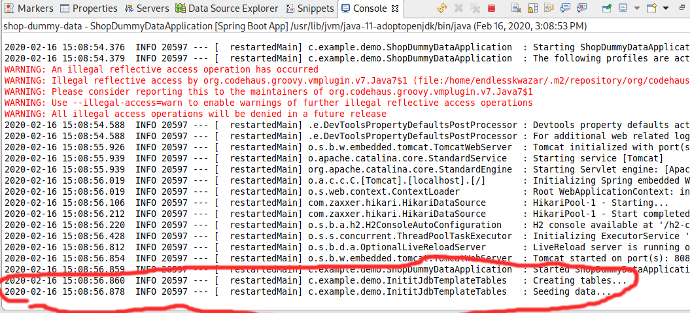
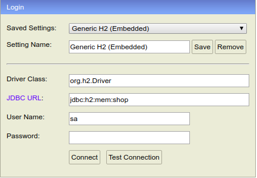
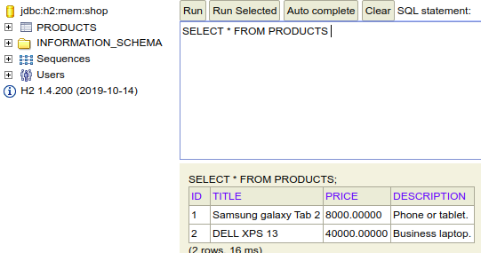

# JDBC TEmplates

# Application profiles

Spring Boot застосовує свою типову умову щодо підходу до налаштування. Це означає, що ми можемо просто помістити файл «application.properties» у каталог «src/main/resources», і він буде автоматично виявлений. Тоді ми можемо зчитувати з нього будь-які завантажені властивості.

Додаймо у файл application.properties властивість:

application.properties:
```
myprop=myprop value
```

Зчитати цю властивість можна наступними способами:

1. Отримати із контексту клас Environment і викликати метод getProperty()

```java
...
@Autowired
private Environment env;
...
System.out.println(env.getProperty("myprop"));
...
```

2. Використати анотацію @Value

```java
...
@Value("${myprop}")
private String myProp;
...
System.out.println(this.myProp);
...
```

> Назви властивостей можуть мати крапки у своїх іменах.
> 
> application.properties можуть містити властивісті, які визначені користувачем, так і властивості, які вбудовані і предназначені для конфігурації Spring. Подивитися список визначених властей можна [тут](https://docs.spring.io/spring-boot/docs/current/reference/html/appendix-application-properties.html).

# Spring profiles

Spring надає могутній інструмент для групування конфігураційних властивостей у так звані профілі, що дозволяє нам активувати купу конфігурацій з одним параметром профілю. Spring Boot спирається на це, дозволяючи нам налаштувати та активувати профілі зовні.

Профілі ідеально підходять для налаштування нашої програми для різних середовищ, але вони спокушають і в інших випадках використання.

Активація певного профілю може мати величезний вплив на додаток Spring Boot, але під капотом профіль може просто керувати двома речами:

- профіль може впливати на властивості програми
- профіль може впливати на те, які компоненти завантажуються в контекст програми.

Приклад:

Як стартовий проект використаємо [shop-basic-mvc](https://github.com/endlesskwazar/spring-examples/tree/shop-basic-mvc)

Додамо файд application-jdbc.properties в src/main/resources.

application.properties:
```
myprop=myprop value
spring.profiles.active=jdbc
```

application-jdbc.properties:
```
myprop=my prop jdbc value
```

Як результати ми отримаємо значення myprop = my prop jdbc value. Якщо ми видалимо строчку spring.profiles.active=jdbc, то значення myprop = myprop value.

Для створення і активації профілю потрібно:
- Створити файл application-[profile_name].properties. Всі значення, які цей файл визначає будуть перезаписані поверх application.properties
- Активувати профіль в application.properties за допомогою вказання атрибута spring.profiles.active=[profile-name]

Додаймо до проекту ще одну реалізацію інтерфейсу Repository для роботи із продуктами:

ProductRepositoryJdbc:
```java
@Repository
public class ProductRepositoryJdbc implements com.example.demo.repository.Repository<Product, Long> {

	@Override
	public Product save(Product entity) {
		// TODO Auto-generated method stub
		return null;
	}

	@Override
	public Optional<Product> getById(Long id) {
		// TODO Auto-generated method stub
		return null;
	}

	@Override
	public Iterable<Product> findAll() {
		// TODO Auto-generated method stub
		return null;
	}

	@Override
	public void removeById(Long id) {
		// TODO Auto-generated method stub
		
	}

}
```

Тепер в нас ж два компоненти, які можуть бути використані в ProductService, а саме:
- ProductRepository
- ProductRepositoryJdbc

Щоб використати саме ProductRepositoryJdbc додамо анотацію Profile:

```java
@Repository
@Profile("jdbc")
public class ProductRepositoryJdbc implements com.example.demo.repository.Repository<Product, Long> {
```

Для ProductRepository також встановимо свій профіль:

```java
@Repository
@Profile("dummy-data")
public class ProductRepository implements com.example.demo.repository.Repository<Product, Long> {
```

# JDBC Templates

Spring JDBC Template - це потужний механізм підключення до бази даних та виконання запитів SQL. Він внутрішньо використовує JDBC api, але усуває безліч проблем JDBC API.

Spring JDBC Template:
- Бере на себе багато boilerplate - код, який необхідний для користуванням JDBC
- Дає зручний інтерфейс для приведення редяційної моделі до об'єктів

JdbcTemplate - центральний клас у Spring Template. Він піклується про створення та звільнення ресурсів, таких як створення та закриття об'єкта зв'язку тощо. Тому це не призведе до жодних проблем, якщо ви забудете закрити з'єднання.

Він обробляє виняток і надає інформативні повідомлення про виключення за допомогою класів excepion, визначених у пакеті org.springframework.dao.

Ми можемо виконувати всі операції з базою даних за допомогою класу JdbcTemplate, такі як вставка, оновлення, видалення та отримання даних із бази даних.

Давайте розглянемо методи весняного класу JdbcTemplate.

|Метод|Пояснення|
|-|-|
|int update(String query)|використовується для вставки, оновлення та видалення записів.|
|int update(String query,Object... args)|використовується для вставки, оновлення та видалення записів за допомогою PreparedStatement за допомогою заданих аргументів.|
|void execute(String query)|використовується для виконання запиту DDL.|
|T execute(String sql, PreparedStatementCallback action)|виконує запит за допомогою зворотного виклику PreparedStatement.|
|T query(String sql, ResultSetExtractor rse)|використовується для отримання записів за допомогою ResultSetExtractor.|
|List query(String sql, RowMapper rse)|використовується для отримання записів за допомогою RowMapper.|

## З'єднання із базою даних

Додомо наступні залежності в pom.xml:

**pom.xml:**
```xml
<!-- Jdbc template example -->
<dependency>
	<groupId>org.springframework.boot</groupId>
	<artifactId>spring-boot-starter-jdbc</artifactId>
</dependency>
<dependency>
	<groupId>com.h2database</groupId>
	<artifactId>h2</artifactId>
	<scope>runtime</scope>
</dependency>
<!-- Jdbc template example end -->
```

Сконфігуруємо підключення до БД в application-jdbc.profiles:

**application-jdbc.profiles:**
```
spring.datasource.url=jdbc:h2:mem:shop
spring.datasource.driverClassName=org.h2.Driver
spring.jpa.database-platform=org.hibernate.dialect.H2Dialect
spring.datasource.username=sa
spring.datasource.password=
spring.h2.console.enabled=true
```

- spring.datasource.url=jdbc:h2:mem:shop - Рядок підключення до БД
- spring.datasource.driverClassName=org.h2.Driver - Класс драйвера для підключення
- spring.jpa.database-platform=org.hibernate.dialect.H2Dialect - Діалект SQL
- spring.datasource.username=sa - Ім'я користувача
- spring.datasource.password= - Пароль
- spring.h2.console.enabled=true - Ввімкнення вбудованої СУБД H2


## Додавання тестових даних. CommandLineRunner

Для тестування нам потрібно підготувати дані. Ми їх додамо програмно. Але нам потрібний спосіб для того щоб виконати наш код, коли додаток запустився. В Spring Boot для цього є декілька інтерфейсів:

|Інтерфейс|Пояснення|
|-|-|
|CommandLineRunner|Простий інтерфейс, який ми можемо реалізувати для виконання деякого коду після успішного запуску програми Spring. Коли Spring Boot знайде компонент CommandLineRunner у контексті програми, він викличе метод run() після запуску програми та передасть аргументи командного рядка, з допомогою якого запущено програму.|
|ApplicationRunner|Натомість ми можемо використовувати ApplicationRunner, якщо хочемо, щоб аргументи командного рядка були розібрані. Об'єкт ApplicationArguments надає нам доступ до розбору аргументів командного рядка.|
|ApplicationListener|Якщо нам не потрібен доступ до параметрів командного рядка, ми можемо прив'язати логіку запуску до Spring's ApplicationReadyEvent|

Створимо клас InititJdbTemplateTables:

**InititJdbTemplateTables:**
```java
package com.example.demo;

import java.math.BigDecimal;

import org.slf4j.Logger;
import org.slf4j.LoggerFactory;
import org.springframework.beans.factory.annotation.Autowired;
import org.springframework.boot.CommandLineRunner;
import org.springframework.core.annotation.Order;
import org.springframework.jdbc.core.JdbcTemplate;
import org.springframework.stereotype.Component;

@Component
@Order(1)
public class InititJdbTemplateTables implements CommandLineRunner {
	
	
	private static final Logger log = LoggerFactory.getLogger(InititJdbTemplateTables.class);
	
	@Autowired
	private JdbcTemplate jdbcTemplate;
	
	@Override
	public void run(String... args) throws Exception {
		log.info("Creating tables...");
		
		jdbcTemplate.execute("DROP TABLE products IF EXISTS");
		jdbcTemplate.execute("CREATE TABLE products (id INT AUTO_INCREMENT  PRIMARY KEY, title VARCHAR(250) NOT NULL, price DECIMAL(20, 5) NOT NULL, description VARCHAR(250) NOT NULL);");
		
		log.info("Seeding data...");
		
		jdbcTemplate.update("INSERT INTO products (title, price, description) VALUES(?,?,?)",
                new Object[] { "Samsung galaxy Tab 2", new BigDecimal(8000), "Phone or tablet." });
		jdbcTemplate.update("INSERT INTO products (title, price, description) VALUES(?,?,?)",
                new Object[] { "DELL XPS 13", new BigDecimal(40000), "Business laptop." });
	}

}
```

Запустимо додаток:



В браузері перейдимо за адресою [http://localhost:8080/h2-console](http://localhost:8080/h2-console)

Використаємо наступні параметри підключення:



І перевіримо чи наявні наші тестові дані:



## Отримати список

## Деталі

## Додавання

## Видалення

# Домашнє завдання

Запропонуйте власну реалізацію динамічного масиву, який заснований на звичайномк масивові. Інтерфейс - add(elem), remove(elem), remove(index), get(index), isExists(elem).

# Контрольні запитання

1. Що таке Generics і навіщо вони потрібні?
2. Що таке Java Collection Framework?
3. Перелічіть інтерфейси Java Collection Map.
4. Поясніть колекції - Hashtable, HashMap, LinkedHashMap, TreeMap.
4. Поясніть колекції - Vector, Stack, ArrayList, LinkedList.
4. Поясніть колекції - HashSet, LinkedHashSet, TreeSet.
4. Поясніть колекції - PriorityQueue, ArrayDeque.
4. Як вибрати, яку колекцію використовувати?