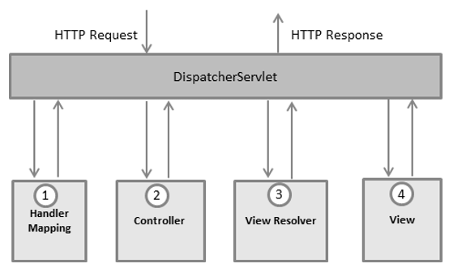
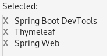
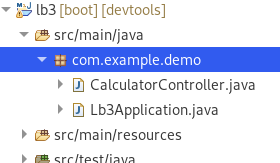
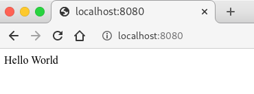
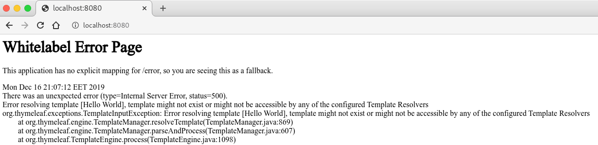
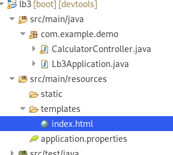
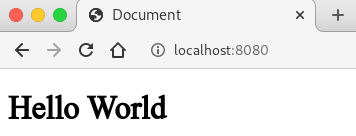
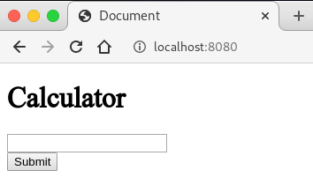
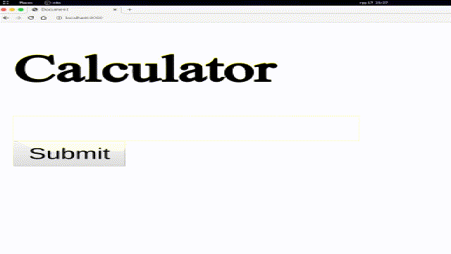

# Spring MVC

${toc}

# Spring MVC

Фреймворк **Spring MVC** забезпечує архітектуру паттерна Model - View - Controller (Модель - Відображення (далі - Вид) - Контролер) за допомогою слабо пов'язаних готових компонентів. Патерн MVC розділяє аспекти додатки (логіку введення, бізнес-логіку і логіку UI), забезпечуючи при цьому вільний зв'язок між ними.

- Model (Модель) інкапсулює (об'єднує) дані програми, в цілому вони будуть складатися з POJO ( «Старих добрих Java-об'єктів», або бінів).
- View (Відображення, Вид) відповідає за відображення даних Моделі, - як правило, генеруючи HTML, які ми бачимо в своєму браузері.
- Controller (Контролер) обробляє запит користувача, створює відповідну Model і передає її для відображення в View.

Вся логіка роботи Spring MVC побудована навколо **DispatcherServlet**, який приймає і обробляє всі HTTP-запити (з UI) і відповіді на них. Робочий процес обробки запиту DispatcherServlet'ом проілюстрований на рисунку:



Нижче наведена послідовність подій, відповідна вхідному HTTP-запиту:

- Після отримання HTTP-запиту DispatcherServlet звертається до інтерфейсу HandlerMapping, який визначає, який Контролер повинен бути викликаний, після чого, відправляє запит в потрібний Контролер.
- Контролер приймає запит і викликає відповідний службовий метод, заснований на GET або POST. Викликаний метод визначає дані Моделі, засновані на певній бізнес-логікою і повертає в DispatcherServlet ім'я Віда (View).
- За допомогою інтерфейсу ViewResolver DispatcherServlet визначає, який Вид потрібно використовувати на підставі отриманого імені.
- Після того, як Вид (View) створений, DispatcherServlet відправляє дані Моделі у вигляді атрибутів в Вид, який в кінцевому підсумку відображається в браузері.

# Thymeleaf

# Створюємо проект

В Eclipse із установленим Spring Boot плагіном створимо новий проект із наступними залежностями:



- Spring WEB - містить в собі функціонал за допомогою, якого реалізується патерн MVC
- Thymeleaf - це Template Engine, який ми будемо використовувати для того щоб динамічно генерувати HTML.
- Spring Boot DevTools - допоможе нам в розробці. Справа в тім, що якщо ми зробимо зміну в коді, при запущеному сервері, то зміни небудуть видні, доки ми не перезавантажимо сервер. DevTools перезавантажить сервер за нас.

# Простий калькулятор

**Створимо клас CalculatorController в дефолтному пакеті:** 



**Анотуємо створений клас за допомогою анотації Controller.** Анотація @Controller - це просто спеціалізація класу @Component і дозволяє автоматично виявляти класи впровадження за допомогою сканування classpath.

@Controller зазвичай використовується в поєднанні з анотацією @RequestMapping, що використовується для методів обробки запитів.

```java
package com.example.demo;

import org.springframework.stereotype.Controller;

@Controller
public class CalculatorController {

}
```

**Створимо метод index** і за домосогою анотації @RequestMapping визначимо за якою адресою буде виконуватися даний метод:

```java
@Controller
public class CalculatorController {

	@RequestMapping("/")
	@ResponseBody
	public String index() {
		return "Hello World";
	}
	
}
```

Анотація @RequestMapping призначена для того, щоб задати методам вашого контролера адреси, за якими вони будуть доступні на клієнті. 
У цій інструкції можна задати деякі параметри:

- **value** - призначений для вказівки адреси. Його зазвичай застосовують, якщо задається більш, ніж один параметр.
- **method** - визначає метод доступу. Варіанти - RequestMethod.GET, RequestMethod.POST, RequestMethod.DELETE, RequestMethod.PUT і інші.
- **consumes** - визначає тип вмісту тіла запиту. наприклад, consumes = "application / json" визначає, що Content-Type запиту, який відправив клієнт повинен бути "application / json". Можна задати негативне вказівку: consumes = "! Application / json". Тоді буде вимагатися будь Content-Type, крім зазначеного. допускається вказівку кількох значень: ( "text / plain", "application / *).
- **produces** - визначає формат повертається методом значення. Якщо на клієнті в header'ах не вказано заголовок Accept, то не має значення, що встановлено в produces. Якщо ж заголовок Accept встановлений, то значення produces має збігатися з ним для успішного повернення результату клієнтові. Параметр produces може також містити перерахування значень.
- **params** - дозволяє відфільтрувати запити по наявності / відсутності певного параметра в запиті або по його значенню. params = "myParam = myValue", params = "! myParam = myValue", params = "myParam", params = "! myParam".
- **headers** - дозволяє відфільтрувати запити по наявності / відсутності певного заголовка в запиті або по його значенню. headers = "myHeader = myValue", headers = "! myHeader = myValue", headers = "myHeader", headers = "! myHeader".

Анотація @ResponseBody в нас тимчасова, вона вказує на те що ми хочемо повернути строку у відповідь, а не шукати Thymeleaf - представлення по значенню строки.

Якщо ми зараз запустимо додаток, то отримаємо наступний результат:



**Створюємо представлення для калькулятора**. Якщо ми приберемо анотацію @ResponseBody і запустимо додаток, то отримаємо наступну помилку:



Інформативний текст помилки - Error resolving template [Hello World], template might not exist or might not be accessible by any of the configured Template Resolvers. Який говорить нам, що Template Resolver намагався знайти представлення, по імені(вміст рядка, який ми повернули із контролера), але не зміг його знайти.

Створімо файл index.html в директорії templates:



Вміст index.html зробімо, покищо, наступним:

```html
<!DOCTYPE html>
<html lang="en">
<head>
    <meta charset="UTF-8">
    <meta name="viewport" content="width=device-width, initial-scale=1.0">
    <meta http-equiv="X-UA-Compatible" content="ie=edge">
    <title>Document</title>
</head>
<body>
    <h1>Hello World</h1>
</body>
</html>
```

Змінимо метод index в CalculatorController:

```java
@RequestMapping("/")
	public String index() {
		return "index";
	}
```

І подивимося на результат:



**Створимо форму для майбутнього калькулятора**. Для цього модифікуємо index.html наступним чином:

```html
<!DOCTYPE html>
<html lang="en" >
<head>
    <meta charset="UTF-8">
    <meta name="viewport" content="width=device-width, initial-scale=1.0">
    <meta http-equiv="X-UA-Compatible" content="ie=edge">
    <title>Document</title>
</head>
<body>
    <h1>Calculator</h1>
    <form th:action="@{/calculate}" method="GET">
        <div>
            <input type="text" name="expression">
        </div>
        <div>
            <input type="submit">
        </div>
    </form>
</body>
</html>
```

Ми створили форму із одним полем введення, де користувач може ввести вираз для обчислення. Параметр name=expression, по цьому імені ми будемо отримувати доступ до введеного користувачем значення на сервері. Форма відправить дані по методу GET на адресу /calculate.



**Створимо метод для обчислення виразу**. Покищо метод буде виглядати так:

```java
@RequestMapping("/calculate")
@ResponseBody
public String calculate(@RequestParam("expression") String expression) {
    return "You entered " + expression;
}
```

Тут ми знову використовуємо @ResponseBody (представлення зробимо пізніше). Тепер наший метод приймає параметр expression типу String, використовуючи анотацію @RequestParam, ми автоматично занисемо вміст того що вів користувач в змінну. @RequestParam приймає параметр, який вказує ім'я користувацького елементу.




# CRUD - проект

## Repository

## Service

## Як буде виглядати розроблений проект

## Вивести список

## Подивитися деталі

## Додавання

## Видалення

# Домашнє завдання

Запропонуйте власну реалізацію динамічного масиву, який заснований на звичайномк масивові. Інтерфейс - add(elem), remove(elem), remove(index), get(index), isExists(elem).

# Контрольні запитання

1. Що таке Spring MVC? Поясніть патерн MVC.
2. Поясніть процес створення контролера в Spring MVC.
3. Що таке Thymeleaf?
4. Перелічіть інтерфейси Java Collection Map.
5. Поясніть колекції - Hashtable, HashMap, LinkedHashMap, TreeMap.
6. Поясніть колекції - Vector, Stack, ArrayList, LinkedList.
7. Поясніть колекції - HashSet, LinkedHashSet, TreeSet.
8. Поясніть колекції - PriorityQueue, ArrayDeque.
9. Як вибрати, яку колекцію використовувати?