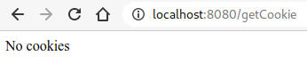
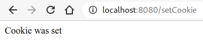
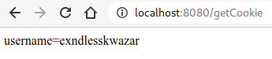
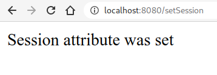
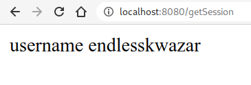

# Cookie, Session

${toc}

## Cookie and session

Усі ми знаємо, що HTTP - це протокол без стану. Усі запити та відповіді незалежні. Сервер не може розрізняти нових відвідувачів та відвідувачів, що повертаються. Але іноді нам може знадобитися відслідковувати діяльність клієнта у кількох запитах. Це досягається за допомогою управління сесіями. Це механізм, який використовується веб-контейнером для зберігання інформації про сеанс для конкретного користувача.
Управління сесіями може бути досягнуто одним із наступних способів:

- Cookies
- Hidden form field
- URL Rewriting
- HttpSession

## Cookie

### Встановлення cookie і читання cookie

Щоб встановити cookie у Spring Boot, ми можемо використовувати метод addCookie() класу HttpServletResponse. Все, що вам потрібно зробити - це створити новий екземпляр класу Cookie і додати його до відповіді.

```java
@GetMapping("/setCookie")
@ResponseBody
public String setCokkie(HttpServletResponse response) {
	Cookie cookie = new Cookie("username", "exndlesskwazar");
	response.addCookie(cookie);
	return "Cookie was set";
}
```

Щоб прочитати cookie можна використати метод getCookies() класу HttpServletRequest.

```java
@GetMapping("/getCookie")
@ResponseBody
public String getCookie(HttpServletRequest request) {
	Cookie[] cookies = request.getCookies();
	if (cookies != null) {
		return Arrays.stream(cookies)
				.map(c -> c.getName() + "=" + c.getValue()).collect(Collectors.joining(", "));
	}
	return "No cookies";
}
```







В Spring є ще один спосіб прочитати cookie - використовуючи анотацію @CookieValue:

```java
@GetMapping("/getOneCookie")
@ResponseBody
public String getOneCookie(@CookieValue(value = "username", defaultValue="anonymus") String username) {
	return "username " + username;
}
```

defaultValue - якщо cookie не встановлений використовується

Також в CookieValue є ще один корисний атрибут requred, який за відстуності встановленого cookie викине org.springframework.web.bind.MissingRequestCookieException:

```java
@GetMapping("/getOneCookie")
@ResponseBody
public String getOneCookie(@CookieValue(value = "username", required = true) String username) {
	return "username " + username;
}
```

Якщо час життя cookie не вказаний, він триває доти, доки сеанс не закінчиться. Такі файли cookie називаються сесійними файлами cookie. Файли cookie сесії залишаються активними, поки користувач не закриє веб-переглядач або не очистить файли cookie. Файл cookie користувача, створений вище, насправді є файлом cookie сеансу.

Але ви можете змінити цю поведінку за замовчуванням і встановити час закінчення файлу cookie, використовуючи метод setMaxAge () класу Cookie.

```java
Cookie cookie = new Cookie("username", "endlesskwazar");
cookie.setMaxAge(7 * 24 * 60 * 60); // expires in 7 days
```

### Secure cookie

Захищеним cookie є той, який надсилається серверу лише через зашифроване з'єднання HTTPS. Захищені файли cookie не можуть передаватися серверу через незашифровані HTTP-з'єднання.

```java
Cookie cookie = new Cookie("username", "endlesskwazar");
cookie.setMaxAge(7 * 24 * 60 * 60); // expires in 7 days
cookie.setSecure(true);
```

### HttpOnly Cookie

Файли cookie HttpOnly використовуються для запобігання атак міжсайтових скриптів (XSS) та не доступні через API Document.cookie JavaScript API. Коли для файлу cookie встановлено прапор HttpOnly, він повідомляє браузеру, що цей певний файл cookie має бути доступним лише сервером.

```java
Cookie cookie = new Cookie("username", "Jovan");
cookie.setMaxAge(7 * 24 * 60 * 60); // expires in 7 days
cookie.setSecure(true);
cookie.setHttpOnly(true)
```

### Cookie Scope

Якщо область не вказана, cookie надсилається серверу лише для шляху, який був використаний для його встановлення у браузері. Ми можемо змінити цю поведінку, використовуючи метод setPath() класу Cookie. Це встановлює директиву Path для файлу cookie.

```java
Cookie cookie = new Cookie("username", "endlesskwazar");
cookie.setMaxAge(7 * 24 * 60 * 60); // expires in 7 days
cookie.setSecure(true);
cookie.setHttpOnly(true);
cookie.setPath("/"); // global cookie accessible every where
```

### Видалення Cookie

Щоб видалити файл cookie, встановіть директиву Max-Age на 0 та скасуйте її значення. Ви також повинні передати ті самі інші файли cookie, які ви використовували для встановлення. Не встановлюйте значення директиви Max-Age на -1. В іншому випадку браузер буде розглядатись як cookie сеансу.

```java
Cookie cookie = new Cookie("username", null);
cookie.setMaxAge(0);
cookie.setSecure(true);
cookie.setHttpOnly(true);
cookie.setPath("/")
```

## Session

### HttpSession

Для роботи із сесією в Spring використовується об'єкт HttpSession, який може бути запровадженим в контролер багатьма способами способами. Розглянемо декілька:

1. Параметр в контроллер:

```java
...
public String setSession(HttpSession session) {
...
```

2. Запроваджена як залежність

```java
...
@Autowired
private HttpSession session;
...
```

1. Отримана із об'єкта HttpServletRequest

```java
...
public String setSession(HttpServletRequest request) {
		request.getSession()
...
```

### Читання і запис в сессію

Для того, щоб додати пару ключ-значення до сесї достатньо викликати метод addAttribute об'єкта HttpSession:

```java
@GetMapping("/setSession")
@ResponseBody
public String setSession(HttpSession session) {
	session.setAttribute("name", "value");
	return "Session was set";
}
```

Для того, щоб прочитати доданий до сесї об'єкт можна використати метод getAttribute об'єкта HttpSession:

```java
@GetMapping("/setSession")
@ResponseBody
public String setSession(HttpSession session) {
	session.setAttribute("name", "value");
	return "Session was set";
}
```





Також значення із сесії можна прочитати за допомогою анотації @SessionAttribute:

```java
@GetMapping("/getSessionAnnotation")
@ResponseBody
public String getSessionAnnotation(@SessionAttribute String username) {
	if (username != null) {
		return "username " + username;
	}
	return "Session attribute wasn`t set";
}
```

### Налаштування сесії

Зберігання сеансу, надається контейнером Servlet. Це лише внутрішня java.util.Map.

Spring Session - це Spring -  підпроект. Це необов'язково, і його мета полягає в тому, щоб ви могли поміняти механізм строгового сеансу, передбачений контейнером, тим, який надається Spring Session, який може бути RDBMS, Redis, Hazelcast Cluster або MongoDB. Вам більше не потрібно переглядати документацію на контейнер Servlet щодо налаштування кластера тощо.

Налаштувати сесію можна перезаписавши конфігураційні змінні Spring в application.properties:

Наприклад:

**application.properties:**
```
spring.datasource.driver-class-name=com.mysql.cj.jdbc.Driver
spring.datasource.url=jdbc:mysql://localhost:3306/springBootSession?createDatabaseIfNotExist=true&useSSL=false
spring.datasource.username=root
spring.datasource.password=root

spring.session.store-type=jdbc
spring.session.jdbc.initialize-schema=always
spring.session.timeout.seconds=600
spring.h2.console.enabled=true
```

Доступні параметри можна знайти [тут](https://docs.spring.io/spring-boot/docs/current/reference/html/appendix-application-properties.html).

### Повідомлення про успішну операцію

# Домашнє завдання

Запропонуйте власну реалізацію динамічного масиву, який заснований на звичайномк масивові. Інтерфейс - add(elem), remove(elem), remove(index), get(index), isExists(elem).

# Контрольні запитання

1. Що таке cookie?
2. Як в Spring встановити cookie?
3. Поясніть параметри Secure cookie, HttpOnly Cookie, Cookie Scope.
4. Як в Spring прочитати всі cookie?
5. Поясніть анотацію CookieValue і її параметри defaultValue, required.
6. Як в Spring можна працювати з сесією?
7. Поясніть конфігурацію сесії в Spring.