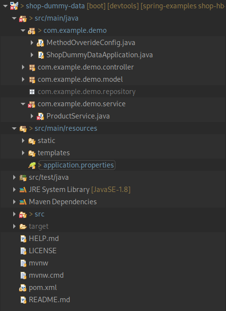

# Зміст

${toc}

# Refactoring

Для початку зробимо рефакторинг проекту, який ми робимо протягом курсу. За основу візьмемо [shop-hb-basic](https://github.com/endlesskwazar/spring-examples/tree/shop-hb-basic) Рефакторинг полягатиме в видаленні непотрібних файлів, а саме:

- клас com.example.demo.InititJdbTemplateTables
- клас com.example.demo.dummydata.DummyData
- пакет com.example.demo.dummydata
- клас com.example.demo.repository.ProductRepository
- всі класи та інтерфейси в пакеті com.example.demo.repository
- файли application-hb.properties, application-jdbc.properties
- Налаштування підключення перенести в application.properties

**application.properties:**

```
spring.jpa.hibernate.ddl-auto=update
spring.datasource.url=jdbc:mysql://localhost:3306/shop
spring.datasource.password=111
spring.datasource.username = root
spring.jpa.properties.hibernate.dialect=org.hibernate.dialect.MySQL55Dialect
```

Фінальна структура:



> Після нашого рефакторинга проект зламався. Ми це виправимо пізніше.

# Spring Data

Шар DAO зазвичай складається з безлічі кодових шаблонів, які можна і потрібно спростити. Переваг такого спрощення багато: зменшення кількості артефактів, які нам потрібно визначити та підтримувати, узгодженість моделей доступу до даних та послідовність конфігурації.

Spring Data робить це спрощення на крок вперед і дає змогу повністю видалити реалізації DAO. Зараз інтерфейс DAO - єдиний артефакт, який нам потрібно чітко визначити.

Для того щоб мати змогу використовувати Spring-Data потрібно мати залежність:

```xml
<dependency>
	<groupId>org.springframework.data</groupId>
	<artifactId>spring-data-jpa</artifactId>
</dependency>
```

## Crud Repository

## Додаємо ще одну модель

## Пагінація (PagingAndSortingRepository)

# Домашнє завдання

Доробіть до структури даних, яка була розроблена на минулій лабораторній роботі:

1. Користувацький Exception, який може бути викинутий, якщо індекс переданий в метод get() від'ємний або знаходиться за межами діапазону. Розробние виключення unchecked.
2. Зробіть метод transform в структурі даних, який приймає першим параметром індекс елемента, другим(функціональний інтерфейс, який вибраний Вами). Метод повинен передати знайдений елемент, ззовні його можуть модифікувати і повернути модифікований елемент.

# Контрольні запитання

1. Що таке виключення?
2. Як в Java обробляти виключення?
3. Назвіть ієрархію класів виключень в Java.
4. Яка різниця між checked і unchecked виключеннями?
5. Як в Java створити власне виключення?
6. Що таке lambda - вирази?
7. Що таке функціональний інтерфейс?
8. Перелічіть вбудовані в Java функціональні інтерфейси.