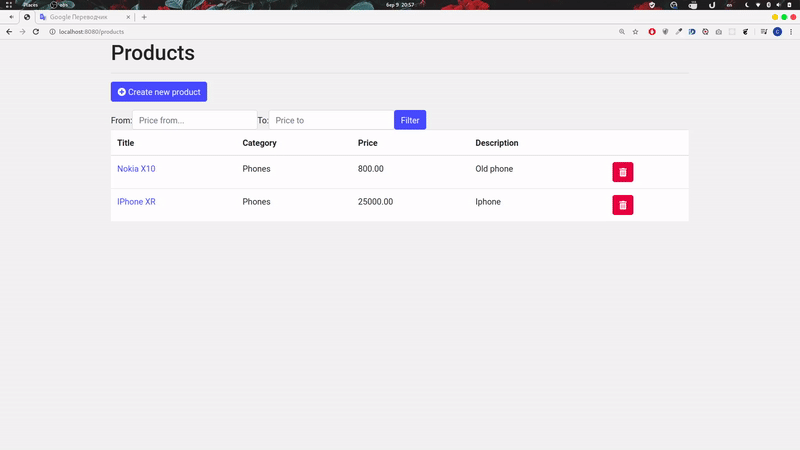

# Зміст

${toc}

# Refactoring

Для початку зробимо рефакторинг проекту, який ми робимо протягом курсу. За основу візьмемо [shop-hb-basic](https://github.com/endlesskwazar/spring-examples/tree/shop-hb-basic) Рефакторинг полягатиме в видаленні непотрібних файлів, а саме:

- клас com.example.demo.InititJdbTemplateTables
- клас com.example.demo.dummydata.DummyData
- пакет com.example.demo.dummydata
- клас com.example.demo.repository.ProductRepository
- всі класи та інтерфейси в пакеті com.example.demo.repository
- файли application-hb.properties, application-jdbc.properties
- Налаштування підключення перенести в application.properties

**application.properties:**

```
spring.jpa.hibernate.ddl-auto=update
spring.datasource.url=jdbc:mysql://localhost:3306/shop
spring.datasource.password=111
spring.datasource.username = root
spring.jpa.properties.hibernate.dialect=org.hibernate.dialect.MySQL55Dialect
```

Фінальна структура:


> Після нашого рефакторинга проект зламався. Ми це виправимо пізніше.

# Spring Data

Шар DAO зазвичай складається з безлічі кодових шаблонів, які можна і потрібно спростити. Переваг такого спрощення багато: зменшення кількості артефактів, які нам потрібно визначити та підтримувати, узгодженість моделей доступу до даних та послідовність конфігурації.

Spring Data робить це спрощення на крок вперед і дає змогу повністю видалити реалізації DAO. Зараз інтерфейс DAO - єдиний артефакт, який нам потрібно чітко визначити.

Місія Spring Data полягає у наданні звичної та послідовної моделі програмування для доступу до даних, зберігаючи при цьому особливі риси сховища даних.

Це полегшує використання технологій доступу до даних, реляційних та нереляційних баз даних.

Spring Data має багато модулів, що відповідають підтримуваним сховищам. Spring Data Commons - це загальний модуль для кожного модуля Spring Data. Це модуль, в якому знаходяться інтерфейси CrudRepository та PagingAndSortingRepository.


Центральним інтерфейсом доступу до даних в Spring Data є Repository.

```java
public interface Repository<T, ID> {
 
}
```

Repository - це **marker interface**, який керує класом домену, а також типом ідентифікатора доменного класу як аргументами типу.

> Інтерфейс маркера на Java - це порожній інтерфейс. Оскільки інтерфейс маркера - це порожній інтерфейс, то методів реалізувати не потрібно. Він використовується для вказівки, що клас, що реалізує інтерфейс маркера, належить до цього типу, але сам інтерфейс маркера не додає жодної поведінки (оскільки у нього немає методів реалізації).

CrudRepository розширює сховище та забезпечує складну функціональність CRUD для класу сутностей, яким керується.

```java
public interface CrudRepository<T, ID> extends Repository<T, ID> {
 
    <S extends T> S save(S entity);
    <S extends T> Iterable<S> saveAll(Iterable<S> entities);
    Optional<T> findById(ID id);
    boolean existsById(ID id);
    Iterable<T> findAll();
    Iterable<T> findAllById(Iterable<ID> ids);
    long count();
    void deleteById(ID id);
    void delete(T entity);
    void deleteAll(Iterable<? extends T> entities);
    void deleteAll();
}
```

На вершині CrudRepository є абстракція PagingAndSortingRepository, яка додає додаткові методи для полегшення доступу до об'єктів.

```java
public interface PagingAndSortingRepository<T, ID> extends CrudRepository<T, ID> {
    Iterable<T> findAll(Sort sort);
    Page<T> findAll(Pageable pageable);
}
```


Для того щоб мати змогу використовувати Spring-Data потрібно мати залежність(в залежності від використованого сховища) на відповідний API Spring Data:

**Реляційні бази даних:**

```xml
<dependency>
	<groupId>org.springframework.data</groupId>
	<artifactId>spring-data-jpa</artifactId>
</dependency>
```

**MongoDB:**
```xml
<dependency>
    <groupId>org.springframework.data</groupId>
    <artifactId>spring-data-mongodb</artifactId>
</dependency>
```

**Redis:**
```xml
<dependency>
    <groupId>org.springframework.data</groupId>
    <artifactId>spring-data-redis</artifactId>
    <version>2.2.5.RELEASE</version>
</dependency>
```

**Neo4J:**
```xml
<dependency>
    <groupId>org.springframework.data</groupId>
    <artifactId>spring-data-neo4j</artifactId>
    <version>5.2.5.RELEASE</version>
</dependency>
```


## Crud Repository

Створимо новий інтерфейс ProductRespository і Віднаслідуємся від CrudRepository:
**ProductRespository.java**
```java
package com.example.demo.repository;

import org.springframework.data.repository.CrudRepository;

public interface ProductRepository extends CrudRepository<Product, Long> {

}
```

Змінимо заллежність на репозиторій в ProductService і поправимо декілька методів, а саме getById, removeById:
**ProductService.java:**
```java
package com.example.demo.service;

import org.springframework.beans.factory.annotation.Autowired;
import org.springframework.stereotype.Service;
import com.example.demo.model.Product;
import com.example.demo.repository.ProductRepository;

@Service
public class ProductService {
	
	@Autowired
	private ProductRepository productRepository;
	
	public Iterable<Product> getAllProducts(){
		return productRepository.findAll();
	}
	
	public Product getById(Long id) {
		return productRepository.findById(id).get();
	}
	
	public Product create(Product product) {
		return productRepository.save(product);
	}
	
	public void removeById(Long id) {
		productRepository.deleteById(id);
	}

}
```

## Додаємо ще одну модель

Створимо ще оду модель, щоб схема БД відповідала наступній:


Створимо Entity:
**Category.java**
```java
package com.example.demo.model;

import java.util.Set;

import javax.persistence.CascadeType;
import javax.persistence.Entity;
import javax.persistence.GeneratedValue;
import javax.persistence.Id;
import javax.persistence.OneToMany;

@Entity
public class Category {
	
	@Id
	@GeneratedValue
	private Long id;
	public Category() {
		super();
	}
	public Category(String title) {
		super();
		this.title = title;
	}
	@Override
	public String toString() {
		return "Category [id=" + id + ", title=" + title + "]";
	}
	public Long getId() {
		return id;
	}
	public void setId(Long id) {
		this.id = id;
	}
	public Set<Product> getProducts() {
		return products;
	}
	public void setProducts(Set<Product> products) {
		this.products = products;
	}
	public String getTitle() {
		return title;
	}
	public void setTitle(String title) {
		this.title = title;
	}
	private String title;
	
	@OneToMany(cascade = CascadeType.ALL, mappedBy = "category")
	private Set<Product> products;
}
```

Модифікуємо модель Product:
**Product.java**
```java
package com.example.demo.model;

import java.math.BigDecimal;

import javax.persistence.Entity;
import javax.persistence.GeneratedValue;
import javax.persistence.Id;
import javax.persistence.JoinColumn;
import javax.persistence.ManyToOne;

@Entity
public class Product {
	
	@Id
	@GeneratedValue
	private Long id;
	public Long getId() {
		return id;
	}
	public void setId(Long id) {
		this.id = id;
	}
	private String title;
	public String getTitle() {
		return title;
	}
	public void setTitle(String title) {
		this.title = title;
	}
	public String getDescription() {
		return description;
	}
	public void setDescription(String description) {
		this.description = description;
	}
	public BigDecimal getPrice() {
		return price;
	}
	public void setPrice(BigDecimal price) {
		this.price = price;
	}
	private String description;
	private BigDecimal price;
	public Product(Long id, String title, String description, BigDecimal price) {
		super();
		this.id = id;
		this.title = title;
		this.description = description;
		this.price = price;
	}
	public Product() {
		super();
	}
	@Override
	public String toString() {
		return "Product [title=" + title + ", description=" + description + ", price=" + price + "]";
	}
	
	@ManyToOne
	@JoinColumn(name="prod_cat", nullable = false)
	private Category category;
	public Category getCategory() {
		return category;
	}
	public void setCategory(Category category) {
		this.category = category;
	}
}
```

Тепер створити новий продукт ми не зможемо оскільки в БД вказаний Constraint на зовнішній ключ(not null).


### Repository Populators

Для початку створимо першопочаткові дані категорій. Для цієї цілі використаємо Spring Data Repository Populator.

Spring Data забезпечує незалежний від магазину сховища механіз першопочаткового заповнення даними. Це схоже на заповнення DataSource за допомогою SQL-скриптів у модулі Spring JDBC, але замість використання сценаріїв SQL він підтримує формати XML та JSON (Jackson).

Додамо залежність на Jackson:
pom.xml:
```xml
<dependency>
	<groupId>com.fasterxml.jackson.core</groupId>
	<artifactId>jackson-databind</artifactId>
</dependency>
```

Оскільки data population буде відбуватися через репозиторій, його потрібно створити:
**CategoryRepository.java**
```java
package com.example.demo.repository;

import org.springframework.data.repository.CrudRepository;

import com.example.demo.model.Category;

public interface CategoryRepository extends CrudRepository<Category, Long> {

}
```

Створимо json - файл в директорії resources:
data.json:
```json
[
    {
        "_class": "com.example.demo.model.Category",
        "id": 1,
        "title": "Phones"
    },
    {
        "_class": "com.example.demo.model.Category",
        "id": 2,
        "title": "Tablets"
    }
]
```

Нарешті, нам доведеться додати бін для популяції даних. Цей бін зчитує дані з файлу json та заповнить їх у базу даних при запуску програми:

**DataPopulation.java**
```java
package com.example.demo;
import org.springframework.context.annotation.Bean;
import org.springframework.context.annotation.Configuration;
import org.springframework.core.io.ClassPathResource;
import org.springframework.core.io.Resource;
import org.springframework.data.repository.init.Jackson2RepositoryPopulatorFactoryBean;

@Configuration
public class DataPopulation {

	@Bean
	public Jackson2RepositoryPopulatorFactoryBean getRespositoryPopulator() {
	    Jackson2RepositoryPopulatorFactoryBean factory = new Jackson2RepositoryPopulatorFactoryBean();
	    factory.setResources(new Resource[]{new ClassPathResource("data.json")});
	    return factory;
	}
	
}
```

## Випраляємо помилку додавання продукта

Для того, щоб виправити додавання продукту, ми передамо доступні катеорії в форму додавання і зв'яжимо створений продукт із вибраною категорією.

Створимо CategoryService:
**CategoryService.java:**
```java
package com.example.demo.service;

import org.springframework.beans.factory.annotation.Autowired;
import org.springframework.stereotype.Service;

import com.example.demo.model.Category;
import com.example.demo.repository.CategoryRepository;

@Service
public class CategoryService {

	@Autowired
	private CategoryRepository repository;
	
	public Iterable<Category> findAll() {
		return repository.findAll();
	}
	
}
```

Модифікуємо метод контролера, який повертає форму додавання:
**ProductController.java:**
```java
...
@Autowired
private CategoryService categoryService;
...
@RequestMapping("/products/create")
public String showCreateForm(Model model) {
	model.addAttribute("categories", categoryService.findAll());
	return "products/create";
}
```

Також модифікуємо саму форму додавання:
**create.html**
```xml
<!DOCTYPE html>
<html xmlns:layout="http://www.w3.org/1999/xhtml"
	layout:decorate="~{layouts/layout}">
<head>
<title>Create new product</title>
<meta name="viewport"
	content="width=device-width, initial-scale=1, shrink-to-fit=no">
</head>
<body>
	<div class="container" layout:fragment="content">
		<div class="row">
			<div class="col">
				<h1>Create new product</h1>
				<hr />

				<div class="card">
					<div class="card-body">
						<form method="POST" th:action="@{/products}">
							<div class="form-group">
								<label>Title</label> <input type="text" class="form-control"
									placeholder="Title" name="title">
							</div>
							<div class="form-group">
								<label>Description</label> <textarea type="text"
									class="form-control" placeholder="Description" name="description"></textarea>
							</div>
							<div class="form-group">
								<label>Price</label> <input type="text" class="form-control"
									placeholder="Price" name="price">
							</div>
							<div class="form-group">
								<label>Category</label>
								<select name="category" class="form-control">
									<option th:each="c : ${categories}" th:value="${c.id}" th:text="${c.title}"></option>
								</select>
							</div>
							<button type="submit" class="btn btn-primary">Submit</button>
						</form>
					</div>
				</div>

				<hr />
				<a th:href="@{/products}">Back to list</a>
			</div>
		</div>
	</div>
</body>
</html>
```

Таож модифікуємо виведення списку продуктів:
**list.html:**
```xml
<div class="row">
	<div class="col">
		<h1>Products</h1>
		<hr />
		<a th:href="@{/products/create}" class="btn btn-primary mb-3"><i class="fas fa-plus-circle"></i> Create new product</a>
		<table class="table table-hover bg-white">
			<thead>
				<tr>
					<th>Title</th>
					<th>Category</th>
					<th>Price</th>
					<th>Description</th>
					<th></th>
				</tr>
			</thead>
			<tbody>
				<tr th:each="product : ${products}">
					<td><a th:href="@{'/products/' + ${product.id}}"
						th:text="${product.title}"></a></td>
					<td th:text="${product.category}"></td>
					<td th:text="${product.price}"></td>
					<td th:text="${product.description}"></td>
					<td>
					<form method="POST" th:action="@{'/products/' + ${product.id}}">
					<input type="hidden" name="_method" value="DELETE"/>
					<button type="submit" class="btn btn-danger"><i
							class="fas fa-trash-alt" style="color:white"></i></button>
							</form>
					</td>
				</tr>
			</tbody>
		</table>
	</div>
</div>
```

## Custom Access Method and Queries

Запити можна будувати прямо з імені методу. Для цього використовується механізм префіксів find ... By, read ... By, query ... By, count ... By, і get ... By, далі від префікса методу починає розбір решти. Метод також може містити додаткові вирази, наприклад, Distinct. Далі перший By діє як роздільник, щоб вказати початок фактичних критеріїв. Можна визначити умови для властивостей сутностей і об'єднати їх за допомогою And і Or.

Приклади:
```java
// And / Or
@Query("SELECT n FROM Note n WHERE n.title = ?1 AND n.featured = ?2 OR n.priority = ?3")
List<Note> findByTitleAndFeaturedOrPriority(String title, boolean featured, int priority);

// Equality
@Query("SELECT n FROM Note n WHERE n.title = ?1")
List<Note> findByTitle(String title);

// Ignore Case
@Query("SELECT n FROM Note n WHERE lower(n.title) = lower(?1) ")
List<Note> findByTitleIgnoreCase(String title);

// Not Equal
@Query("SELECT n FROM Note n WHERE n.title <> ?1")
List<Note> findByTitleNotEqual(String title);

// Like / Contains / Starts With / Ends With
@Query("SELECT n FROM Note n WHERE n.title LIKE ?1")
List<Note> findByTitleLike(String pattern);

// Less Than
@Query("SELECT n FROM Note n WHERE n.priority < ?1")
List<Note> findByPriorityLessThan(int priority);

// Greater Than
@Query("SELECT n FROM Note n WHERE n.priority > ?1")
List<Note> findByPriorityGreaterThan(int priority);

// Between
@Query("SELECT n FROM Note n WHERE n.priority BETWEEN  ?1 AND ?2")
List<Note> findByPriorityBetween(int start, int end);

// Before
@Query("SELECT n FROM Note n WHERE n.created < ?1")
List<Note> findByCreatedBefore(Date before);

// After
@Query("SELECT n FROM Note n WHERE n.created > ?1")
List<Note> findByCreatedAfter(Date before);

// Null
@Query("SELECT n FROM Note n WHERE n.title IS NULL")
List<Note> findByTitleIsNull();

// Not Null
@Query("SELECT n FROM Note n WHERE n.title IS NOT NULL")
List<Note> findByTitleIsNotNull();

// In
@Query("SELECT n FROM Note n WHERE n.priority IN ?1")
List<Note> findByPriorityIn(Set<Integer> priorities);
```

Досить тільки визначити подібним чином метод, без імплементації та Spring підготує запит до бази даних.

### Отримати продукти в діапазоні цін

Додамо метод без імплементації в ProductRepository:
**ProductRepository.java:**
```java
package com.example.demo.repository;

import java.math.BigDecimal;

import org.springframework.data.repository.CrudRepository;

import com.example.demo.model.Product;

public interface ProductRepository extends CrudRepository<Product, Long> {

	public Iterable<Product> findByPriceGreaterThanAndPriceLessThan(BigDecimal leftPrice, BigDecimal rightPrice);
	
}
```

Додамо користувацькі елементи для фільтрації по цінах в list.html
**list.html:**
```xml
<!DOCTYPE html>
<html xmlns:layout="http://www.w3.org/1999/xhtml"
	layout:decorate="~{layouts/layout}">
<head>
<title>Products</title>
<meta name="viewport"
	content="width=device-width, initial-scale=1, shrink-to-fit=no">
</head>
<body>
	<div class="container" layout:fragment="content">

		<div class="alert alert-success alert-dismissible fade show"
			role="alert" th:if="${success_message}">
			<span th:text="${success_message}"></span>
			<button type="button" class="close" data-dismiss="alert"
				aria-label="Close">
				<span aria-hidden="true">&times;</span>
			</button>
		</div>

		<div class="row">
			<div class="col">
				<h1>Products</h1>
				<hr />
				<a th:href="@{/products/create}" class="btn btn-primary mb-3"><i
					class="fas fa-plus-circle"></i> Create new product</a>
					
					<form class="form-inline">
						<label for="leftPrice">From:</label> <input type="number"
							class="form-control" placeholder="Price from..."
							name="price_from"> <label for="pwd">To:</label> <input
							type="number" class="form-control" placeholder="Price to"
							name="price_to">
						<button type="submit" class="btn btn-primary">Filter</button>
					</form>

				<table class="table table-hover bg-white">
					<thead>
						<tr>
							<th>Title</th>
							<th>Category</th>
							<th>Price</th>
							<th>Description</th>
							<th></th>
						</tr>
					</thead>
					<tbody>
						<tr th:each="product : ${products}">
							<td><a th:href="@{'/products/' + ${product.id}}"
								th:text="${product.title}"></a></td>
							<td th:text="${product.category}"></td>
							<td th:text="${product.price}"></td>
							<td th:text="${product.description}"></td>
							<td>
								<form method="POST" th:action="@{'/products/' + ${product.id}}">
									<input type="hidden" name="_method" value="DELETE" />
									<button type="submit" class="btn btn-danger">
										<i class="fas fa-trash-alt" style="color: white"></i>
									</button>
								</form>
							</td>
						</tr>
					</tbody>
				</table>
			</div>
		</div>
	</div>
</body>
</html>
```

Додамо метод в ProductService:
**ProductService.java:**
```java
...
public Iterable<Product> getInPriceRange(BigDecimal leftPrice, BigDecimal rightPrice) {
	return productRepository.findByPriceGreaterThanAndPriceLessThan(leftPrice, rightPrice);
}
...
```

Модифікуємо метод контролера для отримання списку продуктів:
**ProductController.java:**
```java
...
@RequestMapping("/products")
public String list(Model model, @RequestParam(value = "price_from", required = false) BigDecimal price_from,
		@RequestParam(value = "price_to", required = false) BigDecimal price_to) {
	Iterable<Product> products = null;
	if (price_from != null && price_to != null) {
		products = productService.getInPriceRange(price_from, price_to);
	} else {
		products = productService.getAllProducts();
	}
	model.addAttribute("products", products);
	return "products/list";
}
...
```




## Пагінація (PagingAndSortingRepository)

Змінимо базовий інтерфейс для ProductRepository:
**ProductRepository:**
```java
package com.example.demo.repository;

import java.math.BigDecimal;

import org.springframework.data.domain.Page;
import org.springframework.data.domain.Pageable;
import org.springframework.data.repository.PagingAndSortingRepository;

import com.example.demo.model.Product;

public interface ProductRepository extends PagingAndSortingRepository<Product, Long> {

	public Page<Product> findByPriceGreaterThanAndPriceLessThan(BigDecimal leftPrice,
			BigDecimal rightPrice, Pageable pageable);
	
}

```

Маючи це розширення PagingAndSortingRepository, ми отримуємо методи findAll (Pageable pageable) та findAll (Sort sort) для пагінації та сортування.

Як тільки ми розширимо PagingAndSortingRepository, ми можемо додати наші власні методи, які приймають Pageable і сортування як параметри, як ми це робили з findByPriceGreaterThanAndPriceLessThan.

Модифікуємо ProductService:
**ProductService:**
```java
@Service
public class ProductService {
	
	@Autowired
	private ProductRepository productRepository;
	
	public Iterable<Product> getAllProducts(){
		return productRepository.findAll();
	}
	
	//added
	public Page<Product> findAllWithPagination(Pageable pageRequest) {
		return productRepository.findAll(pageRequest);
	}
	
	public Product getById(Long id) {
		return productRepository.findById(id).get();
	}
	
	public Product create(Product product) {
		return productRepository.save(product);
	}
	
	public void removeById(Long id) {
		productRepository.deleteById(id);
	}
	
	public Page<Product> getInPriceRange(BigDecimal leftPrice, BigDecimal rightPrice, Pageable pageRequest) {
		return productRepository.findByPriceGreaterThanAndPriceLessThan(leftPrice, rightPrice, pageRequest);
	}

}
```

Також модифікуємо ProductController:
**ProductController:**
```java
...
@RequestMapping("/products")
public String list(Model model, @RequestParam(value = "price_from", required = false) BigDecimal price_from,
		@RequestParam(value = "price_to", required = false) BigDecimal price_to,
		@PageableDefault(page=0 ,value = 5) Pageable pageRequest) {
	Page<Product> products = null;
	if(price_from != null && price_to!=null) {
		products = productService.getInPriceRange(price_from, price_to, pageRequest);
	} else {
		products = productService.findAllWithPagination(pageRequest);
	}
	model.addAttribute("products", products);
	
	int totalPages = products.getTotalPages();
	if (totalPages > 0) {
		List<Integer> pageNumbers = IntStream.rangeClosed(1, totalPages)
			.boxed()
			.collect(Collectors.toList());
		model.addAttribute("pageNumbers", pageNumbers);
	}
	return "products/list";
}
...
```

Виведемо користувацькі елементи для піганаціх в list.html:
**list.html:**
```xml
<!DOCTYPE html>
<html xmlns:layout="http://www.w3.org/1999/xhtml"
	layout:decorate="~{layouts/layout}">
<head>
<title>Products</title>
<meta name="viewport"
	content="width=device-width, initial-scale=1, shrink-to-fit=no">
</head>
<body>
	<div class="container" layout:fragment="content">

		<div class="alert alert-success alert-dismissible fade show"
			role="alert" th:if="${success_message}">
			<span th:text="${success_message}"></span>
			<button type="button" class="close" data-dismiss="alert"
				aria-label="Close">
				<span aria-hidden="true">&times;</span>
			</button>
		</div>

		<div class="row">
			<div class="col">
				<h1>Products</h1>
				<hr />
				<a th:href="@{/products/create}" class="btn btn-primary mb-3"><i
					class="fas fa-plus-circle"></i> Create new product</a>

				<form class="form-inline">
					<label for="leftPrice">From:</label> <input type="number"
						class="form-control" placeholder="Price from..." name="price_from">
					<label for="pwd">To:</label> <input type="number"
						class="form-control" placeholder="Price to" name="price_to">
					<button type="submit" class="btn btn-primary">Filter</button>
				</form>

				<table class="table table-hover bg-white">
					<thead>
						<tr>
							<th>Title</th>
							<th>Category</th>
							<th>Price</th>
							<th>Description</th>
							<th></th>
						</tr>
					</thead>
					<tbody>
						<tr th:each="product : ${products}">
							<td><a th:href="@{'/products/' + ${product.id}}"
								th:text="${product.title}"></a></td>
							<td th:text="${product.category}"></td>
							<td th:text="${product.price}"></td>
							<td th:text="${product.description}"></td>
							<td>
								<form method="POST" th:action="@{'/products/' + ${product.id}}">
									<input type="hidden" name="_method" value="DELETE" />
									<button type="submit" class="btn btn-danger">
										<i class="fas fa-trash-alt" style="color: white"></i>
									</button>
								</form>
							</td>
						</tr>
					</tbody>
				</table>

				<nav class="pagination justify-content-center" th:if="${products.totalPages > 0}">
					<ul class="pagination">
						<li th:each="pageNumber : ${pageNumbers}"><a class="page-link" th:href="@{/products(page=${pageNumber-1})}"
						th:text=${pageNumber}
						></a></li>
					</ul>
				</nav>

			</div>
		</div>
	</div>
</body>
</html>
```

# Фінальний проект

Фінальний проект можна знайти на [shop-data](https://github.com/endlesskwazar/spring-examples/tree/shop-data)

# Домашнє завдання

Доробіть до розробленого проекту:

1. Доробіть функціонал керування категоріями.
2. Виправте активний клас для поточної сторінки пагінації.
3. Випавте пагінацію, при фільтрації.

# Контрольні запитання

1. Що таке Spring Data?
2. Поясніть інтерфейси Repository, CrudRepository, PagingAndSortingRepository.
3. Поясніть процес створення репозиторія на основі Spring Data.
4. Поясніть процес першопочаткового заповнення даними використовуючи Spring Data Repository Populators.
5. Поясніть name convention користувацьких методів в репозиторії.
6. Що таке пагінація? Поясніть реалізацію пагінації в Spring Data.