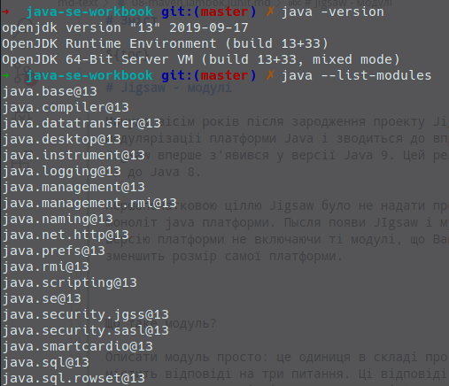
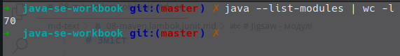
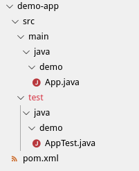
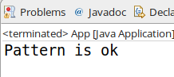

# Зміст

${toc}

# Jigsaw - модулі

Минуло вісім років після зародження проекту Jigsaw, завдання якого полягає в модулярізаціі платформи Java і зводиться до впровадження загальної системи модулів. Jigsaw вперше з'явився у версії Java 9. Цей реліз раніше планувався і до виходу Java 7, і до Java 8.

Першопочатковою ціллю Jigsaw було не надати програмістам систему модулів, а розбити моноліт java платформи. Після появи JIgsaw і мудульної Java можна скласти власну версію платформи не включаючи ті модулі, що Вам не потрібно використовувати, що зменшить розмір самої платформи.

Подивится перелік модулів:



Показати їх загальну кількість:



Що таке модуль?

Описати модуль просто: це одиниця в складі програми, причому кожен модуль відразу містить відповіді на три питання. Ці відповіді записані в файлі module-info.java, Який є у кожного модуля і містить наступну інформацію:

- Як називається модуль?
- Що він експортує?
- Що для цього потрібно?


Створимо наступну структуру директорій:


First.java:
```java
package first.com.demo;

public class First {

    public String getInfo() {
        return "First";
    }

}
```

Second.java:
```java
package second.com.demo;
import first.com.demo.First;

public class Second {

    public String getInfo() {
        return "second";
    }

    public static void main(String[] args) {
        System.out.println(new Second().getInfo());
        System.out.println(new First().getInfo());
    }

}
```

Збудуємо проект наступним build.sh файлом:

```bash
/bin/rm -rf output

mkdir -p output/mlib

javac -d output/classes `find first -name *.java`
jar -c -f output/mlib/first.jar -C output/classes .
/bin/rm -rf output/classes

mkdir -p output/classes
javac -d output/classes -classpath output/mlib/first.jar `find second -name *.java`
jar -c -f output/mlib/second.jar -C output/classes .
/bin/rm -rf output/classes

java -classpath output/mlib/first.jar:output/mlib/second.jar second.com.demo.Second
```

Тут було використання змінна classPath. classpath - це шлях, в якому віртуальна машина Java шукає призначені для користувача класи, пакети і ресурси в програмах Java.

Використовуючи jigsaw крім classpath існує і інший простір - module path. І програмістам вирішувати в який простір класти залежності.

Давайте змінимо build.sh наступним чином:

```bash
/bin/rm -rf output

mkdir -p output/mlib

javac -d output/classes `find first -name *.java`
jar -c -f output/mlib/first.jar -C output/classes .
/bin/rm -rf output/classes

mkdir -p output/classes
javac -d output/classes -classpath output/mlib/first.jar `find second -name *.java`
jar -c -f output/mlib/second.jar -C output/classes .
/bin/rm -rf output/classes

java -p output/mlib -m second/second.com.demo.Second
```

Ми змінили -classpath на -p, де p - це скорочення для modulepath. І позбулися від ручного списку jar - файлів. І за допомогою параметра -m встановили ім'я модуля, який необхідно запустити.

Ім'я модуля не завжди збігається із ім'ям jar - файла. Дізнатися ім'я модуля можна за допомогою команди:

```bash
jar -f output/mlib/second.jar -d
```


Тепер в Java існують 3 типи модулів:

- Unnamed module - всі класи, які знаходяться в classpath
- Automatic module - старий jar, який був поміщений в modulepath
- Explicitly named modules - модулі, які мають дескриптор модуля

Unnamed і Automatic модулі ми вже розглянули. Тепер розглянемо Explicitly named modules.

Модифікуємо структуру проекту наступним чином:


first/module-info.java:
```java
module thefirst {
    exports first.com.demo;
}
```

second/module-info.java:
```java
module thesecond {
    requires thefirst;
}
```

І модифікуємо build.sh:

```bash
/bin/rm -rf output

mkdir -p output/mlib

javac -d output/classes `find first -name *.java`
jar -c -f output/mlib/first.jar -C output/classes .
/bin/rm -rf output/classes

mkdir -p output/classes
javac -d output/classes -p output/mlib/first.jar `find second -name *.java`
jar -c -f output/mlib/second.jar -C output/classes .
/bin/rm -rf output/classes

java -p output/mlib -m thesecond/second.com.demo.Second
```

```bash
jar -f output/mlib/second.jar -d
```


# Lombok

Java - одина із найпопулярніших мов JVM, але не єдиниа. В останні роки конкуренцію їй складають Scala, Clojure і Kotlin, які забезпечують нову функціональність і оптимізовані функції мови. Коротше кажучи, вони дозволяють робити більше з більш лаконічним кодом.

Ці інновації в екосистемі JVM дуже цікаві. Через конкуренцію Java змушена змінюватися, щоб зберегти конкурентоспроможність. Новий шестимісячний графік випуску і кілька JEP (JDK enhancement proposals) в Java 8 (Valhalla, local-Variable Type Inference, Loom) - доказ того, що Java на довгі роки залишиться конкурентноспроможною мовою.

Проте, розмір і масштаб Java означають, що розробка просувається повільніше, ніж ми хотіли б, не кажучи вже про сильне бажання за всяку ціну підтримувати зворотну сумісність. У будь-розробці першим пріоритетом повинні бути функції, однак тут необхідні функції занадто довго розробляються, якщо взагалі потрапляють в мову. Тому існують сторонні інструменти, які вже надають кращу Java. Один із них - **Project Lombok**.

**Project Lombok** - проект по додаванню додаткової функціональності в Java c допомогою зміни вихідного коду перед Java компіляцією.

По суті, проект Lombok дозволяє позбутися від багатослівності Java в більшості випадків і перестати писати величезні простирадла коду з гетер, сеттерів, equals, hashcode і toString (та їх зазвичай генерує IDE, але читати і змінювати все одно доводиться програмісту), в результаті Java ставати майже такий же короткій як Kotlin, Scala або C#.

## Установка Labmok в Eclipse

Перейдіть на [projectlombok.org]() та перейдіть на вкладку Download, завантажте lombok.jar. Запустіть завантажений labmok.jar(з парави адміністратора, sudo для unix - like) і інсталюйте lombok:


Далі потрібно додати lombok.jar до Build Path проекту:


## Вивчення анотацій Lambok

Давайте створимо клас:

```java
class Student {
	private String name;
	private int age;
	private int cardNumber;
}
```

Звісно цього не достатньо: якщо цей класу буде використаний як модель для ORM потрібно мати пустий конструктор, і взагалі скоріш за все потрібно мати конструктор, який використовує параметри для ініціалізації об'єкта. І це звісно не все, потрібно перевизначити методи equals, toString, hashCode і додати геттери і сеттери:

```java
class Student {
	private String name;
	private int age;
	private int cardNumber;
	
	public String getName() {
		return name;
	}
	public void setName(String name) {
		this.name = name;
	}
	public int getAge() {
		return age;
	}
	public void setAge(int age) {
		this.age = age;
	}
	public int getCardNumber() {
		return cardNumber;
	}
	public void setCardNumber(int cardNumber) {
		this.cardNumber = cardNumber;
	}
	@Override
	public int hashCode() {
		final int prime = 31;
		int result = 1;
		result = prime * result + age;
		result = prime * result + cardNumber;
		result = prime * result + ((name == null) ? 0 : name.hashCode());
		return result;
	}
	@Override
	public boolean equals(Object obj) {
		if (this == obj)
			return true;
		if (obj == null)
			return false;
		if (getClass() != obj.getClass())
			return false;
		Student other = (Student) obj;
		if (age != other.age)
			return false;
		if (cardNumber != other.cardNumber)
			return false;
		if (name == null) {
			if (other.name != null)
				return false;
		} else if (!name.equals(other.name))
			return false;
		return true;
	}
	@Override
	public String toString() {
		return "Student [name=" + name + ", age=" + age + ", cardNumber=" + cardNumber + "]";
	}
	public Student(String name, int age, int cardNumber) {
		super();
		this.name = name;
		this.age = age;
		this.cardNumber = cardNumber;
	}
	public Student() {
		super();
	}
	
}
```

Тепер розгляньмо як ламбок нам може допомоги, для цього повернімося до першопочаткового класу і додамо анотацію **@AllArgsConstructor**:

```java
@AllArgsConstructor
class Student {
	private String name;
	private int age;
	private int cardNumber;
}
```

Ця анотацію згенерує для конструктор, який використовує всі поля класу:

```java
import lombok.AllArgsConstructor;

@AllArgsConstructor
class Student {
	private String name;
	private int age;
	private int cardNumber;
}

class Main {
    public static void main(String[] args) {
    	Student s = new Student("Alex", 23, 123123);
    }
}
```

Додамо іншу анотацію **@ToString**. Як можна здогадатися із назви вона згенерує для нас методу toString():

```java
import lombok.AllArgsConstructor;
import lombok.ToString;

@AllArgsConstructor
@ToString
class Student {
	private String name;
	private int age;
	private int cardNumber;
}

class Main {
    public static void main(String[] args) {
    	Student s = new Student("Alex", 23, 123123);
    	System.out.println(s);
    }
}
```

Додамо ще антації **@Getter/@Setter**, але уже не на класові, а полі класа:

```java
@AllArgsConstructor
@ToString
class Student {
	@Getter @Setter private String name;
	private int age;
	private int cardNumber;
}

class Main {
    public static void main(String[] args) {
    	Student s = new Student("Alex", 23, 123123);
    	System.out.println(s.getName());
    }
}
```

Ми також можемо додати **@Getter/@Setter** на сам клас, що зенерує геттери і сеттери для всіх допкстимих полів:

```java
import lombok.AllArgsConstructor;
import lombok.Getter;
import lombok.Setter;
import lombok.ToString;

@AllArgsConstructor
@ToString
@Getter
@Setter
class Student {
	private String name;
	private int age;
	private int cardNumber;
}

class Main {
    public static void main(String[] args) {
    	Student s = new Student("Alex", 23, 123123);
    	System.out.println(s.getName() + s.getAge() + s.getCardNumber());
    }
}
```

Додамо анотацію **@EqualsAndHashCode**, вона згенерує для нас equeals, hashCode():

```java
import lombok.AllArgsConstructor;
import lombok.EqualsAndHashCode;
import lombok.Getter;
import lombok.Setter;
import lombok.ToString;

@AllArgsConstructor
@ToString
@Getter
@Setter
@EqualsAndHashCode
class Student {
	private String name;
	private int age;
	private int cardNumber;
}

class Main {
    public static void main(String[] args) {
    	Student s = new Student("Alex", 23, 123123);
    	System.out.println(s.hashCode());
    }
}
```

Щось анотацій стає дедалі більше, в такому випадку, ми можемо використати анотацію **@Data**, які містить в собі **@ToString**, **@EqualsAndHashCode**, **@Getter** на всіх полях, і **@Setter** на всіх не final - полях, і **@RequiredArgsConstructor**! 

```java
import lombok.Data;

@Data
class Student {
	private String name;
	private int age;
	private int cardNumber;
}

class Main {
    public static void main(String[] args) {
    	Student s = new Student();
    	s.setName("Alex");
    	System.out.println(s);
    }
}
```

Всі анотації lombok можна подивитися на [projectlombok.org](https://projectlombok.org/features/all)

# maven

**Apache Maven** - фреймворк для автоматизації збирання проектів на основі опису їх структури в файлах на мові POM (англ. Project Object Model), що є підмножиною XML.

Maven забезпечує декларативну, а не імперативну (на відміну від засобу автоматизації збирання Apache Ant) збірку проекту. У файлах опису проекту міститься його специфікація, а не окремі команди виконання. Всі завдання по обробці файлів, описані в специфікації, Maven виконує за допомогою їх обробки послідовністю вбудованих і зовнішніх плагінів.

Серед примітних альтернатив - система автоматичного складання Gradle, побудована на принципах Apache Ant і Maven, але використовує спеціалізований DSL на Groovy замість POM-конфігурації.


[Завантажити](https://maven.apache.org/download.cgi) Maven можна з офіційної сторінки проекту.

Перевірити правильність інсталяції можна за допомогою команди:


## Простий проект

Створимо наступну структуру директорій:


Вміст Main.java:

```java
package demo;

class Main {

    public static void main(String[] args) {
        System.out.println("Hello maven");
    }

}
```

Тут цікавого нічого немає.

Вміст pom.xml:

```xml
<project xmlns="http://maven.apache.org/POM/4.0.0" xmlns:xsi="http://www.w3.org/2001/XMLSchema-instance" xsi:schemaLocation="http://maven.apache.org/POM/4.0.0 http://maven.apache.org/xsd/maven-4.0.0.xsd">
    <modelVersion>4.0.0</modelVersion>

    <groupId>demo</groupId>
    <artifactId>demo-app</artifactId>
    <version>1.0-SNAPSHOT</version>

    <properties>
        <maven.compiler.source>1.8</maven.compiler.source>
        <maven.compiler.target>1.8</maven.compiler.target>
    </properties>

    <build>
        <plugins>
            <plugin>
                <!-- Build an executable JAR -->
                <groupId>org.apache.maven.plugins</groupId>
                <artifactId>maven-jar-plugin</artifactId>
                <version>3.1.0</version>
                <configuration>
                  <archive>
                    <manifest>
                      <mainClass>demo.Main</mainClass>
                    </manifest>
                  </archive>
                </configuration>
              </plugin>
        </plugins>
    </build>

</project>
```

pom.xml містить один рутовий тег project із XSD - інформацією. Всередині цього тегу містяться інші теги, які описують складання проекту.

- groupId - id пов'язаних проектів. Наприклад, com.company.bank.
- artifactId - id - проекту
- version - вкрсія проекту
- maven.compiler.source - на якій версії JDK написана программа, може викинути помилку, якщо використана фіча, якої немає в JDK
- maven.compiler.target - для якої версії платформи складаємо

Для того, щоб побудувати проект і отримати jar на виході виконаємо команду:

```bash
mvn package
```


Це згенерує директорію target із jar - файлом:


## Maven archetypes

Звісно створювати maven - проекти вручну буває доволі довго і важко. Тому в Maven існує система Archetypes.

Якщо коротко, то Archetypes - це шаблони проектів для maven.

Наприклад запустимо наступну команду:

```bash
mvn archetype:generate -DarchetypeGroupId=org.apache.maven.archetypes -Darchet
ypeArtifactId=maven-archetype-quickstart -DarchetypeVersion=1.3 
```


Що згенерує для нас наступний проект:



Переглянути список [archetypes](https://gist.github.com/zbigniewTomczak/4235871)

Тепер детальніше про структуру maven-проекту:

|Директорія|Призначення|
|-|-|
|Джерельний код|${basedir}/src/main/java|
|Ресурси|${basedir}/src/main/resources|
|Тести|${basedir}/src/test|
|Збудований проект|${basedir}/target|

## Стадії складання Maven

Це, звісно, не повний список, але найпоширеніші фази тут присутні.

|Фаза|Пояснення|
|-|-|
|validate|Перевірка правильності проекту і наявності всієї необхідної інформації|
|compile|Компіляція джерельного коду|
|test|Тестування скопільованого коду, використовуючи сумісний тестовий фреймворк|
|package|Компіляція і пакування джерельного коду|
|verify|Перевірка скомпільованого пакету|
|install|Встановлення проекту в локальний репозиторій, щоб його можна було використати як залежність|

## Maven і Eclipse

Використовую IDE, нам не потрібно вводити команди в терміналі, так-як найпоширеніші java IDE мають інтеграцію із maven. Нам навіть непотрібно встановлювати сам maven, оскільки, він сам часто поставляється із самою IDE.

Створення нового maven - проекту в exlipse:


## Залежності

maven дозволяє легко отримувати залежності для нашого проекту. Вони перераховуються в dependencies файлу pom.xml:

Наприклад:

```xml
<dependencies>
    <dependency>
      <groupId>junit</groupId>
      <artifactId>junit</artifactId>
      <version>3.8.1</version>
      <scope>test</scope>
    </dependency>
    <dependency>
		<groupId>org.projectlombok</groupId>
		<artifactId>lombok</artifactId>
		<version>1.18.10</version>
		<scope>provided</scope>
	</dependency>
  </dependencies>
```

Знайти залежності можна на [Maven Central Repository](https://search.maven.org/)

Scope - залежностей це область видимості залежності в залежності від фази будування проекту:

|Область видимості|Пояснення|
|-|-|
|test|Якщо залежність junit має область дії test, то ця залежність буде використана maven'ом при виконанні компіляції тієї частини проекту, яка містить тести, а також при запуску тестів на виконання і побудові звіту з результатами тестування коду. Спроба послатися на який-небудь клас або функцію бібліотеки junit в основній частині програми (каталог src / main) викличе помилку.|
|compile|До найбільш часто використовуваної області відносять compile (використовується за умовчанням). Тобто dependency, позначена як compile, або для якої не вказано scope, буде доступна як для компіляції основного додатки і його тестів, так і на стадіях запуску основного додатка або тестів.|
|runtime|Область дії runtime не потрібна для компіляції проекту і використовується тільки на стадії виконання програми.|
|provided|Область дії provided аналогічна compile, за винятком того, що артефакт використовується на етапі компіляції і тестування, а в збірку не включається.|

# junit

**Модульне тестування** (Unit testing) - тестування кожної атомарної функціональності програми окремо, в штучно створеному середовищі. Ідея полягає в тому, щоб писати тести для кожної нетривіальною функції або методу. Це дозволяє досить швидко перевірити, чи не призвело чергову зміну коду до регресії, тобто до появи помилок в уже протестованих місцях програми, а також полегшує виявлення і усунення таких помилок.

**JUnit** - це фреймворк автоматичного тестування вашого хорошого чи не зовсім коду.

**JUnit** базується на статичних методах класу [Assert](http://junit.sourceforge.net/javadoc/org/junit/Assert.html) і анотаціях(або класах TestCase, TestSuite).

Анотації:

|Анотація|Пояснення|
|-|-|
|@Test|Це анотація є заміною org.junit.TestCase, яка вказує на те, що public void метод, до якого він додається, може бути виконаний як тестовий випадок.|
|@Before|Ця внотація використовується, якщо ви хочете виконати якийсь код перед кожним тестовим випадком.|
|@BeforeClass|Ця анотація використовується, якщо ви хочете виконати деякі заяви перед усіма тестовими випадками, наприклад, перевірка підключення до джерела даних.|
|@After|Ця анотація може бути використана, якщо ви хочете виконати деякі оператори після кожного тестового випадку, наприклад, для скидання змінних, видалення тимчасових файлів, змінних тощо.|
|@AfterClass|Ця анотація може бути використана, якщо ви хочете виконати деякі вирази після всіх тестових випадків, наприклад звільнення ресурсів після виконання всіх тестових випадків.|

Створимо новий maven - проект, використовуючи maven-archetype-quickstart. Переконаймося, що pom.xaml мфстить залежність на JUnit:

```xml
<dependency>
    <groupId>junit</groupId>
    <artifactId>junit</artifactId>
    <version>4.12</version>
    <scope>test</scope>
</dependency>
```

і встановленя версія JDK в pom.xaml не менше 1.7:

```xml
<properties>
    <project.build.sourceEncoding>UTF-8</project.build.sourceEncoding>
    <maven.compiler.source>1.8</maven.compiler.source>
        <maven.compiler.target>1.8</maven.compiler.target>
  </properties>
```

Створимо клас BracketsChaker, задача, якого перевірити правильність відкриваючих і закриваючих дужок:

```java
import java.util.Stack;

public final class BracketsChaker {
	private final String testValue;
	
	public BracketsChaker(String testValue) {
		this.testValue = testValue;
	}
	
	public boolean test() {
		if (this.testValue.isEmpty())
	        return true;

	    Stack<Character> stack = new Stack<Character>();
	    for (int i = 0; i < this.testValue.length(); i++)
	    {
	        char current = this.testValue.charAt(i);
	        if (current == '{' || current == '(' || current == '[')
	        {
	            stack.push(current);
	        }


	        if (current == '}' || current == ')' || current == ']')
	        {
	            if (stack.isEmpty())
	                return false;

	            char last = stack.peek();
	            if (current == '}' && last == '{' || current == ')' && last == '(' || current == ']' && last == '[')
	                stack.pop();
	            else 
	                return false;
	        }

	    }

	    return stack.isEmpty();
	}
}
```

Протестуємо, наче працює:

```java
public class App 
{
    public static void main( String[] args )
    {
        String pattern = "(({}))";
        BracketsChaker bracketsChaker = new BracketsChaker(pattern);
        if (bracketsChaker.test()) {
        	System.out.println("Pattern is ok");
        }
        else {
        	System.out.println("Pattern isn`t ok");
        }
    }
}
```



Але, для впевненості протестуваємо, використовуючи JUnit:

```java
import org.junit.Test;
import static org.junit.Assert.*;

import java.util.Arrays;
import java.util.List;

public class BracketsCheckerTest {
	
	@Test
	public void test_brackets_ok() {
		List<String> patterns = Arrays.asList("()", "{}", "(())", "({})");
		for(String pattern : patterns) {
			BracketsChaker bracketsChaker = new BracketsChaker(pattern);
			assertTrue(bracketsChaker.test());
		}
	}
	
	@Test
	public void test_brackets_not_ok() {
		List<String> patterns = Arrays.asList("(", "}", "())", "({}");
		for(String pattern : patterns) {
			BracketsChaker bracketsChaker = new BracketsChaker(pattern);
			assertFalse(bracketsChaker.test());
		}
	}
	
}
```

Для запуска тестів запустимо фазу test maven:


# Домашнє завдання

Доробіть до проекту [java-se-examples](https://github.com/endlesskwazar/java-se-examples) гілка rpn:

1. Обчислення postfix - виразу.
2. Переробіть весь RPN - алгоритм із використанням ООП.
3. Напишіть тести.

# Контрольні запитання

1. Що таке Jigsaw - модулі, яка їх відмінність від classPath?
2. Для чого використовується lombok? Перелічіть анотації lombok, які ви знаєте.
3. Що таке Maven?
4. Поясніть структуру maven - проекту.
5. Перелічіть стадії складання maven.
6. Яка різницця між groupId і artifactId?
7. Перелічіть і поясніть область видимості залежностей maven.